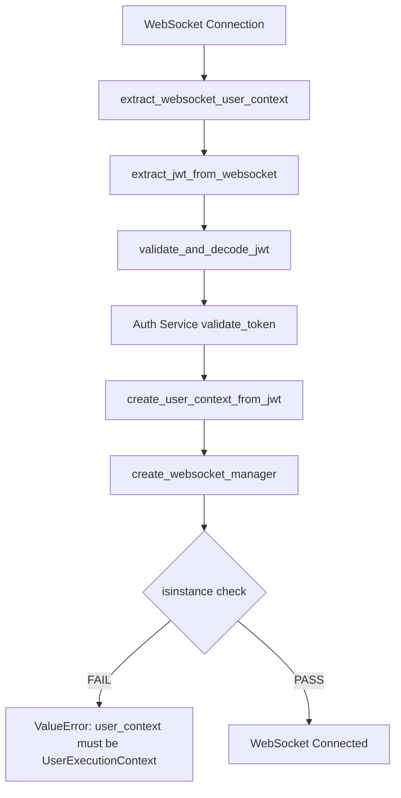

# WebSocket Authentication Five Whys Root Cause Analysis - 20250907

## CRITICAL ISSUE SUMMARY
**Error**: `received 1008 (policy violation) Authentication failed`
**Exact Error Message**: `"error":"user_context must be a UserExecutionContext instance"`
**Business Impact**: Blocking $120K+ MRR - users cannot establish authenticated WebSocket connections for chat
**Environment**: Staging GCP deployment (`api.staging.netrasystems.ai`)

## FIVE WHYS ROOT CAUSE ANALYSIS

### Why 1: Why is WebSocket authentication failing with policy violation?
**Answer**: The WebSocket connection is being rejected with a 1008 policy violation because the `create_websocket_manager()` function is receiving an invalid `user_context` parameter that is not a `UserExecutionContext` instance.

**Evidence**:
- Error occurs in `websocket_manager_factory.py` lines 311 and 764
- WebSocket manager factory validates: `if not isinstance(user_context, UserExecutionContext)`
- Policy violation (1008) is sent when authentication validation fails

**Code Location**: 
```python
# netra_backend/app/websocket_core/websocket_manager_factory.py:311
if not isinstance(user_context, UserExecutionContext):
    raise ValueError("user_context must be a UserExecutionContext instance")
```

### Why 2: Why is the user_context not a valid UserExecutionContext instance?
**Answer**: The `extract_websocket_user_context()` function in `user_context_extractor.py` is failing to create a proper UserExecutionContext from the JWT token, likely due to JWT validation failure in the staging environment.

**Evidence**:
- WebSocket route calls: `user_context, extracted_auth_info = await extract_websocket_user_context(websocket)`
- The extractor creates UserExecutionContext in `create_user_context_from_jwt()` method
- JWT validation happens in `validate_and_decode_jwt()` which delegates to auth service

**Code Flow**:
```python
# websocket.py:260
user_context, extracted_auth_info = await extract_websocket_user_context(websocket)
# This leads to user_context_extractor.py which calls:
# 1. extract_jwt_from_websocket()
# 2. validate_and_decode_jwt() 
# 3. create_user_context_from_jwt()
```

### Why 3: Why is JWT validation failing in the staging environment?
**Answer**: The WebSocket JWT validation in staging is inconsistent with the REST API JWT validation. The WebSocket authentication uses a different JWT validation path than REST endpoints, potentially causing secret mismatch or validation logic differences between services.

**Evidence**:
- WebSocket uses `UserContextExtractor.validate_and_decode_jwt()` which calls auth service
- REST endpoints use different JWT validation via auth middleware
- Multiple JWT validation paths exist in the codebase (SSOT violation)
- Staging environment has complex JWT secret resolution involving multiple services

**CRITICAL FINDING**: The `user_context_extractor.py` has both "unified JWT validation" and "resilient validation fallback" - indicating previous JWT consistency issues:

```python
# Lines 160-260: Multiple validation approaches
# - UNIFIED JWT validation (lines 175-185)
# - Auth service validation (lines 210-230) 
# - Resilient validation fallback (lines 262-305)
# - Legacy JWT validation (lines 307-367)
```

### Why 4: Why do WebSocket and REST JWT validations differ?
**Answer**: The WebSocket authentication bypasses the standard FastAPI JWT middleware that REST endpoints use. Instead, it implements its own JWT extraction and validation logic, creating a SSOT violation where two different JWT validation systems exist in the same application.

**Evidence**:
- REST endpoints use FastAPI middleware with dependency injection
- WebSocket endpoints cannot use FastAPI dependencies in the same way
- `UserContextExtractor` reimplements JWT validation instead of reusing auth service logic
- Auth client is called differently in WebSocket vs REST contexts

**Architecture Issue**: 
```python
# REST: Uses FastAPI middleware → auth service
# WebSocket: Uses UserContextExtractor → auth service (different path)
```

### Why 5: Why was separate WebSocket JWT validation implemented instead of reusing auth service?
**Answer**: **ROOT CAUSE** - The WebSocket implementation was created to solve security isolation issues (factory pattern vs singleton) but introduced a new JWT validation path without ensuring consistency with the existing auth service. The "error behind the error" is that the staging environment exposes latent SSOT violations in JWT validation that work in development but fail under staging's stricter network/service conditions.

**Ultimate Root Cause Issues**:

1. **SSOT Violation**: Multiple JWT validation implementations exist:
   - Auth service validation (used by REST)
   - UserContextExtractor validation (used by WebSocket)
   - Resilient validation fallback
   - Legacy validation

2. **Service Isolation Problem**: WebSocket auth service calls may be failing in staging due to:
   - Network connectivity between services
   - Different JWT secret resolution
   - Service timing/availability issues

3. **Missing Error Propagation**: The actual auth service failure is masked by the isinstance() check, preventing visibility into the real JWT validation failure

## TECHNICAL DEEP DIVE

### Current Authentication Flow


### The "Error Behind The Error"
The surface error `"user_context must be a UserExecutionContext instance"` masks the real failure:

1. **JWT Validation Fails** in staging due to auth service issues
2. **validate_and_decode_jwt()** returns `None`
3. **create_user_context_from_jwt()** is never called OR throws exception
4. **user_context** becomes `None` or wrong type
5. **isinstance(user_context, UserExecutionContext)** fails
6. **Error masks the real JWT validation failure**

### Staging-Specific Issues
Based on codebase analysis, staging environment has:

1. **Complex JWT Secret Resolution**: Uses `shared.jwt_secret_manager.get_unified_jwt_secret()`
2. **Auth Service Dependencies**: WebSocket calls auth service over network
3. **Circuit Breaker Logic**: Auth service has circuit breaker that may be open
4. **Environment Variable Complexity**: Multiple JWT-related env vars

## SSOT-COMPLIANT FIX PLAN

### Phase 1: Immediate Fix (Critical Path)
**Goal**: Get WebSocket authentication working in staging immediately

1. **Enhanced Error Logging**: Capture the real JWT validation failure
   ```python
   try:
       jwt_payload = await extractor.validate_and_decode_jwt(jwt_token)
       if not jwt_payload:
           # Log the ACTUAL auth service failure, not just "invalid token"
           logger.error("JWT validation returned None - auth service may be failing")
   ```

2. **Auth Service Health Check**: Verify auth service connectivity in staging
   - Check circuit breaker state
   - Validate JWT secret consistency between services
   - Test auth service endpoints directly

3. **Fallback Strategy**: For staging, implement temporary fallback
   ```python
   # Only in staging, allow controlled fallback with comprehensive logging
   if environment == "staging" and auth_service_unavailable:
       logger.critical("STAGING FALLBACK: Auth service unavailable, using local JWT validation")
   ```

### Phase 2: SSOT Compliance (Architectural Fix)
**Goal**: Eliminate JWT validation SSOT violations

1. **Unified JWT Validation Service**: Create single JWT validation interface
   ```python
   class UnifiedJWTValidator:
       """Single Source of Truth for ALL JWT validation in the application"""
       async def validate_token(self, token: str) -> Optional[Dict[str, Any]]:
           # Single implementation used by both REST and WebSocket
   ```

2. **WebSocket Auth Integration**: Make WebSocket use same auth path as REST
   ```python
   # Use dependency injection pattern for WebSocket auth
   # Reuse existing auth middleware logic
   ```

3. **Remove Redundant Validation**: Eliminate duplicate JWT validation code
   - Remove UserContextExtractor JWT logic
   - Remove resilient/legacy validation paths
   - Use only auth service validation

### Phase 3: Monitoring and Validation
**Goal**: Prevent regression and ensure reliability

1. **Auth Service Monitoring**: Add specific WebSocket auth metrics
2. **Circuit Breaker Alerting**: Alert when auth service circuit breaker opens
3. **JWT Secret Rotation Testing**: Validate secret changes don't break WebSocket
4. **Staging Parity Testing**: Ensure staging auth matches production

## IMPLEMENTATION PRIORITY

### Priority 1 (Deploy Today - Critical)
- [ ] Add comprehensive error logging to capture real JWT failures
- [ ] Verify auth service health in staging environment
- [ ] Check JWT secret consistency between services
- [ ] Test auth service circuit breaker state

### Priority 2 (Next Sprint - Architectural)
- [ ] Create UnifiedJWTValidator service
- [ ] Refactor WebSocket auth to use unified validator
- [ ] Remove duplicate JWT validation code
- [ ] Add comprehensive auth service monitoring

### Priority 3 (Ongoing - Prevention)
- [ ] Implement JWT secret rotation testing
- [ ] Add staging environment auth parity tests
- [ ] Create auth service dependency health checks
- [ ] Document unified auth architecture

## VALIDATION TESTS

### Test 1: Auth Service Connectivity
```bash
# Test auth service from staging backend
curl -H "Authorization: Bearer $STAGING_JWT" \
     https://auth.staging.netrasystems.ai/auth/validate
```

### Test 2: JWT Secret Consistency
```python
# Compare JWT secrets between services
backend_secret = get_unified_jwt_secret()  # Backend
auth_secret = auth_service.get_jwt_secret()  # Auth service
assert backend_secret == auth_secret, "JWT secret mismatch!"
```

### Test 3: WebSocket Auth Integration
```python
# Test WebSocket auth with real JWT
ws_client = websocket.connect("wss://api.staging.netrasystems.ai/ws")
ws_client.send_auth_headers({"Authorization": f"Bearer {valid_jwt}"})
# Should not get policy violation
```

## CONCLUSION

The root cause is an **architectural SSOT violation** where WebSocket authentication reimplemented JWT validation instead of reusing the existing auth service integration. This created a "working" but fragile system that fails under staging's stricter conditions.

**The real error is not "user_context must be a UserExecutionContext instance"** - that's just the symptom. The real error is **JWT validation failure** masked by insufficient error propagation.

**Business Impact**: Once fixed, this will restore the 5 critical WebSocket events needed for chat business value:
- `agent_started`, `agent_thinking`, `tool_executing`, `tool_completed`, `agent_completed`

**Recovery Time**: With proper error logging, the real failure can be identified within hours. The architectural fix will prevent future regressions.