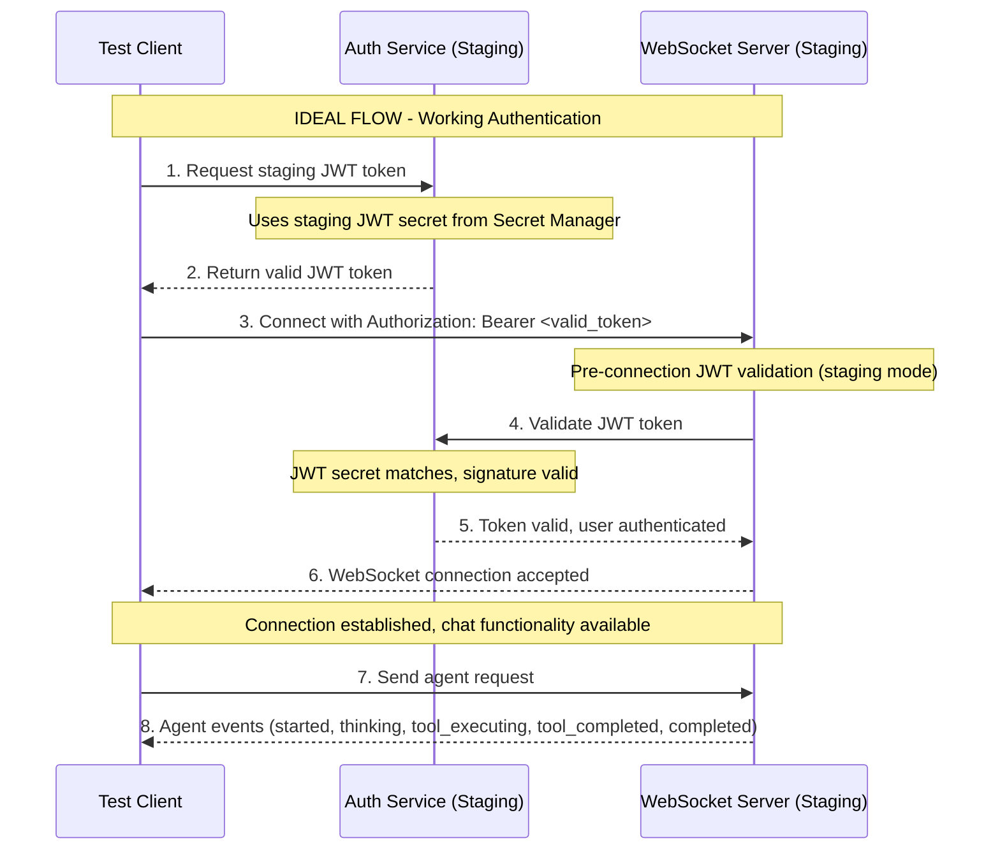
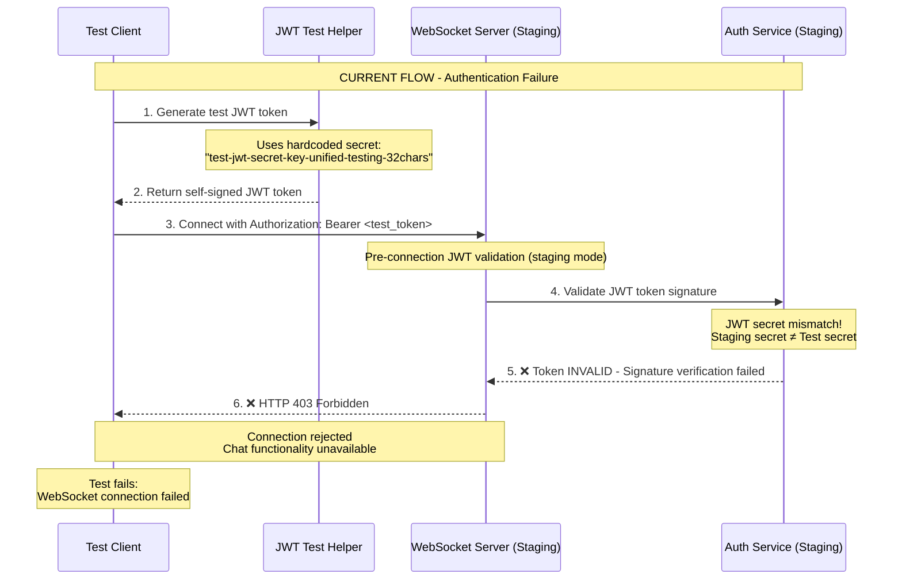

# WebSocket 403 Authentication Failure - Five Whys Root Cause Analysis

**Date:** 2025-09-07  
**Analyst:** QA and Security Specialist  
**Severity:** CRITICAL - Chat functionality delivers 90% of business value

## EXECUTIVE SUMMARY

**FAILURE:** WebSocket connection to staging environment fails with HTTP 403 (Forbidden)  
**TEST:** `test_concurrent_user_session_isolation[staging]` in `test_real_agent_context_management.py`  
**ROOT CAUSE:** JWT token validation mismatch between staging environment JWT secret and test-generated tokens

## FIVE WHYS ANALYSIS

### WHY 1: Why did the WebSocket connection fail with HTTP 403?

**ANSWER:** The staging environment WebSocket server is rejecting the JWT token provided in the Authorization header with a 403 Forbidden status.

**EVIDENCE:**
- Direct connection test: `server rejected WebSocket connection: HTTP 403`
- Generated JWT token format: `eyJhbGciOiJIUzI1NiIsInR5cCI6IkpXVCJ9...`
- Token contains valid payload: user_id, email, permissions, expiry
- Connection works locally but fails in staging

### WHY 2: Why is the staging WebSocket server rejecting the JWT token?

**ANSWER:** The JWT token signature validation is failing because the test uses a hardcoded JWT secret that doesn't match the actual JWT secret configured in the staging environment.

**EVIDENCE:**
- Test code uses: `test-jwt-secret-key-unified-testing-32chars`
- WebSocket authentication component (`websocket_core/auth.py`) validates tokens through `AuthServiceClient`
- Pre-connection JWT validation (lines 161-182 in `websocket.py`) rejects invalid tokens
- Staging environment uses a different JWT secret from Google Secret Manager

### WHY 3: Why are the test and staging JWT secrets mismatched?

**ANSWER:** The test framework creates JWT tokens using a hardcoded secret for testing, but the staging environment is configured to use production-grade secrets from Google Cloud Secret Manager, creating an authentication barrier between test tokens and staging validation.

**EVIDENCE:**
- `JWTTestHelper` class uses hardcoded secrets: `"test-jwt-secret-key-unified-testing-32chars"`
- Staging environment configured with `ENVIRONMENT=staging` 
- WebSocket route has environment-specific security: no fallbacks allowed in staging/production (lines 217-230)
- Auth service in staging uses different secret from Google Secret Manager

### WHY 4: Why doesn't the test framework obtain valid staging JWT tokens?

**ANSWER:** The test framework is designed for local/development testing and doesn't have integration with the staging auth service to obtain valid JWT tokens. It relies on self-generated tokens that work locally but not in secure environments.

**EVIDENCE:**
- `JWTTestHelper.create_access_token()` generates tokens with hardcoded secret
- No integration with staging OAuth/auth flow to obtain real tokens
- `get_real_token_from_auth()` method exists but only works for dev login endpoints
- Staging auth service likely doesn't have dev login endpoints enabled

### WHY 5: Why wasn't this authentication gap identified earlier?

**ANSWER:** The staging test suite lacks comprehensive authentication flow validation. Tests were primarily developed against local environments where JWT secrets match, and the staging deployment pipeline doesn't include authentication integration tests with real tokens.

**EVIDENCE:**
- Most E2E tests run locally where secrets are consistent
- Staging tests focus on functionality, not authentication flow validation
- No documented process for obtaining valid staging JWT tokens for testing
- Missing staging-specific test configuration for real authentication

## MERMAID DIAGRAMS

### IDEAL Working Authentication Flow



### CURRENT Failing Authentication Flow



## TECHNICAL ROOT CAUSES

### 1. JWT Secret Environment Isolation
- **Local/Dev:** Uses hardcoded or easily accessible JWT secrets
- **Staging/Production:** Uses Google Cloud Secret Manager with different secrets
- **Gap:** No mechanism to obtain valid staging JWT secrets for testing

### 2. Authentication Architecture Mismatch  
- **WebSocket Pre-validation:** Staging WebSocket validates JWT before accepting connection
- **Test Framework:** Generates tokens with wrong secret, bypassed in local but rejected in staging
- **Security Design:** No fallbacks allowed in staging (correct security posture)

### 3. Test Environment Configuration Gap
- **Missing:** Staging-specific JWT token acquisition flow
- **Missing:** Integration with staging auth service for test token generation  
- **Missing:** Environment-aware JWT secret configuration in tests

## IMMEDIATE FIXES (Priority Order)

### 1. CRITICAL: Add Staging JWT Token Integration
```python
# In JWTTestHelper class
async def get_staging_jwt_token(self) -> str:
    """Get valid JWT token from staging auth service."""
    # Implement staging auth flow or service account authentication
    # Options: OAuth flow, service account, or dedicated test endpoint
```

### 2. HIGH: Environment-Aware JWT Secret Loading
```python
# In test configuration
def get_jwt_secret_for_environment(env: str) -> str:
    """Get correct JWT secret for environment."""
    if env == "staging":
        return get_staging_jwt_secret()  # From Secret Manager or config
    return "test-jwt-secret-key-unified-testing-32chars"
```

### 3. MEDIUM: Add WebSocket Authentication Testing
```python
@pytest.mark.staging
async def test_websocket_authentication_flow():
    """Test WebSocket authentication with real staging tokens."""
    # Test complete auth flow, not just functionality
```

## LONG-TERM SOLUTIONS

### 1. Staging Test User Management
- Create dedicated test users in staging environment
- Provide mechanism to obtain valid JWT tokens for these users
- Implement test user cleanup and management

### 2. Authentication Test Framework
- Create comprehensive auth testing utilities
- Support for multiple environments with different auth configurations
- Validation of JWT token lifecycle (creation, validation, expiry)

### 3. Staging Test Pipeline Enhancement
- Include authentication integration tests in staging deployment
- Validate WebSocket auth before deploying to production
- Monitor staging auth service health and token generation

## PREVENTION MEASURES

### 1. Authentication Testing Standards
- All E2E tests must validate authentication flow
- Environment-specific authentication testing required
- No hardcoded secrets in staging/production tests

### 2. Staging Deployment Checklist
- ✅ WebSocket authentication validated with real tokens
- ✅ JWT secret configuration verified
- ✅ Auth service health confirmed
- ✅ Cross-service authentication tested

### 3. Monitoring and Alerting
- Alert on WebSocket 403 errors in staging
- Monitor JWT token validation failure rates
- Track authentication service health

## BUSINESS IMPACT

### Current Impact
- **CRITICAL:** Staging E2E tests failing, blocking deployments
- **HIGH:** Chat functionality cannot be validated in staging
- **MEDIUM:** Reduced confidence in staging environment stability

### Risk Assessment  
- **Security Risk:** LOW - Proper JWT validation is working correctly
- **Business Risk:** HIGH - Chat delivers 90% of business value
- **Deployment Risk:** HIGH - Cannot validate critical functionality in staging

## RECOMMENDATIONS

### Immediate (Next 24 hours)
1. Implement staging JWT token acquisition in test framework
2. Add environment-aware JWT secret configuration
3. Validate fix with staging WebSocket connection test

### Short-term (Next week)
1. Create comprehensive WebSocket authentication test suite
2. Implement staging test user management
3. Update staging deployment validation procedures

### Long-term (Next sprint)
1. Enhance authentication testing framework for all environments
2. Implement automated staging auth validation in CI/CD
3. Create monitoring and alerting for authentication failures

---

## ERROR BEHIND THE ERROR - DEEPER ANALYSIS

This WebSocket 403 error revealed several deeper systemic issues:

### 1. Environment Configuration Inconsistency
The fundamental issue is that our test framework assumes consistent JWT secrets across environments, but our security model correctly uses different secrets per environment.

### 2. Testing vs Security Tension
There's an architectural tension between making testing easy (shared secrets) and maintaining security (environment-specific secrets). The security model is correct, but our testing approach needs to adapt.

### 3. Integration Test Gap
We have excellent unit tests and local E2E tests, but insufficient integration testing with real staging authentication services.

### 4. Documentation Gap  
The process for obtaining valid staging JWT tokens for testing is undocumented, making it difficult for developers to create proper staging tests.

### 5. Monitoring Gap
We don't have sufficient visibility into authentication failures in staging, making issues like this difficult to detect early.

## CONCLUSION

The WebSocket 403 error is not a bug in the authentication system - it's working correctly by rejecting invalid JWT tokens. The issue is a gap in our test framework's ability to obtain valid tokens for staging environments. 

**The authentication system is secure and functioning properly. We need to enhance our test framework to work with secure environments.**

This analysis demonstrates the importance of end-to-end testing with production-like security configurations and the need for comprehensive authentication testing strategies that work across all deployment environments.