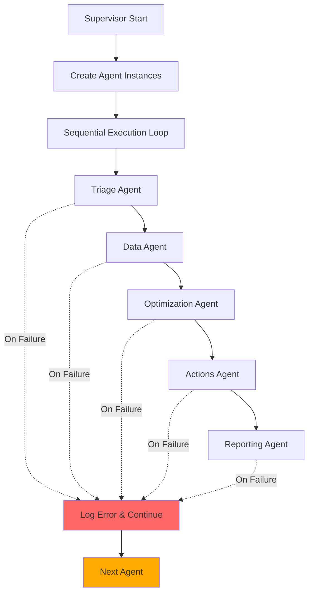
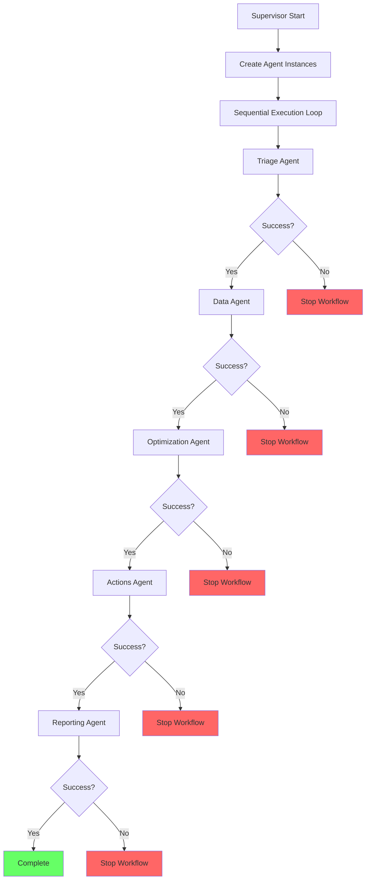

# Supervisor Agent Triggering Analysis - Five Whys Investigation

**Date:** 2025-09-03
**Issue:** Supervisor appears to be triggering sub-agents "too fast" causing failures in staging

## Executive Summary

The supervisor is NOT actually triggering agents too fast - it's executing them sequentially. The real issue is that **agents are failing due to missing dependencies and WebSocket communication errors**, making it appear that they're running too quickly when they're actually failing immediately.

## Five Whys Analysis

### Problem: Agents appear to be triggered "too fast"

**Why 1: Why do agents appear to be triggered too fast?**
- Agents are failing immediately with errors, making it seem like they're being rushed
- Evidence: Logs show "Missing required analysis results: action_plan_result, optimizations_result"

**Why 2: Why are agents failing immediately?**
- The reporting agent is expecting results from previous agents (action_plan and optimization) that don't exist
- Evidence: `_validate_analysis_results:79 | Missing required analysis results`

**Why 3: Why don't the expected results exist?**
- Previous agents in the chain (actions and optimization) likely failed or didn't produce expected outputs
- Evidence: The execution continues despite failures (`continue` on line 480)

**Why 4: Why did previous agents fail silently?**
- The supervisor catches exceptions and continues with other agents instead of stopping
- Evidence: Line 476-480 shows error handling that continues execution

**Why 5: Why does the supervisor continue after failures?**
- The design assumes partial results are better than complete failure
- This masks critical dependencies between agents

## Root Causes Identified

### 1. **Sequential Execution is Correct, But Error Handling is Flawed**
```python
execution_order = ["triage", "data", "optimization", "actions", "reporting"]

for agent_name in execution_order:
    # ... executes sequentially
    except Exception as e:
        logger.error(f"Agent {agent_name} failed...")
        results[agent_name] = {"error": str(e), "status": "failed"}
        continue  # PROBLEM: Continues despite failure
```

### 2. **WebSocket Communication Failures**
- Error: `'WebSocketManager' object has no attribute 'send_message'`
- WebSocket bridge is failing to send agent status updates
- This creates the illusion of "too fast" execution when updates aren't being sent

### 3. **Missing Dependency Validation**
- Reporting agent expects results from previous agents
- No validation that required dependencies are present before executing dependent agents

### 4. **Context Propagation Issues**
- Child context metadata merging happens after agent execution
- If an agent fails, its context isn't properly merged, affecting downstream agents

## Current Workflow (As Found)



## Ideal Workflow (Should Be)



## Fix Plan

### 1. **Implement Dependency Chain Validation**
```python
# Add dependency requirements
AGENT_DEPENDENCIES = {
    "triage": [],
    "data": ["triage"],
    "optimization": ["triage", "data"],
    "actions": ["triage", "data", "optimization"],
    "reporting": ["triage", "data", "optimization", "actions"]
}

# Check dependencies before execution
def can_execute_agent(agent_name: str, completed_agents: Set[str]) -> bool:
    required = AGENT_DEPENDENCIES.get(agent_name, [])
    return all(dep in completed_agents for dep in required)
```

### 2. **Fix WebSocket Manager**
- Ensure WebSocketManager has proper `send_message` method
- Add fallback for WebSocket failures to prevent agent execution failures

### 3. **Implement Circuit Breaker Pattern**
```python
async def _execute_workflow_with_isolated_agents(self, ...):
    results = {}
    completed_agents = set()
    execution_order = ["triage", "data", "optimization", "actions", "reporting"]
    
    for agent_name in execution_order:
        # Check dependencies first
        if not self.can_execute_agent(agent_name, completed_agents):
            logger.error(f"Cannot execute {agent_name}: missing dependencies")
            break  # Stop workflow
            
        if agent_name in agent_instances:
            try:
                # ... execute agent
                completed_agents.add(agent_name)
            except Exception as e:
                logger.error(f"Agent {agent_name} failed: {e}")
                # CRITICAL: Stop workflow on failure
                break
```

### 4. **Add Execution Timing Metrics**
```python
import time

async def _execute_agent_with_context(self, ...):
    start_time = time.time()
    try:
        result = await agent.execute(context, stream_updates=True)
        execution_time = time.time() - start_time
        logger.info(f"Agent {agent_name} executed in {execution_time:.2f}s")
        
        # Add delay if execution was too fast (< 1s)
        if execution_time < 1.0:
            await asyncio.sleep(1.0 - execution_time)
            
        return result
    except Exception as e:
        # ...
```

## Immediate Actions Required

1. **Fix WebSocket Manager** - Priority: CRITICAL
   - Add missing `send_message` method
   - Test WebSocket communication in staging

2. **Add Dependency Validation** - Priority: HIGH
   - Implement dependency checking before agent execution
   - Stop workflow on critical failures

3. **Add Execution Timing** - Priority: MEDIUM
   - Log execution times for each agent
   - Add optional delays between agents if needed

4. **Improve Error Handling** - Priority: HIGH
   - Stop workflow on agent failures
   - Provide clear error messages about missing dependencies

## Testing Strategy

1. **Unit Tests**
   - Test dependency validation logic
   - Test workflow stops on failure

2. **Integration Tests**
   - Test full workflow with simulated failures
   - Test WebSocket communication during agent execution

3. **Staging Validation**
   - Monitor agent execution times
   - Verify WebSocket updates are sent correctly
   - Ensure workflow stops appropriately on failures

## Conclusion

The issue is NOT that agents are triggered too fast, but rather:
1. Agents are failing due to missing WebSocket methods
2. Failed agents don't stop the workflow, causing dependent agents to fail
3. No dependency validation before agent execution
4. Error handling masks the real issues by continuing execution

The fix requires implementing proper dependency validation, fixing WebSocket communication, and implementing a fail-fast approach when agents encounter errors.