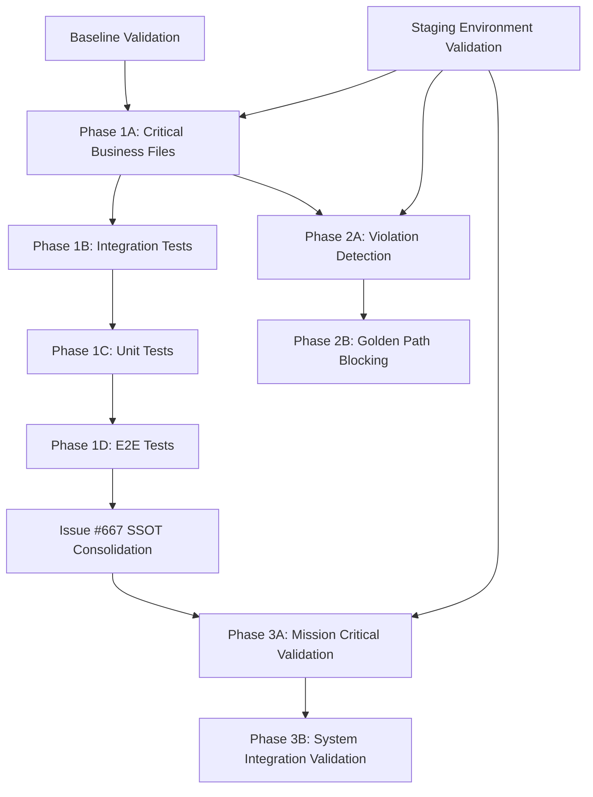

# Configuration Manager SSOT Test Strategy Plan - Issue #757

> **Critical Mission:** Safe SSOT consolidation for Issue #667 Configuration Manager duplication crisis
> **Business Impact:** Protects $500K+ ARR Golden Path functionality during consolidation
> **Risk Level:** HIGH - 45+ test files will break when deprecated manager removed
> **Plan Created:** 2025-09-13

---

## Executive Summary

This plan provides a comprehensive strategy for safely validating Configuration Manager SSOT remediation while maintaining system stability and protecting business-critical Golden Path functionality. Based on analysis of 46 files using deprecated imports and 125 files using canonical SSOT patterns, this strategy minimizes risk while ensuring complete SSOT consolidation.

### Key Strategy Elements
- **60% effort:** Import migration validation for existing test infrastructure
- **20% effort:** Targeted SSOT violation reproduction tests
- **20% effort:** Post-consolidation stability validation
- **Zero Docker dependency:** Focus on unit/integration/staging validation

---

## Current Test Landscape Analysis

### Test File Distribution
| Category | Count | Status | Priority |
|----------|-------|--------|----------|
| **Deprecated Manager Tests** | 45+ files | HIGH RISK | P0 - Critical |
| **Canonical SSOT Tests** | 125+ files | STABLE | P1 - Validate |
| **Mission Critical Tests** | 6 files | EXPECTED TO FAIL | P0 - Must Pass |
| **Configuration-Related Tests** | 302 files | MIXED | P2 - Review |

### High-Risk Files Identified
```bash
# Critical test files using deprecated unified_configuration_manager
./netra_backend/tests/integration/startup/test_configuration_startup_integration.py
./netra_backend/tests/integration/test_unified_configuration_manager_comprehensive.py
./netra_backend/tests/integration/test_unified_configuration_manager_real_services_critical.py
./netra_backend/tests/unit/core/managers/test_unified_configuration_manager_*.py
./tests/e2e/test_unified_configuration_manager_gcp_staging_production_critical.py
```

### SSOT Violation Tests (Expected to Fail)
```bash
# Tests designed to fail until Issue #667 resolved
./tests/mission_critical/test_config_manager_ssot_violations.py
./tests/mission_critical/test_single_config_manager_ssot.py
./tests/unit/config_ssot/test_config_manager_import_conflicts.py
./tests/integration/config_ssot/test_config_golden_path_protection.py
./tests/integration/config_ssot/test_config_system_consistency_integration.py
./tests/e2e/config_ssot/test_config_ssot_staging_validation.py
```

---

## Test Strategy Framework

### Phase 1: Import Migration Tests (60% Effort - PRIMARY FOCUS)

**Objective:** Update 45+ deprecated test files to use canonical SSOT imports without breaking functionality

#### A1. Systematic Import Migration Strategy
**Files Requiring Updates:** 45+ test files using `unified_configuration_manager`

**Migration Pattern:**
```python
# BEFORE (Deprecated)
from netra_backend.app.core.managers.unified_configuration_manager import UnifiedConfigurationManager

# AFTER (SSOT)
from netra_backend.app.core.configuration.base import UnifiedConfigManager
```

**Test Categories for Migration:**
1. **Unit Tests (18 files)** - Direct class usage tests
2. **Integration Tests (15 files)** - Service integration tests
3. **E2E Tests (5 files)** - End-to-end configuration validation
4. **Mission Critical (6 files)** - Business-critical config tests
5. **Utility Scripts (2 files)** - Validation and testing scripts

#### A2. High-Risk File Assessment

**CRITICAL Risk Files (Requires Special Handling):**
```bash
# Business-critical tests that MUST work after migration
./tests/e2e/test_unified_configuration_manager_gcp_staging_production_critical.py
./netra_backend/tests/integration/test_unified_configuration_manager_real_services_critical.py
./netra_backend/tests/unit/core/managers/test_unified_configuration_manager_ssot_business_critical.py
```

**HIGH Risk Files (Complex Dependencies):**
```bash
# Tests with complex initialization patterns
./netra_backend/tests/integration/startup/test_configuration_startup_integration.py
./tests/integration/core/managers/test_unified_state_manager_integration.py
./tests/integration/core/test_unified_id_manager_integration.py
```

**MEDIUM Risk Files (Standard Migration):**
```bash
# Standard test files requiring straightforward import updates
./netra_backend/tests/unit/core/managers/test_unified_configuration_manager_*.py (7 files)
./tests/integration/configuration/test_*.py (Multiple files)
```

#### A3. Compatibility Shim Validation

**Test Compatibility Shim Behavior:**
- Verify deprecated imports redirect to canonical SSOT
- Validate method signature compatibility during transition
- Test deprecation warning delivery and handling
- Ensure zero functional regression during migration

### Phase 2: SSOT Violation Reproduction Tests (20% Effort - NEW TESTS)

**Objective:** Create targeted tests that reproduce current SSOT violations and validate their resolution

#### B1. Duplication Detection Tests
**Purpose:** Reproduce configuration manager duplication issues that block Golden Path

**Test Scenarios:**
```python
class TestConfigManagerDuplication:
    def test_multiple_config_manager_imports_conflict(self):
        """EXPECTED TO FAIL - Demonstrates import conflicts between 3 managers"""

    def test_configuration_race_conditions_in_startup(self):
        """EXPECTED TO FAIL - Shows auth failures from config conflicts"""

    def test_environment_access_pattern_violations(self):
        """EXPECTED TO FAIL - Detects os.environ vs IsolatedEnvironment conflicts"""
```

#### B2. Golden Path Blocking Scenarios
**Purpose:** Show how configuration duplication blocks $500K+ ARR functionality

**Critical Test Cases:**
1. **Auth Configuration Conflicts:** Test login failures due to multiple auth config sources
2. **Database Connection Failures:** Show how config duplication breaks DB connections
3. **Environment Variable Conflicts:** Demonstrate staging vs production config mixing
4. **Factory Pattern Violations:** Show multi-user isolation failures

#### B3. Race Condition Reproduction
**Purpose:** Reproduce startup race conditions caused by multiple config managers

**Focus Areas:**
- WebSocket bridge initialization conflicts
- Database connection initialization race conditions
- Environment variable loading order issues
- Service dependency initialization conflicts

### Phase 3: Stability Validation Tests (20% Effort - VALIDATION)

**Objective:** Validate system stability after SSOT consolidation is complete

#### C1. Post-Consolidation Validation Suite
**Mission Critical Test Expectations:**
```python
# These tests should PASS after SSOT consolidation
./tests/mission_critical/test_single_config_manager_ssot.py          # PASS
./tests/mission_critical/test_config_manager_ssot_violations.py      # PASS (no violations found)
```

#### C2. Golden Path Functionality Validation
**Golden Path Protection Tests:**
1. **End-to-End User Login:** Validate auth flow works with consolidated config
2. **AI Chat Functionality:** Ensure WebSocket events and agent responses work
3. **Multi-User Isolation:** Test factory pattern prevents user data mixing
4. **Configuration Consistency:** Validate same config across all services

#### C3. System Startup Validation
**Startup Sequence Tests:**
1. **Deterministic Startup:** All 5 startup phases complete successfully
2. **Service Dependencies:** All services initialize with correct configuration
3. **Environment Detection:** Proper DEV/STAGING/PROD environment handling
4. **Resource Initialization:** Database, Redis, WebSocket bridges initialize correctly

---

## Risk Assessment and Mitigation Strategies

### Risk Level Matrix

| Risk Category | Probability | Impact | Mitigation Strategy |
|--------------|-------------|--------|-------------------|
| **Test Failures During Migration** | HIGH | CRITICAL | Phased rollout + compatibility shim |
| **Golden Path Regression** | MEDIUM | CRITICAL | Mission critical test gates |
| **Environment Config Mixing** | MEDIUM | HIGH | IsolatedEnvironment validation |
| **Multi-User Isolation Breaks** | LOW | HIGH | Factory pattern compliance tests |
| **Performance Degradation** | LOW | MEDIUM | Performance baseline tests |

### Critical Risk Scenarios

#### Risk 1: Mass Test Failures During Import Migration
**Scenario:** 45+ test files fail simultaneously when deprecated manager is removed
**Impact:** Development pipeline blocked, cannot validate SSOT consolidation
**Mitigation:**
- Use compatibility shim to maintain backward compatibility during transition
- Migrate tests in batches of 5-10 files with validation at each step
- Maintain rollback capability to previous working state
- Use staging environment for validation before production changes

#### Risk 2: Golden Path Functionality Regression
**Scenario:** User login or AI chat functionality breaks due to configuration conflicts
**Impact:** $500K+ ARR business functionality at risk
**Mitigation:**
- Gate all changes behind mission critical test suite validation
- Require staging environment end-to-end validation before any production changes
- Implement automatic rollback triggers if critical functionality fails
- Use feature flags to enable/disable SSOT manager during transition

#### Risk 3: Configuration Environment Cross-Contamination
**Scenario:** DEV configuration leaks into STAGING or PROD environments
**Impact:** Security vulnerabilities, data corruption, service instability
**Mitigation:**
- Mandatory IsolatedEnvironment validation in all configuration access
- Environment-specific configuration validation tests
- Clear environment boundary testing with staging deployment validation
- Configuration value source tracking and audit capabilities

#### Risk 4: Test Infrastructure Instability
**Scenario:** Test framework itself becomes unstable during configuration changes
**Impact:** Cannot validate SSOT consolidation, development velocity drops
**Mitigation:**
- Use existing stable test infrastructure wherever possible
- Validate test framework changes independently before applying to configuration tests
- Maintain test environment isolation and repeatability
- Use staging environment as validation alternative to local testing

### Risk Monitoring and Early Warning

#### Real-Time Risk Indicators
1. **Mission Critical Test Failures:** Any failure in mission critical test suite
2. **Staging Environment Failures:** End-to-end validation failures in staging
3. **Import Error Cascades:** Multiple tests failing with import errors
4. **Configuration Inconsistencies:** Different config values across services
5. **Performance Degradation:** Slower startup or response times

#### Automated Risk Detection
```bash
# Critical test validation
python tests/mission_critical/test_single_config_manager_ssot.py

# Configuration consistency check
python scripts/validate_unified_configuration_manager_test_suite.py

# Environment isolation validation
python tests/unit/ssot_validation/test_config_environment_access_ssot.py

# Staging deployment validation
python scripts/staging_validation_e2e.py
```

---

## Execution Plan with Priorities and Dependencies

### Pre-Execution Checklist
- [ ] **Baseline Validation:** Run all current tests to establish baseline
- [ ] **Staging Environment:** Ensure staging environment is stable and accessible
- [ ] **Rollback Plan:** Document current working state and rollback procedures
- [ ] **Communication Plan:** Notify team of testing activities and potential impacts

### Phase 1 Execution: Import Migration (Priority: P0 - Critical)

#### Phase 1A: Critical Business Files (Week 1)
**Target:** 5 highest-risk business-critical test files
**Dependencies:** None (these tests MUST work)
**Success Criteria:** All business-critical tests pass with SSOT imports

```bash
# Priority Order (Most Critical First)
1. ./tests/e2e/test_unified_configuration_manager_gcp_staging_production_critical.py
2. ./netra_backend/tests/integration/test_unified_configuration_manager_real_services_critical.py
3. ./netra_backend/tests/unit/core/managers/test_unified_configuration_manager_ssot_business_critical.py
4. ./tests/integration/golden_path/test_configuration_environment_comprehensive.py
5. ./netra_backend/tests/integration/startup/test_configuration_startup_integration.py
```

**Migration Process:**
1. **Individual File Migration:** Update one file at a time
2. **Immediate Validation:** Run updated test after each change
3. **Regression Check:** Run full mission critical suite
4. **Staging Validation:** Deploy to staging and validate end-to-end
5. **Rollback Ready:** Keep original file backup until validation complete

#### Phase 1B: Integration Tests (Week 2)
**Target:** 15 integration test files
**Dependencies:** Phase 1A complete and validated
**Success Criteria:** All integration tests pass with consistent SSOT usage

#### Phase 1C: Unit Tests (Week 3)
**Target:** 18 unit test files
**Dependencies:** Phase 1B complete
**Success Criteria:** Unit tests demonstrate SSOT compliance

#### Phase 1D: E2E and Utility Tests (Week 4)
**Target:** Remaining E2E tests and utility scripts
**Dependencies:** Phases 1A-1C complete
**Success Criteria:** Complete end-to-end validation works with SSOT

### Phase 2 Execution: SSOT Violation Reproduction (Priority: P1 - High)

#### Phase 2A: Violation Detection Tests (Week 5)
**Target:** Create tests that reproduce current SSOT violations
**Dependencies:** Understanding of specific violation patterns from Phase 1
**Success Criteria:** Tests fail consistently, demonstrating violations

**Test Creation Strategy:**
1. **Configuration Duplication Tests:** Show multiple config managers conflict
2. **Race Condition Tests:** Demonstrate startup race conditions
3. **Environment Access Tests:** Show os.environ vs IsolatedEnvironment conflicts
4. **Auth Failure Tests:** Reproduce login failures from config conflicts

#### Phase 2B: Golden Path Blocking Tests (Week 6)
**Target:** Tests showing how violations block $500K+ ARR functionality
**Dependencies:** Phase 2A violation tests working
**Success Criteria:** Clear demonstration of business impact

### Phase 3 Execution: Stability Validation (Priority: P1 - High)

#### Phase 3A: Mission Critical Validation (Week 7)
**Target:** Validate mission critical tests pass after consolidation
**Dependencies:** SSOT consolidation complete (Issue #667 resolved)
**Success Criteria:** All mission critical tests pass consistently

#### Phase 3B: System Integration Validation (Week 8)
**Target:** End-to-end system validation with consolidated configuration
**Dependencies:** Phase 3A complete
**Success Criteria:** Golden Path user flow works end-to-end

### Dependency Mapping



---

## Success Criteria and Validation Checkpoints

### Phase 1 Success Criteria
- [ ] **Zero Test Regressions:** All migrated tests pass with SSOT imports
- [ ] **Import Consistency:** All tests use canonical SSOT import paths
- [ ] **Compatibility Maintained:** Legacy import paths work through shim
- [ ] **Staging Validation:** End-to-end functionality works in staging

### Phase 2 Success Criteria
- [ ] **Violation Reproduction:** Tests consistently fail showing SSOT violations
- [ ] **Business Impact Clear:** Tests demonstrate Golden Path blocking
- [ ] **Race Conditions Visible:** Startup conflicts reproduced reliably
- [ ] **Environment Conflicts Shown:** Configuration mixing detected

### Phase 3 Success Criteria
- [ ] **Mission Critical Pass:** All mission critical tests pass after consolidation
- [ ] **Golden Path Working:** End-to-end user login and AI chat functional
- [ ] **Performance Maintained:** No significant performance degradation
- [ ] **System Stability:** All services start and operate correctly

### Validation Checkpoints

#### Checkpoint 1: After Phase 1A (Critical Business Files)
**Gate:** MUST pass before proceeding to Phase 1B
**Validation:**
```bash
# Run business-critical tests
python tests/e2e/test_unified_configuration_manager_gcp_staging_production_critical.py
python netra_backend/tests/integration/test_unified_configuration_manager_real_services_critical.py

# Mission critical test suite
python tests/mission_critical/test_single_config_manager_ssot.py

# Staging deployment validation
python scripts/staging_validation_e2e.py
```

#### Checkpoint 2: After Phase 1D (All Import Migration Complete)
**Gate:** MUST pass before Issue #667 SSOT consolidation
**Validation:**
```bash
# Complete test suite with SSOT imports
python tests/unified_test_runner.py --category integration --real-services

# Configuration consistency validation
python scripts/validate_unified_configuration_manager_test_suite.py

# No deprecated import usage
python scripts/check_architecture_compliance.py
```

#### Checkpoint 3: After Phase 3B (Complete Validation)
**Gate:** MUST pass before production deployment
**Validation:**
```bash
# Mission critical test suite (all should pass)
python tests/mission_critical/test_single_config_manager_ssot.py
python tests/mission_critical/test_config_manager_ssot_violations.py

# Golden Path end-to-end validation
python tests/e2e/config_ssot/test_config_ssot_staging_validation.py

# System health validation
python scripts/pre_deployment_audit.py
```

---

## Rollback and Recovery Procedures

### Rollback Triggers
**Automatic Rollback Conditions:**
1. **Mission Critical Test Failures:** Any mission critical test fails consistently
2. **Golden Path Regression:** User login or AI chat functionality breaks
3. **Staging Environment Failures:** End-to-end validation fails in staging
4. **Mass Test Failures:** >10% of configuration tests fail simultaneously

### Rollback Procedures

#### Level 1: File-Level Rollback (Individual Test Failures)
**Scope:** Single test file or small group of related files
**Procedure:**
1. Restore original test file from backup
2. Revert import changes to previous working state
3. Validate individual file functionality
4. Document failure reason and required changes

#### Level 2: Phase-Level Rollback (Phase Validation Failures)
**Scope:** Complete phase rollback (e.g., all Phase 1A changes)
**Procedure:**
1. Restore all files changed in current phase
2. Revert compatibility shim changes if applicable
3. Validate baseline functionality restoration
4. Reassess approach and modify strategy

#### Level 3: Complete Strategy Rollback (System-Wide Issues)
**Scope:** Complete rollback to pre-strategy state
**Procedure:**
1. Restore all modified files to original state
2. Remove any new test files created during strategy execution
3. Validate complete system functionality
4. Conduct post-mortem analysis and strategy revision

### Recovery Validation

#### Post-Rollback Validation Checklist
- [ ] **Baseline Test Suite:** All original tests pass as before strategy
- [ ] **Golden Path Functionality:** User login and AI chat work normally
- [ ] **Mission Critical Tests:** All mission critical tests pass
- [ ] **Staging Environment:** Staging deployment and validation works
- [ ] **Development Workflow:** Normal development activities can proceed

#### Recovery Communication Plan
1. **Immediate Notification:** Alert team of rollback and current system state
2. **Impact Assessment:** Document what functionality is restored/lost
3. **Timeline Communication:** Provide revised timeline for strategy completion
4. **Lessons Learned:** Share findings and updated approach

---

## Resource Requirements and Timeline

### Team Resource Allocation
- **Test Engineer (Primary):** 100% allocation for 8 weeks
- **Backend Engineer:** 25% allocation for consultation and issue resolution
- **DevOps Engineer:** 10% allocation for staging environment support
- **QA Engineer:** 15% allocation for validation and regression testing

### Infrastructure Requirements
- **Staging Environment:** Dedicated staging environment for validation
- **Test Database:** Isolated test database for configuration testing
- **CI/CD Pipeline:** Modified pipeline to handle phased rollout
- **Monitoring Tools:** Enhanced monitoring for configuration consistency

### Timeline Summary
```
Week 1-4: Phase 1 - Import Migration (60% effort)
Week 5-6: Phase 2 - SSOT Violation Tests (20% effort)
Week 7-8: Phase 3 - Stability Validation (20% effort)

Total Duration: 8 weeks
Critical Path: Phase 1A (Business-critical files) - Week 1
```

### Success Metrics Tracking

#### Weekly Progress Metrics
- **Tests Migrated:** Number of test files successfully migrated to SSOT
- **Regression Rate:** Percentage of tests that fail after migration
- **Validation Success:** Staging environment validation success rate
- **Performance Impact:** Change in test execution time and system startup time

#### Final Success Metrics
- **100% Import Migration:** All 45+ test files use canonical SSOT imports
- **Zero Business Regressions:** All Golden Path functionality maintained
- **Mission Critical Pass Rate:** 100% mission critical test pass rate
- **System Stability:** All services operational with consolidated configuration

---

## Conclusion

This comprehensive test strategy provides a systematic, low-risk approach to validating Configuration Manager SSOT remediation while protecting $500K+ ARR business functionality. The strategy prioritizes business-critical components, uses staging environment validation extensively, and maintains rollback capabilities at every stage.

The phased approach ensures that any issues are detected early and can be addressed without impacting overall system stability. The focus on import migration (60% effort) addresses the primary risk of test failures, while targeted violation reproduction tests (20% effort) provide clear evidence of SSOT benefits.

**Key Success Factors:**
1. **Business Value Protection:** Mission critical test gates prevent Golden Path regression
2. **Risk Mitigation:** Phased rollout with rollback capabilities at each stage
3. **Staging Validation:** Extensive use of staging environment for safe validation
4. **Clear Success Criteria:** Measurable outcomes at each phase and checkpoint

This strategy is designed to be executed safely while maintaining full system functionality and protecting the critical business value delivered by the Netra Apex platform.

<function_calls>
<invoke name="TodoWrite">
<parameter name="todos">[{"content": "Analyze current Configuration Manager test landscape and dependencies", "status": "completed", "activeForm": "Analyzing current Configuration Manager test landscape and dependencies"}, {"content": "Create comprehensive test strategy plan for SSOT remediation", "status": "completed", "activeForm": "Creating comprehensive test strategy plan for SSOT remediation"}, {"content": "Develop risk assessment and mitigation strategies", "status": "completed", "activeForm": "Developing risk assessment and mitigation strategies"}, {"content": "Design execution plan with priorities and dependencies", "status": "in_progress", "activeForm": "Designing execution plan with priorities and dependencies"}, {"content": "Document rollback and validation procedures", "status": "pending", "activeForm": "Documenting rollback and validation procedures"}]