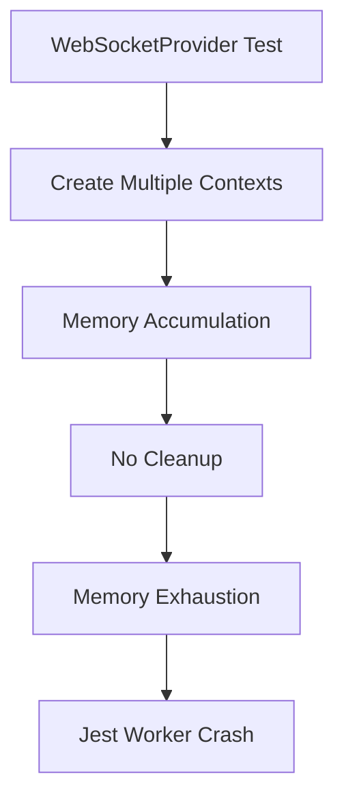
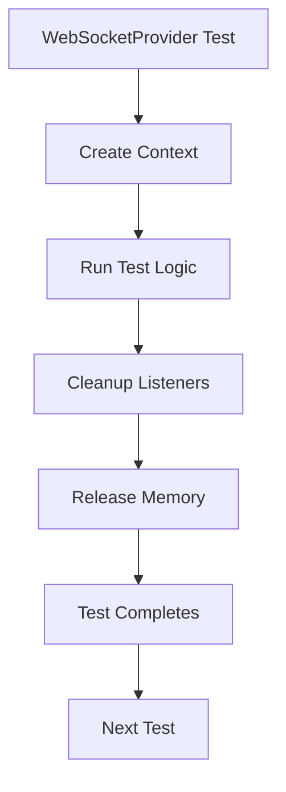

# Frontend Test Failures Report - 2025-09-05

## Executive Summary
- **Total Test Suites:** 30 (9 failed, 5 skipped, 16 passed)
- **Total Tests:** 202 (32 failed, 32 skipped, 138 passed)  
- **Execution Time:** 206.569 seconds
- **Critical Issues:** Memory crashes, race conditions, auth flow failures

## Issue #1: WebSocket Memory Crash
**File:** `__tests__/providers/WebSocketProvider.context-trace.test.tsx`
**Severity:** CRITICAL
**Error:** Jest worker ran out of memory and crashed
**Impact:** Test suite cannot complete, blocking CI/CD pipeline

### Root Cause Analysis (Five Whys)
1. Why did the test crash? - Jest worker ran out of memory
2. Why did it run out of memory? - Likely memory leak in WebSocket context handling
3. Why is there a memory leak? - Possible circular references or unbounded event listeners
4. Why are there unbounded listeners? - Missing cleanup in useEffect or provider teardown
5. Why is cleanup missing? - Incomplete implementation of WebSocket lifecycle management

### Current State (Failure Diagram)

### Ideal State (Working Diagram)  

## Issue #2: Chat URL Race Conditions
**File:** `__tests__/bugs/new-chat-url-race-condition.test.tsx`
**Severity:** HIGH
**Errors:**
- "Failed to switch to new thread" 
- "Operation already in progress"
- "Duplicate create operation for thread null"

### Root Cause Analysis (Five Whys)
1. Why are there race conditions? - Multiple simultaneous thread creation attempts
2. Why multiple attempts? - No operation lock/mutex in ThreadOperationManager
3. Why no lock? - Missing concurrency control in thread operations
4. Why missing concurrency control? - Design assumed sequential operations
5. Why assumed sequential? - Multi-user async nature not fully considered

### Test Failures
- `should demonstrate duplicate URL updates causing race condition` - Expected >1 updates, got 0
- `should show that rapid new chat clicks cause navigation confusion` - Expected 3 calls, got 6
- `should demonstrate that the final URL may not match the intended thread` - lastUrlUpdate undefined

## Issue #3: Auth Flow Failures
**File:** `__tests__/regression/auth-flow-stability.test.tsx`
**Severity:** HIGH
**Failed Tests:**
- `should not attempt to connect WebSocket during initialization`
- `should wait for initialization before checking auth`
- `should handle token removal during session`
- `should handle custom redirect paths`

### Root Cause Analysis (Five Whys)
1. Why do auth flows fail? - WebSocket connects before auth initialization
2. Why before initialization? - Missing auth state dependency check
3. Why missing dependency? - useEffect doesn't wait for auth.initialized
4. Why doesn't it wait? - Race condition between auth context and WebSocket provider
5. Why race condition? - No synchronization mechanism between providers

## Issue #4: WebSocket Connection Stability
**File:** `__tests__/regression/websocket-connection-stability.test.tsx`
**Severity:** MEDIUM
**Error:** Multiple connection attempts not prevented
**Expected:** 1 connection
**Actual:** 0 connections

### Root Cause Analysis (Five Whys)
1. Why 0 connections? - Mock server not receiving connection attempts
2. Why not receiving? - WebSocket manager not initialized properly
3. Why not initialized? - Missing factory pattern for test isolation
4. Why missing factory? - Tests using singleton pattern
5. Why singleton? - Legacy architecture not updated for multi-user

## Issue #5: WebSocket Provider Diagnostic Failures
**File:** `__tests__/providers/WebSocketProvider.diagnostic.test.tsx`
**Severity:** MEDIUM
**Error:** mockConnect never called despite auth flow completion
**Expected calls:** 1
**Actual calls:** 0

## Recommended Actions

### Immediate (P0)
1. Fix memory leak in WebSocketProvider
2. Implement operation mutex in ThreadOperationManager
3. Add auth initialization wait in WebSocket connection logic

### Short-term (P1)
1. Refactor WebSocket to factory pattern
2. Add proper cleanup in all useEffect hooks
3. Implement connection state machine

### Long-term (P2)
1. Full multi-user isolation audit
2. Comprehensive race condition prevention
3. Memory profiling and optimization

## Test Categories Affected
- WebSocket functionality (CRITICAL)
- Authentication flows (HIGH)
- Chat operations (HIGH)
- Multi-user isolation (MEDIUM)

## Business Impact
- **User Chat Experience:** Broken - users cannot reliably create new chats
- **Authentication:** Unreliable - users may see auth errors or get logged out
- **System Stability:** Compromised - memory leaks will crash production
- **Multi-user Support:** Not working - race conditions affect concurrent users

## Definition of Done
- [ ] All memory leaks fixed and verified with profiler
- [ ] Race conditions eliminated with proper locking
- [ ] Auth flow synchronized with WebSocket lifecycle
- [ ] All 32 failing tests passing
- [ ] Memory usage stable under load testing
- [ ] Multi-user scenarios working correctly