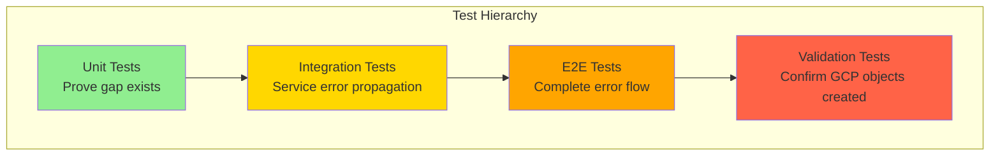

# GCP Error Logging Integration Test Plan

**Business Value Justification (BVJ):**
- Segment: Mid & Enterprise
- Business Goal: Production visibility and rapid incident response
- Value Impact: Enables real-time error monitoring in GCP dashboards
- Strategic Impact: Supports enterprise reliability requirements and reduces MTTR

## Current State Analysis

### Gap Identified
The current `unified_logging.py` system does NOT automatically integrate with GCP Error Reporting:

1. **logger.error()** calls only go to loguru/console/file
2. **GCPErrorReporter** is a separate service requiring manual calls
3. **No automatic bridge** between logging system and GCP Error objects

### Expected Integration
When `logger.error()` is called, it SHOULD automatically:
1. Log to console/file (current behavior)
2. Create GCP Error object (missing functionality)
3. Include proper context (user_id, trace_id, etc.)

## Test Strategy Overview



## Test Categories

### 1. Unit Tests - Gap Validation

**File:** `netra_backend/tests/unit/logging/test_gcp_error_integration_gap.py`

**Purpose:** Prove current logger.error() calls DON'T create GCP Error objects

**Test Cases:**
```python
class TestGCPErrorIntegrationGap:
    """Tests that FAIL initially, proving the gap exists."""
    
    async def test_logger_error_should_create_gcp_error_object(self):
        """FAILING TEST: logger.error() should create GCP Error object."""
        with patch('netra_backend.app.services.monitoring.gcp_error_reporter.report_exception') as mock_report:
            logger = get_central_logger()
            
            # This SHOULD trigger GCP error creation but currently DOESN'T
            logger.error("Critical database connection failed", 
                        user_id="user_123", 
                        error_context={"database": "postgres"})
            
            # This assertion WILL FAIL initially
            mock_report.assert_called_once()  # Currently NOT called
    
    async def test_logger_critical_should_create_high_priority_gcp_error(self):
        """FAILING TEST: logger.critical() should create high-priority GCP Error."""
        with patch('netra_backend.app.services.monitoring.gcp_error_reporter.report_message') as mock_report:
            logger = get_central_logger()
            
            logger.critical("Authentication service down", 
                           severity="CRITICAL",
                           service="auth")
            
            # Should call with CRITICAL severity
            mock_report.assert_called_once_with(
                message=ANY,
                severity=ErrorSeverity.CRITICAL,
                extra_context=ANY
            )
    
    async def test_websocket_error_logging_integration_gap(self):
        """FAILING TEST: WebSocket errors should create GCP Error objects."""
        # WebSocket errors are critical for chat functionality
        # but currently don't automatically report to GCP
        pass
        
    async def test_auth_error_logging_integration_gap(self):
        """FAILING TEST: Auth errors should create GCP Error objects."""
        # Auth failures are security-critical
        pass
```

### 2. Integration Tests - Service Error Propagation

**File:** `netra_backend/tests/integration/logging/test_error_propagation_gcp_integration.py`

**Purpose:** Test cross-service error propagation to GCP Error Reporting

**Test Cases:**
```python
class TestErrorPropagationGCPIntegration:
    """Test error propagation across services creates GCP Error objects."""
    
    @pytest.mark.integration
    @pytest.mark.real_services
    async def test_websocket_authentication_error_creates_gcp_error(self, real_services_fixture):
        """Test WebSocket auth errors create GCP Error objects."""
        # Simulate WebSocket auth failure
        # Verify GCP Error object created with correct context
        
    @pytest.mark.integration  
    async def test_database_connection_error_creates_gcp_error(self, real_db):
        """Test database errors create GCP Error objects."""
        # Force database connection failure
        # Verify error propagation to GCP
        
    @pytest.mark.integration
    async def test_agent_execution_error_creates_gcp_error(self, real_services_fixture):
        """Test agent execution errors create GCP Error objects."""
        # Execute agent with error condition
        # Verify GCP Error object includes agent context
```

### 3. E2E Tests - Complete Error Flow

**File:** `tests/e2e/logging/test_gcp_error_reporting_e2e.py`

**Purpose:** Test complete error reporting flow from user action to GCP dashboard

**Test Cases:**
```python
class TestGCPErrorReportingE2E:
    """E2E tests for complete GCP Error Reporting integration."""
    
    @pytest.mark.e2e
    @pytest.mark.real_services
    @pytest.mark.mission_critical
    async def test_user_websocket_error_appears_in_gcp(self, real_services, authenticated_user):
        """E2E: User WebSocket error creates visible GCP Error object."""
        # User connects to WebSocket
        # Simulate error condition (invalid token, etc.)
        # Verify error appears in GCP Error Reporting
        
    @pytest.mark.e2e
    @pytest.mark.real_services
    async def test_agent_failure_creates_traceable_gcp_error(self, real_services, authenticated_user):
        """E2E: Agent execution failure creates traceable GCP Error."""
        # User starts agent execution
        # Force agent failure
        # Verify GCP Error includes user context and trace ID
        
    @pytest.mark.e2e
    async def test_cross_service_error_aggregation_gcp(self, real_services):
        """E2E: Errors across services aggregate correctly in GCP."""
        # Trigger errors in multiple services
        # Verify proper error aggregation and correlation
```

### 4. Validation Tests - GCP Object Creation

**File:** `tests/integration/monitoring/test_gcp_error_object_validation.py`

**Purpose:** Validate actual GCP Error objects are created with correct data

**Test Cases:**
```python
class TestGCPErrorObjectValidation:
    """Validate GCP Error objects are created correctly."""
    
    @pytest.mark.integration
    @pytest.mark.skipif(not os.getenv('GCP_PROJECT'), reason="GCP credentials required")
    async def test_gcp_error_object_structure(self, gcp_error_client):
        """Validate GCP Error objects have correct structure."""
        # Trigger error that should create GCP object
        # Query GCP API to verify object exists
        # Validate object structure and metadata
        
    @pytest.mark.integration
    async def test_gcp_error_rate_limiting(self, gcp_error_client):
        """Test GCP Error reporting respects rate limits."""
        # Generate many errors rapidly
        # Verify rate limiting prevents GCP quota exhaustion
        
    @pytest.mark.integration
    async def test_gcp_error_context_preservation(self):
        """Test error context is preserved in GCP objects."""
        # Create error with rich context
        # Verify all context appears in GCP Error object
```

## Test Data and Fixtures

### 1. GCP Error Client Fixture
```python
@pytest.fixture
async def gcp_error_client():
    """Real GCP Error Reporting client for validation."""
    if not os.getenv('GCP_PROJECT'):
        pytest.skip("GCP credentials not available")
    
    from google.cloud import error_reporting
    client = error_reporting.Client()
    yield client
```

### 2. Error Scenario Fixtures
```python
@pytest.fixture
def websocket_auth_error_scenario():
    """Fixture for WebSocket authentication error scenarios."""
    return {
        'invalid_token': 'Bearer invalid_jwt_token',
        'expired_token': 'Bearer expired_jwt_token',
        'malformed_token': 'Bearer malformed.token'
    }

@pytest.fixture
def database_error_scenarios():
    """Fixture for database error scenarios."""
    return {
        'connection_timeout': "connection timeout after 30s",
        'invalid_credentials': "authentication failed",
        'table_not_found': "relation 'missing_table' does not exist"
    }
```

### 3. Mock Strategy (Unit Tests Only)

**Unit Tests:**
- Mock GCP Error Reporting client to verify calls are made
- Mock network requests to avoid GCP API calls
- Focus on interface compliance

**Integration/E2E Tests:**
- Use REAL GCP Error Reporting client
- Use test GCP project for validation
- Clean up test errors after execution

## Test File Structure

```
tests/
├── unit/
│   └── logging/
│       ├── test_gcp_error_integration_gap.py          # Gap validation
│       └── test_unified_logger_gcp_hooks.py           # Hook integration
├── integration/
│   ├── logging/
│   │   ├── test_error_propagation_gcp_integration.py  # Service propagation
│   │   └── test_cross_service_error_reporting.py      # Multi-service
│   └── monitoring/
│       └── test_gcp_error_object_validation.py        # GCP object validation
└── e2e/
    └── logging/
        ├── test_gcp_error_reporting_e2e.py             # Complete flow
        └── test_user_error_visibility_e2e.py           # User perspective
```

## Test Execution Strategy

### 1. Phase 1: Prove Gap (Unit Tests)
```bash
# Run unit tests that FAIL initially
python tests/unified_test_runner.py --category unit --path "*/logging/*"
# Expected: FAILURES proving gap exists
```

### 2. Phase 2: Integration Testing
```bash
# Run integration tests with real services
python tests/unified_test_runner.py --category integration --real-services --path "*/logging/*"
# Expected: Test error propagation flows
```

### 3. Phase 3: E2E Validation
```bash
# Run E2E tests with real GCP
python tests/unified_test_runner.py --category e2e --real-services --env staging
# Expected: Full error reporting flow validation
```

## Success Criteria

### Initial (Failing) Tests Must Prove:
1. `logger.error()` does NOT create GCP Error objects
2. WebSocket errors don't automatically report to GCP
3. Auth service errors don't automatically report to GCP
4. Database errors don't automatically report to GCP
5. Cross-service error correlation is missing

### After Remediation Tests Must Pass:
1. All `logger.error()` calls create corresponding GCP Error objects
2. Error context is preserved (user_id, trace_id, service_name)
3. Rate limiting prevents GCP quota exhaustion
4. Error severity mapping is correct
5. Cross-service error correlation works

## Implementation Approach

### 1. Test First Development
1. Create ALL failing tests first
2. Run tests to confirm failures
3. Implement logging-to-GCP bridge
4. Iterate until all tests pass

### 2. SSOT Integration Pattern
- Use existing `UnifiedLogger` as integration point
- Extend `_emit_log()` method to include GCP reporting
- Preserve all existing logging behavior
- Add GCP integration as additional handler

### 3. Real Service Testing
- Use real GCP Error Reporting in integration/E2E tests
- Use test GCP project to avoid production pollution
- Implement cleanup mechanisms for test errors

## Risk Mitigation

### 1. GCP Quota Protection
- Implement rate limiting in tests
- Use separate test GCP project
- Clean up test errors after execution

### 2. Test Environment Isolation
- Skip GCP tests if credentials unavailable
- Use environment detection for test configuration
- Provide clear error messages for missing setup

### 3. Production Safety
- All GCP integration disabled by default in tests
- Require explicit environment variables for GCP testing
- Validate test environment before running GCP tests

---

This comprehensive test plan follows SSOT principles and will prove the current gap exists, then validate the complete integration after implementation.