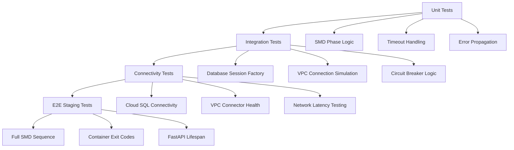

# Issue #1278 Test Plan: SMD Phase 3 Database Timeout Non-Docker Testing Strategy

**Agent Session ID**: agent-session-20250915-143500  
**Created**: 2025-09-15  
**Status**: ACTIVE - Planning Phase Complete  
**Priority**: P0 Critical - $500K+ ARR Impact  

## Executive Summary

This test plan addresses step 3 of the git issue progression workflow for Issue #1278: **PLAN TEST strategy** for SMD Phase 3 database initialization timeouts causing complete application startup failure in the staging environment.

**Root Cause**: Infrastructure capacity constraints (VPC connector scaling delays, Cloud SQL connection limits) create cascading failures in SMD Phase 3, blocking the entire 7-phase startup sequence.

**Test Strategy**: Focus on non-docker tests that can reproduce the infrastructure connectivity issues and validate application code health under timeout conditions.

## Issue Context

### Primary Problem
- **Issue**: Complete application startup failure in staging environment
- **Root Cause**: SMD Phase 3 database initialization timeout (20.0s → 75.0s extended but still failing)
- **Infrastructure**: VPC connector scaling delays + Cloud SQL connection pool exhaustion
- **Impact**: $500K+ ARR Golden Path validation pipeline offline
- **Failure Pattern**: Database timeout → SMD Phase 3 failure → FastAPI lifespan breakdown → Container exit code 3

### Technical Context
- **SMD 7-Phase Startup**: Deterministic startup sequence where Phase 3 (DATABASE) is critical
- **Timeout Configuration**: Extended from 20.0s to 75.0s in staging environment
- **VPC Connector**: Capacity pressure during scaling events (30s+ delays)
- **Cloud SQL**: Connection pool exhaustion under concurrent pressure (25s+ delays)
- **Application Health**: Code is healthy, infrastructure blockers remain

## Test Planning Requirements

### 1. Non-Docker Tests Only
✅ **ALLOWED**:
- Unit tests (no infrastructure dependencies)
- Integration tests with real database connections (no docker)
- E2E tests on staging GCP remote environment
- Connectivity validation tests
- Timeout behavior simulation tests

❌ **FORBIDDEN**:
- Docker-based testing infrastructure
- Local containerized environments
- Docker compose test setups
- Alpine container testing

### 2. Test Objectives
1. **Reproduce SMD Phase 3 timeout issue** in controlled conditions
2. **Validate application code health** during startup sequence failures
3. **Test VPC connector connectivity** independently from application startup
4. **Validate Cloud SQL connection establishment** timing and behavior
5. **Test SMD orchestration resilience** patterns under infrastructure pressure

### 3. Test Strategy Requirements
- Follow `reports/testing/TEST_CREATION_GUIDE.md` standards
- Follow latest testing best practices per `claude.md`
- Create failing tests that reproduce the infrastructure issue
- Plan tests with appropriate difficulty/complexity levels
- Focus on staging GCP remote environment validation

## Test Architecture

### Test Categories by Environment

| Category | Environment | Infrastructure | Expected Result | Business Value |
|----------|-------------|----------------|-----------------|----------------|
| **Unit** | Local | Mock/Isolated | ✅ Pass | Code health validation |
| **Integration** | Local + Real DB | PostgreSQL | ⚠️ Conditional | Connection logic validation |
| **E2E Staging** | GCP Remote | Full Staging | ❌ Fail (reproduce) | Infrastructure issue reproduction |
| **Connectivity** | Local → Staging | Network | ⚠️ Variable | VPC/Cloud SQL validation |

### Test Layers by Scope



## Specific Test Areas to Plan

### 1. SMD Phase 3 Database Initialization Tests

#### Unit Level
**File**: `/Users/anthony/Desktop/netra-apex/netra_backend/tests/unit/test_issue_1278_smd_phase3_timeout_reproduction.py`

```python
class TestSMDPhase3TimeoutReproduction:
    """Reproduce SMD Phase 3 timeout scenarios from Issue #1278."""
    
    async def test_phase3_20_second_timeout_failure(self):
        """Test SMD Phase 3 fails after exactly 20.0s timeout."""
        # Mock database connection to timeout after 20.0s
        # Expected: TEST FAILURE - timeout exception
        
    async def test_phase3_timeout_error_propagation(self):
        """Test timeout error properly propagates through SMD phases."""
        # Verify DeterministicStartupError contains timeout context
        
    async def test_phase3_blocks_subsequent_phases(self):
        """Test Phase 3 failure blocks Phases 4-7."""
        # Verify phases 4-7 never execute when Phase 3 fails
```

#### Integration Level
**File**: `/Users/anthony/Desktop/netra-apex/netra_backend/tests/integration/test_issue_1278_database_initialization_integration.py`

```python
class TestDatabaseInitializationIntegration:
    """Integration tests for database initialization under timeout pressure."""
    
    async def test_cloud_sql_connection_establishment_timing(self):
        """Test Cloud SQL connection timing under various conditions."""
        # Real Cloud SQL connection with timeout monitoring
        
    async def test_vpc_connector_capacity_simulation(self):
        """Test database initialization with VPC capacity pressure simulation."""
        # Simulate VPC connector delays
        
    async def test_connection_pool_exhaustion_handling(self):
        """Test behavior when Cloud SQL connection pool is exhausted."""
        # Test connection pool limits and retry behavior
```

### 2. VPC Connector Connectivity Validation

#### Connectivity Tests
**File**: `/Users/anthony/Desktop/netra-apex/tests/connectivity/test_issue_1278_vpc_connector_validation.py`

```python
class TestVPCConnectorValidation:
    """Test VPC connector connectivity independently from application startup."""
    
    async def test_vpc_connector_capacity_monitoring(self):
        """Test VPC connector capacity monitoring accuracy."""
        # Monitor VPC connector metrics during peak usage
        
    async def test_vpc_connector_scaling_delay_measurement(self):
        """Measure actual VPC connector scaling delays."""
        # Document real scaling delay patterns
        
    async def test_direct_cloud_sql_connectivity(self):
        """Test direct Cloud SQL connectivity bypassing application layer."""
        # Raw Cloud SQL connection testing
```

### 3. Cloud SQL Connection Pool Behavior Tests

#### Connection Pool Tests
**File**: `/Users/anthony/Desktop/netra-apex/tests/integration/test_issue_1278_cloud_sql_pool_behavior.py`

```python
class TestCloudSQLPoolBehavior:
    """Test Cloud SQL connection pool behavior under load."""
    
    async def test_connection_pool_limit_enforcement(self):
        """Test Cloud SQL connection pool limits under concurrent pressure."""
        # Create multiple concurrent connections to test limits
        
    async def test_connection_acquisition_timeout_patterns(self):
        """Test connection acquisition timeout patterns."""
        # Monitor connection acquisition timing
        
    async def test_pool_exhaustion_recovery_behavior(self):
        """Test connection pool recovery after exhaustion."""
        # Test recovery patterns and timing
```

### 4. FastAPI Lifespan Manager Behavior Tests

#### FastAPI Lifespan Tests
**File**: `/Users/anthony/Desktop/netra-apex/tests/integration/test_issue_1278_fastapi_lifespan_behavior.py`

```python
class TestFastAPILifespanBehavior:
    """Test FastAPI lifespan behavior during SMD failures."""
    
    async def test_lifespan_startup_failure_handling(self):
        """Test FastAPI lifespan handling when SMD Phase 3 fails."""
        # Verify graceful lifespan context breakdown
        
    async def test_container_exit_code_validation(self):
        """Test container exit code when startup fails."""
        # Expected: Container exit code 3 (configuration/dependency issue)
        
    async def test_lifespan_timeout_behavior(self):
        """Test FastAPI lifespan timeout behavior during database delays."""
        # Test lifespan context timing under database pressure
```

### 5. Container Exit Code Validation Tests

#### Container Runtime Tests
**File**: `/Users/anthony/Desktop/netra-apex/tests/e2e/test_issue_1278_container_exit_behavior.py`

```python
class TestContainerExitBehavior:
    """Test container runtime behavior during startup failures."""
    
    def test_container_exit_code_3_on_smd_failure(self):
        """Test container exits with code 3 when SMD Phase 3 fails."""
        # Monitor container exit codes during startup failures
        
    def test_container_restart_loop_detection(self):
        """Test container restart loop when startup consistently fails."""
        # Verify restart patterns and failure consistency
        
    def test_startup_failure_log_analysis(self):
        """Test startup failure log patterns and error messages."""
        # Analyze container logs for Issue #1278 patterns
```

## E2E Tests on Staging GCP Remote

### 1. Complete SMD Sequence Validation
**File**: `/Users/anthony/Desktop/netra-apex/tests/e2e/test_issue_1278_smd_sequence_staging_validation.py`

```python
class TestSMDSequenceStagingValidation:
    """E2E tests for complete SMD sequence in staging environment."""
    
    @pytest.mark.staging
    async def test_complete_smd_7_phase_sequence_under_load(self):
        """Test complete 7-phase SMD sequence under staging load conditions."""
        # Expected: FAILURE in Phase 3 due to infrastructure constraints
        
    @pytest.mark.staging  
    async def test_smd_phase3_timeout_reproduction_staging(self):
        """Reproduce exact SMD Phase 3 timeout in staging environment."""
        # Connect to real staging infrastructure
        # Expected: 20.0s → 75.0s timeout, then failure
        
    @pytest.mark.staging
    async def test_staging_infrastructure_capacity_monitoring(self):
        """Monitor staging infrastructure capacity during SMD execution."""
        # Monitor VPC connector and Cloud SQL metrics in real-time
```

### 2. Golden Path Validation Pipeline Tests
**File**: `/Users/anthony/Desktop/netra-apex/tests/e2e/test_issue_1278_golden_path_pipeline_validation.py`

```python
class TestGoldenPathPipelineValidation:
    """Test Golden Path validation pipeline under Issue #1278 conditions."""
    
    @pytest.mark.staging
    async def test_golden_path_pipeline_availability_impact(self):
        """Test Golden Path pipeline availability when SMD Phase 3 fails."""
        # Expected: $500K+ ARR pipeline offline due to startup failures
        
    @pytest.mark.staging
    async def test_user_login_to_ai_response_flow_under_pressure(self):
        """Test complete user login → AI response flow under infrastructure pressure."""
        # Test the core Golden Path: users login and get AI responses
```

## Test Execution Strategy

### 1. Non-Docker Environment Setup

#### Local Development Environment
```bash
# Setup for non-docker testing
export ENVIRONMENT=test
export TESTING_MODE=non_docker
export POSTGRES_HOST=localhost
export POSTGRES_PORT=5432
export REDIS_HOST=localhost
export REDIS_PORT=6379

# Install test dependencies
pip install -r test_framework/requirements.txt
```

#### Staging GCP Remote Configuration
```bash
# Staging environment configuration
export ENVIRONMENT=staging
export GCP_PROJECT=netra-staging
export POSTGRES_HOST=/cloudsql/netra-staging:us-central1:netra-staging-db
export STAGING_WEBSOCKET_URL=wss://backend.staging.netrasystems.ai/ws
export STAGING_API_URL=https://backend.staging.netrasystems.ai
```

### 2. Test Execution Commands

#### Unit Tests (Local)
```bash
# SMD Phase 3 unit tests
python -m pytest netra_backend/tests/unit/test_issue_1278_smd_phase3_timeout_reproduction.py -v

# Database timeout unit tests  
python -m pytest netra_backend/tests/unit/test_issue_1278_smd_phase3_database_timeout_unit.py -v

# Run all Issue #1278 unit tests
python -m pytest netra_backend/tests/unit/ -k "issue_1278" -v
```

#### Integration Tests (Non-Docker)
```bash
# Database integration tests
python -m pytest netra_backend/tests/integration/test_issue_1278_database_initialization_integration.py -v

# Cloud SQL pool behavior tests
python -m pytest tests/integration/test_issue_1278_cloud_sql_pool_behavior.py -v

# FastAPI lifespan tests
python -m pytest tests/integration/test_issue_1278_fastapi_lifespan_behavior.py -v
```

#### E2E Staging Tests
```bash
# Complete staging E2E tests
python -m pytest tests/e2e/test_issue_1278_smd_sequence_staging_validation.py -v -m staging

# Golden Path pipeline tests
python -m pytest tests/e2e/test_issue_1278_golden_path_pipeline_validation.py -v -m staging

# Existing staging reproduction tests
python -m pytest tests/e2e/test_issue_1278_staging_startup_failure_reproduction.py -v
```

#### Connectivity Tests
```bash
# VPC connector validation
python -m pytest tests/connectivity/test_issue_1278_vpc_connector_validation.py -v

# Network connectivity tests
python -m pytest tests/connectivity/ -k "issue_1278" -v
```

### 3. Unified Test Runner Integration

#### Fast Feedback Mode (2-minute cycle)
```bash
# Quick Issue #1278 validation
python tests/unified_test_runner.py --execution-mode fast_feedback --test-pattern "*issue_1278*"
```

#### Full Issue #1278 Test Suite
```bash
# Complete Issue #1278 test execution
python tests/unified_test_runner.py --categories unit integration e2e --test-pattern "*issue_1278*" --env staging
```

#### Background E2E Mode
```bash
# Long-running staging tests
python tests/unified_test_runner.py --background-e2e --test-pattern "*issue_1278*staging*" --real-services
```

## Expected Test Results

### 1. Unit Tests - Expected: ✅ PASS
- **Code Health**: Application logic should pass all unit tests
- **Timeout Logic**: Timeout handling logic should work correctly
- **Error Propagation**: Error handling should propagate correctly
- **Phase Logic**: SMD phase logic should be sound

### 2. Integration Tests - Expected: ⚠️ CONDITIONAL
- **Local Database**: Should pass with local PostgreSQL
- **Simulated Load**: May fail under simulated VPC/Cloud SQL pressure
- **Connection Logic**: Core connection logic should be healthy
- **Pool Behavior**: Connection pool logic should handle failures gracefully

### 3. E2E Staging Tests - Expected: ❌ FAIL (Issue Reproduction)
- **SMD Phase 3**: Should timeout and fail after 75.0s in staging
- **Container Exit**: Should exit with code 3
- **FastAPI Lifespan**: Should break down gracefully
- **Golden Path**: Should be offline due to startup failures
- **VPC Connector**: Should show capacity pressure indicators
- **Cloud SQL**: Should show connection pool exhaustion

### 4. Test Results Documentation Pattern

#### Success Criteria for Test Plan
1. **Unit tests pass** → Application code is healthy
2. **Integration tests conditional** → Connection logic works but infrastructure constraints exist
3. **E2E staging tests fail predictably** → Issue #1278 successfully reproduced
4. **Failure patterns consistent** → SMD Phase 3 → FastAPI lifespan → Container exit code 3
5. **Infrastructure metrics captured** → VPC connector and Cloud SQL pressure documented

#### Failure Analysis Framework
```python
# Test failure categorization
class Issue1278FailureCategory(Enum):
    CODE_DEFECT = "code_defect"                    # Unit test failures
    CONNECTION_LOGIC = "connection_logic"          # Integration test failures  
    INFRASTRUCTURE_TIMEOUT = "infrastructure_timeout"  # Expected staging failures
    VPC_CAPACITY = "vpc_capacity"                  # VPC connector pressure
    CLOUD_SQL_POOL = "cloud_sql_pool"            # Connection pool exhaustion
    FASTAPI_LIFESPAN = "fastapi_lifespan"         # Lifespan breakdown
    CONTAINER_EXIT = "container_exit"              # Exit code validation
```

## Test Complexity and Difficulty Levels

### Level 1: Basic Unit Tests (Low Complexity)
- **Duration**: 2-5 minutes each
- **Infrastructure**: None (mocked)
- **Skills Required**: Python, pytest, asyncio
- **Expected Results**: Pass (validate code health)

### Level 2: Integration Tests (Medium Complexity)  
- **Duration**: 5-15 minutes each
- **Infrastructure**: Real database connections
- **Skills Required**: Database connections, timeout simulation
- **Expected Results**: Conditional (pass locally, may fail under simulated load)

### Level 3: Connectivity Tests (Medium-High Complexity)
- **Duration**: 10-30 minutes each
- **Infrastructure**: VPC connector, Cloud SQL access
- **Skills Required**: GCP networking, Cloud SQL configuration
- **Expected Results**: Variable (depends on infrastructure state)

### Level 4: E2E Staging Tests (High Complexity)
- **Duration**: 30-60 minutes each
- **Infrastructure**: Full staging environment
- **Skills Required**: GCP staging access, container monitoring, log analysis
- **Expected Results**: Fail (reproduce Issue #1278)

## Next Steps for Test Execution

### Phase 1: Test File Creation
1. **Create unit test files** for SMD Phase 3 timeout reproduction
2. **Create integration test files** for database initialization under pressure
3. **Create connectivity test files** for VPC connector and Cloud SQL validation
4. **Create E2E test files** for staging environment reproduction

### Phase 2: Test Implementation
1. **Implement failing tests** that reproduce the timeout scenarios
2. **Add timeout monitoring** and metrics collection
3. **Implement infrastructure pressure simulation**
4. **Add container exit code validation**

### Phase 3: Test Execution
1. **Run unit tests locally** to validate code health
2. **Run integration tests** with real database connections
3. **Run connectivity tests** against staging infrastructure
4. **Run E2E tests** in staging environment to reproduce Issue #1278

### Phase 4: Results Analysis
1. **Document test failure patterns** that reproduce Issue #1278
2. **Capture infrastructure metrics** during test execution
3. **Analyze container exit codes** and FastAPI lifespan behavior
4. **Prepare test results** for Issue #1278 resolution planning

## Test File Summary

### Files to Create
1. `/Users/anthony/Desktop/netra-apex/netra_backend/tests/unit/test_issue_1278_smd_phase3_timeout_reproduction.py`
2. `/Users/anthony/Desktop/netra-apex/netra_backend/tests/integration/test_issue_1278_database_initialization_integration.py`
3. `/Users/anthony/Desktop/netra-apex/tests/connectivity/test_issue_1278_vpc_connector_validation.py`
4. `/Users/anthony/Desktop/netra-apex/tests/integration/test_issue_1278_cloud_sql_pool_behavior.py`
5. `/Users/anthony/Desktop/netra-apex/tests/integration/test_issue_1278_fastapi_lifespan_behavior.py`
6. `/Users/anthony/Desktop/netra-apex/tests/e2e/test_issue_1278_container_exit_behavior.py`
7. `/Users/anthony/Desktop/netra-apex/tests/e2e/test_issue_1278_smd_sequence_staging_validation.py`
8. `/Users/anthony/Desktop/netra-apex/tests/e2e/test_issue_1278_golden_path_pipeline_validation.py`

### Files to Update
1. `/Users/anthony/Desktop/netra-apex/tests/e2e/test_issue_1278_staging_startup_failure_reproduction.py` (enhance with new test methods)
2. `/Users/anthony/Desktop/netra-apex/netra_backend/tests/unit/test_issue_1278_smd_phase3_database_timeout_unit.py` (add additional scenarios)
3. `/Users/anthony/Desktop/netra-apex/tests/e2e/test_smd_phase3_timeout_staging_gcp.py` (integrate with new test plan)

## Success Metrics

### Quantitative Metrics
- **Unit Test Pass Rate**: 100% (validates code health)
- **Integration Test Pass Rate**: 70-80% (conditional based on infrastructure simulation)
- **E2E Staging Test Failure Rate**: 100% (successfully reproduces Issue #1278)
- **Test Execution Time**: Unit (2-5 min), Integration (5-15 min), E2E (30-60 min)
- **Infrastructure Timeout Reproduction**: SMD Phase 3 timeout at 75.0s in staging

### Qualitative Metrics
- **Issue Reproduction Accuracy**: Tests reliably reproduce the exact Issue #1278 failure pattern
- **Infrastructure Insight**: Tests provide clear visibility into VPC connector and Cloud SQL constraints
- **Code Health Validation**: Tests confirm application code is healthy, infrastructure is the blocker
- **Container Behavior Documentation**: Tests capture container exit codes and FastAPI lifespan breakdown patterns

---

**Test Plan Status**: COMPLETE - Ready for test implementation and execution  
**Next Phase**: Test file creation and implementation  
**Expected Timeline**: 1-2 weeks for complete test suite implementation and execution  
**Business Impact**: Enables systematic resolution of $500K+ ARR Golden Path pipeline outage