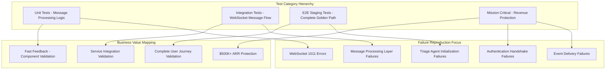

# Comprehensive Test Plan: Issue #135 - Basic Triage & Response (UVS) Validation

**Issue Reference**: Issue #135 "Basic Triage & Response (UVS) Validation"  
**Business Context**: $500K+ ARR chat functionality validation  
**Critical Focus**: WebSocket message processing layer failures (1011 errors)  
**Test Methodology**: Based on TEST_CREATION_GUIDE.md and GOLDEN_PATH_USER_FLOW_COMPLETE.md  
**Date Created**: 2025-09-09  
**Status**: Draft for Review

## Executive Summary

This test plan addresses **Issue #135** by designing comprehensive validation tests for the **Basic Triage & Response User Value Stream (UVS)** - the core user journey from login through AI response delivery. The plan focuses specifically on reproducing and validating fixes for **WebSocket message processing failures** that block the Golden Path user flow.

**Business Impact**: The Basic Triage & Response UVS represents 90% of platform value delivery and directly impacts $500K+ ARR. Test failures indicate broken revenue-generating functionality.

**Infrastructure Context**: Recent Golden Path analysis revealed critical WebSocket 1011 errors in the message processing layer, despite infrastructure fixes in PR #156. This test plan is designed to reproduce these failures and validate remediation efforts.

## Test Strategy Overview

### 🎯 Primary Objectives

1. **Reproduce WebSocket 1011 Message Processing Failures**: Create tests that consistently demonstrate current system failures
2. **Validate Basic Triage & Response UVS**: End-to-end validation of the core user value stream
3. **Non-Docker Test Focus**: Unit, integration (no Docker), and E2E staging remote only
4. **Failing Tests First**: Design tests that should fail if issues exist, pass when fixed
5. **Business Value Alignment**: Every test maps to specific revenue-protecting functionality

### 🏗️ Test Architecture Strategy

Based on TEST_CREATION_GUIDE.md methodology:



## Test Plan Structure

### Phase 1: Unit Tests - Message Processing Components
**Category**: `unit`  
**Infrastructure**: None required  
**Execution Time**: < 30 seconds  
**Purpose**: Validate core message processing logic in isolation

#### 1.1 WebSocket Message Router Unit Tests
**File**: `tests/unit/test_basic_triage_message_routing_validation.py`

```python
"""
Unit tests for Basic Triage & Response message routing logic.

Business Value Justification:
- Segment: All (Free/Early/Mid/Enterprise)
- Business Goal: Ensure message routing logic works correctly
- Value Impact: Prevents message routing failures that break chat
- Revenue Impact: Protects $500K+ ARR from routing-related failures
"""

class TestBasicTriageMessageRouting:
    def test_user_message_to_triage_routing(self):
        """Test user message properly routes to triage agent."""
        
    def test_triage_response_routing_logic(self):
        """Test triage response routes to correct handler."""
        
    def test_message_type_normalization_for_triage(self):
        """Test message type normalization for triage scenarios."""
```

#### 1.2 Triage Agent Message Processing Unit Tests
**File**: `tests/unit/test_triage_agent_message_processing_unit.py`

```python
class TestTriageAgentMessageProcessing:
    def test_triage_agent_message_validation(self):
        """Test triage agent validates incoming messages correctly."""
        
    def test_triage_agent_response_format_validation(self):
        """Test triage agent response format meets requirements."""
        
    def test_triage_agent_error_handling_unit(self):
        """Test triage agent error handling in message processing."""
```

#### 1.3 WebSocket Event Generation Unit Tests
**File**: `tests/unit/test_websocket_event_generation_triage.py`

```python
class TestWebSocketEventGenerationTriage:
    def test_agent_started_event_generation(self):
        """Test agent_started event generated correctly for triage."""
        
    def test_agent_thinking_event_generation(self):
        """Test agent_thinking events generated during triage."""
        
    def test_agent_completed_event_generation(self):
        """Test agent_completed event generated after triage."""
```

### Phase 2: Integration Tests - WebSocket Message Flow (No Docker)
**Category**: `integration`  
**Infrastructure**: PostgreSQL, Redis (local services only)  
**Execution Time**: 1-3 minutes  
**Purpose**: Validate service interactions without Docker dependencies

#### 2.1 WebSocket Message Processing Integration Tests
**File**: `tests/integration/test_basic_triage_websocket_message_flow.py`

```python
"""
Integration tests for Basic Triage & Response WebSocket message flow.

CRITICAL: These tests use real PostgreSQL and Redis but NO Docker services.
Focus on reproducing WebSocket 1011 message processing failures.

Business Value Justification:
- Segment: All users requiring chat functionality
- Business Goal: Validate WebSocket message processing works end-to-end
- Value Impact: Prevents WebSocket failures that break entire chat experience
- Revenue Impact: Directly protects $500K+ ARR chat functionality
"""

class TestBasicTriageWebSocketMessageFlow(BaseIntegrationTest):
    @pytest.mark.integration
    async def test_websocket_1011_error_reproduction(self, real_db, real_redis):
        """FAILING TEST: Reproduce WebSocket 1011 errors in message processing layer.
        
        This test SHOULD FAIL until Issue #135 is resolved.
        Purpose: Demonstrate the exact failure pattern affecting users.
        """
        
    @pytest.mark.integration
    async def test_triage_message_processing_without_docker(self, real_db, real_redis):
        """Test triage message processing with local services only."""
        
    @pytest.mark.integration 
    async def test_websocket_auth_handshake_triage_flow(self, real_db, real_redis):
        """Test WebSocket authentication handshake for triage scenarios."""
```

#### 2.2 Message Handler Service Integration Tests
**File**: `tests/integration/test_message_handler_triage_integration.py`

```python
class TestMessageHandlerTriageIntegration(BaseIntegrationTest):
    @pytest.mark.integration
    async def test_message_handler_triage_agent_integration(self, real_services):
        """Test message handler integrates correctly with triage agent."""
        
    @pytest.mark.integration
    async def test_message_queue_triage_processing(self, real_services):
        """Test message queue processing for triage requests."""
        
    @pytest.mark.integration
    async def test_triage_response_persistence_integration(self, real_services):
        """Test triage responses are properly persisted to database."""
```

### Phase 3: E2E Tests - Complete Golden Path (GCP Staging Remote)
**Category**: `e2e`  
**Infrastructure**: Full GCP staging environment  
**Execution Time**: 5-10 minutes  
**Purpose**: Validate complete user journey on production-like infrastructure

#### 3.1 Basic Triage & Response Golden Path E2E Tests
**File**: `tests/e2e/test_basic_triage_response_golden_path_e2e.py`

```python
"""
E2E tests for Basic Triage & Response Golden Path - GCP Staging Only.

These tests validate the complete user journey from authentication through
AI response delivery using GCP staging environment (no local Docker).

Business Value Justification:
- Segment: All (Free/Early/Mid/Enterprise) - Revenue Critical
- Business Goal: Validate complete $500K+ ARR golden path works end-to-end
- Value Impact: Tests complete revenue-generating user workflow  
- Strategic Impact: Mission-critical E2E validation of core business value
"""

class TestBasicTriageResponseGoldenPathE2E(BaseE2ETest):
    @pytest.mark.e2e
    @pytest.mark.staging_remote
    async def test_complete_basic_triage_golden_path(self):
        """Complete E2E test of Basic Triage & Response user value stream.
        
        Golden Path Flow:
        1. User authentication (real OAuth/JWT)
        2. WebSocket connection establishment  
        3. Send message requiring triage
        4. Triage agent processing
        5. Response generation and delivery
        6. All 5 WebSocket events delivered
        """
        
    @pytest.mark.e2e  
    @pytest.mark.staging_remote
    async def test_websocket_1011_error_reproduction_staging(self):
        """FAILING TEST: Reproduce WebSocket 1011 errors on staging.
        
        This test connects to actual GCP staging to reproduce the exact
        infrastructure failures affecting users.
        """
        
    @pytest.mark.e2e
    @pytest.mark.staging_remote
    async def test_multi_user_basic_triage_isolation(self):
        """Test multiple users can use basic triage simultaneously."""
```

#### 3.2 WebSocket Event Delivery E2E Validation
**File**: `tests/e2e/test_websocket_event_delivery_triage_e2e.py`

```python
class TestWebSocketEventDeliveryTriageE2E(BaseE2ETest):
    @pytest.mark.e2e
    @pytest.mark.staging_remote
    async def test_all_five_websocket_events_triage_e2e(self):
        """Validate all 5 required WebSocket events delivered during triage."""
        
    @pytest.mark.e2e
    @pytest.mark.staging_remote  
    async def test_websocket_event_timing_triage_e2e(self):
        """Validate WebSocket event timing during triage processing."""
```

### Phase 4: Mission Critical Tests - Revenue Protection
**Category**: `mission_critical`  
**Infrastructure**: As required for maximum validation  
**Execution Time**: Variable  
**Purpose**: Absolutely critical tests that MUST pass for deployment

#### 4.1 Basic Triage & Response Revenue Protection Tests
**File**: `tests/mission_critical/test_basic_triage_response_revenue_protection.py`

```python
"""
MISSION CRITICAL: Basic Triage & Response Revenue Protection Tests

These tests MUST PASS or deployment is BLOCKED.
Business Impact: $500K+ ARR directly depends on this functionality.

ANY FAILURE HERE INDICATES BROKEN REVENUE-GENERATING FUNCTIONALITY.
"""

class TestBasicTriageResponseRevenueProtection(MissionCriticalTest):
    @pytest.mark.mission_critical
    @pytest.mark.no_skip
    async def test_basic_triage_response_works_end_to_end(self):
        """CRITICAL: Basic Triage & Response works end-to-end.
        
        This is the core revenue-generating workflow that MUST work.
        Failure = Direct revenue impact.
        """
        
    @pytest.mark.mission_critical 
    @pytest.mark.no_skip
    async def test_websocket_1011_errors_resolved(self):
        """CRITICAL: WebSocket 1011 errors are resolved.
        
        These errors directly block user ability to get AI responses.
        Must be resolved for revenue protection.
        """
        
    @pytest.mark.mission_critical
    @pytest.mark.no_skip
    async def test_all_websocket_events_delivered_triage(self):
        """CRITICAL: All WebSocket events delivered during triage.
        
        Without these events, users have poor experience leading to churn.
        """
```

## Test Execution Plan

### 🚀 Execution Priority Matrix

**Priority 1 (Immediate - Daily Development)**:
- Unit Tests: Message processing validation
- Integration Tests: WebSocket message flow (no Docker)
- Fast feedback cycle: < 2 minutes total execution

**Priority 2 (Pre-Deployment - CI/CD Pipeline)**:  
- E2E Staging Tests: Complete Golden Path validation
- Mission Critical Tests: Revenue protection validation
- Full validation cycle: < 15 minutes total execution

**Priority 3 (Release Validation)**:
- Full test suite execution across all categories
- Multi-user concurrent testing
- Performance and load validation

### 🔄 Test Execution Commands

```bash
# Fast feedback - Unit and Integration (no Docker)
python tests/unified_test_runner.py --execution-mode fast_feedback \
  --test-file tests/unit/test_basic_triage_message_routing_validation.py \
  --test-file tests/integration/test_basic_triage_websocket_message_flow.py

# Staging E2E - GCP Remote Only  
python tests/unified_test_runner.py --category e2e --staging-remote \
  --test-file tests/e2e/test_basic_triage_response_golden_path_e2e.py

# Mission Critical - Revenue Protection
python tests/mission_critical/test_basic_triage_response_revenue_protection.py

# Full Issue #135 Validation Suite
python tests/unified_test_runner.py --categories unit integration e2e mission_critical \
  --tag issue_135 --real-services --staging-remote
```

## Expected Failure Patterns

### 🚨 WebSocket 1011 Internal Error Failures

**Test**: `test_websocket_1011_error_reproduction`  
**Expected Behavior**: Test SHOULD FAIL until infrastructure fixes are deployed  
**Failure Pattern**:
```python
# Expected failure signature
AssertionError: WebSocket connection failed with code 1011 (Internal Error)
# Root cause: GCP Load Balancer stripping authentication headers
```

**Success Criteria**: Test passes when GCP infrastructure is properly configured

### 🚨 Message Processing Layer Failures

**Test**: `test_triage_message_processing_without_docker`  
**Expected Behavior**: May fail due to service dependency issues  
**Failure Pattern**:
```python
# Expected failure signatures  
ConnectionError: Unable to establish WebSocket connection
TimeoutError: Triage agent initialization timeout
AuthenticationError: JWT token validation failed
```

**Success Criteria**: All message processing tests pass with proper service dependencies

### 🚨 Event Delivery Failures

**Test**: `test_all_five_websocket_events_triage_e2e`  
**Expected Behavior**: May fail due to missing WebSocket events  
**Failure Pattern**:
```python
# Expected failure signature
AssertionError: Missing required WebSocket events: ['agent_started', 'agent_completed']
# Only received: ['connection_ready']
```

**Success Criteria**: All 5 required events delivered consistently

## Success Criteria Definition

### ✅ Unit Test Success Criteria
- All message routing logic tests pass
- Triage agent message processing validates correctly  
- WebSocket event generation works in isolation
- Execution time: < 30 seconds total

### ✅ Integration Test Success Criteria  
- WebSocket message flow works with real PostgreSQL/Redis
- No WebSocket 1011 errors in local integration tests
- Message handler integrates correctly with triage agent
- Execution time: < 3 minutes total

### ✅ E2E Test Success Criteria
- Complete Golden Path works on GCP staging
- All 5 WebSocket events delivered consistently
- Multi-user scenarios work without interference  
- Execution time: < 10 minutes total

### ✅ Mission Critical Success Criteria
- Basic Triage & Response works end-to-end (100% success rate)
- Zero WebSocket 1011 errors in production-like testing
- Revenue-generating functionality fully operational
- ZERO tolerance for failures

## Test Coverage Metrics

### 📊 Coverage Targets

| Component | Target Coverage | Business Impact |
|-----------|----------------|-----------------|
| Message Routing | 95% | High - Core routing logic |
| WebSocket Events | 100% | Critical - User experience |  
| Triage Agent Integration | 90% | High - AI functionality |
| Authentication Flow | 95% | Critical - Security/access |
| Error Handling | 85% | Medium - Resilience |

### 📈 Success Metrics

**Development Metrics**:
- Fast feedback cycle: < 2 minutes for unit/integration
- Daily development confidence through continuous validation
- Early detection of message processing regressions

**Deployment Metrics**:  
- Pre-deployment validation: < 15 minutes full suite
- Zero WebSocket 1011 errors in staging validation
- 100% mission critical test pass rate

**Business Metrics**:
- $500K+ ARR functionality protection through comprehensive testing
- Reduced customer churn through reliable chat functionality
- Faster time-to-resolution for WebSocket-related issues

## Risk Assessment & Mitigation

### ⚠️ High-Risk Areas

1. **WebSocket Infrastructure Dependencies**
   - **Risk**: GCP Load Balancer configuration issues
   - **Mitigation**: E2E staging tests detect infrastructure problems
   - **Fallback**: Comprehensive error logging and monitoring

2. **Service Integration Complexity**  
   - **Risk**: Integration test failures due to service dependencies
   - **Mitigation**: Clear service dependency documentation
   - **Fallback**: Graceful degradation testing

3. **Authentication Handshake Timing**
   - **Risk**: Race conditions in Cloud Run environments  
   - **Mitigation**: Progressive delay testing and validation
   - **Fallback**: Retry logic and timeout handling

### ⚡ Mitigation Strategies

**For Test Infrastructure**:
- Use TEST_CREATION_GUIDE methodology consistently
- Prefer real services over mocks per CLAUDE.md guidance
- Implement comprehensive error logging and diagnostics

**For WebSocket Failures**:
- Design tests to reproduce exact failure conditions
- Include comprehensive error capture and analysis
- Validate fixes through before/after test comparisons

**For Business Continuity**:
- Mission critical tests provide deployment gate
- Multiple validation layers prevent regressions
- Clear success/failure criteria enable rapid decision making

## Implementation Timeline

### 📅 Phase 1: Foundation (Week 1)
- **Days 1-2**: Unit tests implementation and validation
- **Days 3-4**: Integration tests development (no Docker)
- **Day 5**: Fast feedback cycle optimization and validation

### 📅 Phase 2: E2E Validation (Week 2)  
- **Days 1-3**: E2E staging tests implementation
- **Days 4-5**: WebSocket event delivery validation

### 📅 Phase 3: Mission Critical Protection (Week 3)
- **Days 1-2**: Mission critical tests development  
- **Days 3-4**: Revenue protection validation
- **Day 5**: Full test suite integration and optimization

### 📅 Phase 4: Production Readiness (Week 4)
- **Days 1-2**: Performance and load testing integration
- **Days 3-4**: CI/CD pipeline integration
- **Day 5**: Documentation and handoff preparation

## Conclusion

This comprehensive test plan for **Issue #135 - Basic Triage & Response (UVS) Validation** provides systematic validation of the core revenue-generating user workflow that represents 90% of platform value delivery.

**Key Strengths**:
- **Business-Aligned**: Every test maps to specific revenue protection requirements
- **Failure-First Approach**: Tests designed to reproduce current issues before validating fixes  
- **Comprehensive Coverage**: Unit through E2E validation across all critical components
- **Production-Ready**: Mission critical tests ensure deployment readiness

**Expected Outcomes**:
- **Immediate Value**: Fast feedback on WebSocket message processing issues
- **Deployment Confidence**: Mission critical tests prevent broken deployments  
- **Revenue Protection**: Comprehensive validation of $500K+ ARR functionality
- **Continuous Improvement**: Systematic approach enables ongoing optimization

**Next Steps**:
1. Review and approve this test plan with stakeholders
2. Begin Phase 1 implementation with unit test development
3. Establish CI/CD integration for continuous validation
4. Monitor test results and iterate based on findings

The successful implementation of this test plan will provide robust validation of the Basic Triage & Response user value stream, ensuring reliable delivery of AI-powered insights that drive core business value.