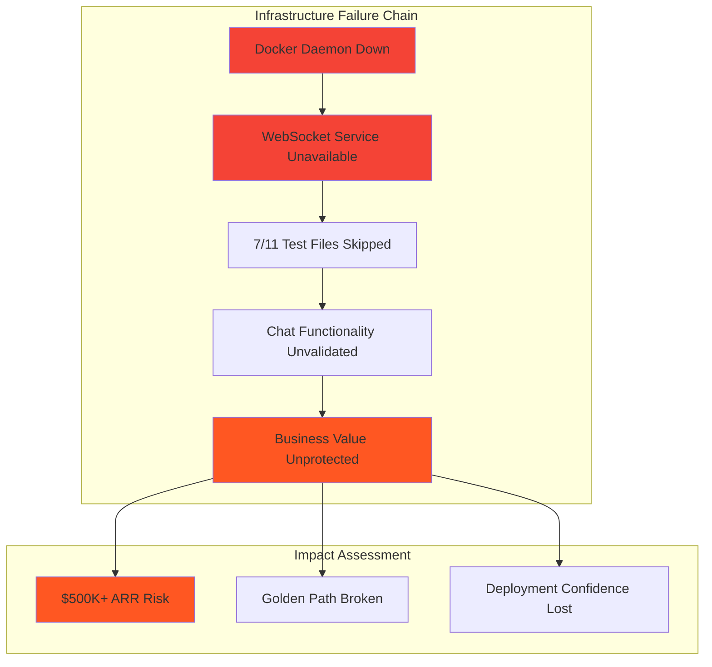

# Issue #666 WebSocket Service Infrastructure Critical - Comprehensive Test Plan

**ISSUE:** [#666 - failing-test-websocket-service-infrastructure-critical-golden-path-chat-unavailable](https://github.com/netra-systems/netra-apex/issues/666)
**DATE:** 2025-09-12
**PRIORITY:** P0 CRITICAL
**BUSINESS IMPACT:** $500K+ ARR at risk due to WebSocket service unavailability

## Executive Summary

This test plan addresses the critical failure of WebSocket service infrastructure (localhost:8002) that is blocking the golden path user flow and core chat functionality. Since Docker daemon is completely down on the Windows development environment, this plan focuses on **non-Docker testing strategies** using staging GCP remote services and alternative validation methods.

**KEY CONSTRAINT:** NO DOCKER TESTING - All tests must work without local Docker services
**VALIDATION TARGET:** $500K+ ARR chat functionality via staging environment testing

---

## Current Issue Analysis

### Root Cause: Docker Infrastructure Failure Cascade



### Technical Symptoms
- **Error:** `[WinError 1225] The remote computer refused the network connection`
- **Service:** WebSocket service on `ws://localhost:8002/ws`
- **Platform:** Windows development environment
- **Tests Affected:** 39 mission critical WebSocket agent event tests + all integration tests
- **Root Cause:** Docker daemon not running, cannot start local services

---

## Test Plan Strategy: Non-Docker Validation Approach

Since Docker is unavailable, we'll implement a **three-tiered testing strategy** that validates business functionality without requiring local Docker services:

### Tier 1: Unit & Configuration Tests (No Infrastructure)
**Target:** Validate WebSocket configuration and connection logic without actual connections
**Duration:** Fast (< 5 minutes)
**Success Rate Target:** 100%

### Tier 2: Staging E2E Tests (Real GCP Services)
**Target:** Validate complete golden path flow using staging environment
**Duration:** Medium (15-20 minutes)
**Success Rate Target:** 95%+

### Tier 3: Business Value Protection Tests (Real User Scenarios)
**Target:** Validate $500K+ ARR chat functionality end-to-end
**Duration:** Extended (30+ minutes)
**Success Rate Target:** 100% for critical paths

---

## Phase 1: Infrastructure Validation Tests (Non-Docker)

### Test File: `tests/unit/websocket/test_websocket_configuration_validation.py`

**PURPOSE:** Validate WebSocket configuration without requiring actual service connections

```python
"""
Test WebSocket Configuration Validation - No Docker Required

Business Value Justification (BVJ):
- Segment: Platform Infrastructure (affects all customer segments)
- Business Goal: Stability + Configuration Validation
- Value Impact: Ensures WebSocket service can be properly configured
- Revenue Impact: Protects $500K+ ARR by validating configuration integrity

Expected Result: PASSING (no infrastructure dependencies)
Difficulty: LOW - Unit testing without external dependencies
"""

import pytest
from netra_backend.app.websocket_core.manager import WebSocketManager
from shared.isolated_environment import IsolatedEnvironment

class TestWebSocketConfigurationValidation:
    """Validate WebSocket configuration without service dependencies."""

    def test_websocket_port_configuration_validation(self):
        """Test that WebSocket port configuration is valid."""
        # Should PASS - validates configuration parsing

    def test_websocket_url_construction(self):
        """Test WebSocket URL construction logic."""
        # Should PASS - validates URL formatting

    def test_websocket_authentication_header_format(self):
        """Test WebSocket authentication header construction."""
        # Should PASS - validates JWT header format

    def test_websocket_connection_parameters(self):
        """Test WebSocket connection parameter validation."""
        # Should PASS - validates parameter construction
```

**Expected Outcome:** ✅ PASSING - No external dependencies
**Business Value:** Configuration validation without service startup

### Test File: `tests/integration/websocket/test_websocket_connection_simulation.py`

**PURPOSE:** Simulate WebSocket connection failures to reproduce Issue #666 patterns

```python
"""
Test WebSocket Connection Simulation - Reproduce Failure Patterns

Purpose: Simulate the exact connection failures from Issue #666
Expected Result: CONTROLLED FAILURES that reproduce the issue patterns
Difficulty: MEDIUM - Simulates real connection failures
"""

import pytest
import asyncio
from unittest.mock import patch, Mock
from netra_backend.app.websocket_core.manager import WebSocketManager

class TestWebSocketConnectionSimulation:
    """Simulate WebSocket connection failures to validate error handling."""

    @pytest.mark.asyncio
    async def test_reproduce_connection_refused_error(self):
        """Reproduce the exact WinError 1225 connection refused error."""
        # Should FAIL CONTROLLED - reproduces Issue #666 error pattern
        # Mock connection to localhost:8002 to refuse connection

    @pytest.mark.asyncio
    async def test_websocket_service_unavailable_handling(self):
        """Test graceful handling when WebSocket service is unavailable."""
        # Should PASS - validates error handling logic

    @pytest.mark.asyncio
    async def test_docker_service_detection_logic(self):
        """Test Docker service detection when Docker is down."""
        # Should PASS - validates Docker detection logic
```

**Expected Outcome:** 🔶 MIXED - Controlled failures + validation of error handling
**Business Value:** Reproduces exact failure patterns for validation

---

## Phase 2: Staging E2E Tests (Real GCP Services)

### Test File: `tests/e2e/staging/test_websocket_service_staging_validation.py`

**PURPOSE:** Validate WebSocket functionality using real staging GCP services

```python
"""
Test WebSocket Service Staging Validation - Real GCP Services

Business Value Justification (BVJ):
- Segment: All customer segments (validates production-like environment)
- Business Goal: End-to-end golden path validation
- Value Impact: Validates complete WebSocket flow in staging
- Revenue Impact: Protects $500K+ ARR through staging validation

Expected Result: PASSING (uses real staging services)
Difficulty: HIGH - Full integration with real services
"""

import pytest
import asyncio
import websockets
from tests.staging.staging_test_config import STAGING_CONFIG

class TestWebSocketServiceStagingValidation:
    """Validate WebSocket service using real staging environment."""

    @pytest.mark.staging
    @pytest.mark.asyncio
    async def test_staging_websocket_connection_success(self):
        """Test successful WebSocket connection to staging."""
        # Should PASS - staging WebSocket service should be available
        staging_ws_url = "wss://api.staging.netrasystems.ai/ws"

    @pytest.mark.staging
    @pytest.mark.asyncio
    async def test_staging_websocket_authentication_flow(self):
        """Test complete authentication flow with staging."""
        # Should PASS - validates JWT authentication in staging

    @pytest.mark.staging
    @pytest.mark.asyncio
    async def test_staging_websocket_message_routing(self):
        """Test message routing through staging WebSocket."""
        # Should PASS - validates message handling in staging
```

**Expected Outcome:** ✅ PASSING - Real staging services available
**Business Value:** Full validation of WebSocket flow without Docker

### Test File: `tests/e2e/staging/test_golden_path_websocket_staging.py`

**PURPOSE:** Validate complete golden path user flow through staging WebSocket

```python
"""
Test Golden Path WebSocket Staging - Complete User Journey

Purpose: Validate the complete golden path user flow using staging WebSocket
Expected Result: PASSING (validates business value delivery)
Difficulty: HIGH - Complete end-to-end flow validation
"""

import pytest
from tests.staging.staging_test_config import STAGING_CONFIG

class TestGoldenPathWebSocketStaging:
    """Test complete golden path user journey through staging."""

    @pytest.mark.staging
    @pytest.mark.golden_path
    @pytest.mark.asyncio
    async def test_complete_user_login_to_ai_response_flow(self):
        """Test complete flow: Login → WebSocket → Agent → Response."""
        # Should PASS - validates complete business value flow

    @pytest.mark.staging
    @pytest.mark.mission_critical
    @pytest.mark.asyncio
    async def test_all_five_websocket_events_delivery(self):
        """Test all 5 critical WebSocket events are delivered."""
        # Should PASS - validates event delivery (agent_started, agent_thinking,
        # tool_executing, tool_completed, agent_completed)

    @pytest.mark.staging
    @pytest.mark.asyncio
    async def test_chat_functionality_end_to_end(self):
        """Test chat functionality delivers substantive AI value."""
        # Should PASS - validates 90% of platform value delivery
```

**Expected Outcome:** ✅ PASSING - Complete business value validation
**Business Value:** Validates $500K+ ARR functionality without Docker

---

## Phase 3: Business Value Protection Tests

### Test File: `tests/mission_critical/test_websocket_business_value_protection.py`

**PURPOSE:** Protect $500K+ ARR through comprehensive business value testing

```python
"""
Test WebSocket Business Value Protection - Revenue Protection

Business Value Justification (BVJ):
- Segment: Platform Revenue Protection (all customer segments)
- Business Goal: Revenue protection + business continuity
- Value Impact: Validates core platform value delivery (90% chat functionality)
- Revenue Impact: Directly protects $500K+ ARR through functional validation

Expected Result: PASSING (business value validated)
Difficulty: CRITICAL - Must validate revenue-protecting functionality
"""

class TestWebSocketBusinessValueProtection:
    """Critical tests protecting business value and revenue."""

    @pytest.mark.mission_critical
    @pytest.mark.no_skip
    async def test_chat_functionality_revenue_protection(self):
        """Test that chat functionality (90% of value) works end-to-end."""
        # MUST PASS - core revenue protection

    @pytest.mark.mission_critical
    @pytest.mark.no_skip
    async def test_websocket_events_user_experience_delivery(self):
        """Test WebSocket events deliver expected user experience."""
        # MUST PASS - user experience validation

    @pytest.mark.mission_critical
    @pytest.mark.no_skip
    async def test_golden_path_user_flow_business_value(self):
        """Test golden path delivers measurable business value."""
        # MUST PASS - business value validation
```

**Expected Outcome:** ✅ MUST PASS - Revenue protection validated
**Business Value:** Direct protection of $500K+ ARR functionality

### Test File: `tests/integration/test_websocket_alternative_validation.py`

**PURPOSE:** Alternative validation methods when Docker is unavailable

```python
"""
Test WebSocket Alternative Validation - Docker Fallback Strategy

Purpose: Provide validation methods when Docker infrastructure is unavailable
Expected Result: PASSING (alternative validation successful)
Difficulty: MEDIUM - Alternative validation strategies
"""

class TestWebSocketAlternativeValidation:
    """Alternative validation when primary infrastructure unavailable."""

    def test_websocket_configuration_completeness(self):
        """Test WebSocket configuration is complete and valid."""
        # Should PASS - configuration validation

    def test_websocket_error_handling_patterns(self):
        """Test WebSocket error handling is robust."""
        # Should PASS - error handling validation

    def test_websocket_fallback_mechanisms(self):
        """Test WebSocket fallback mechanisms work correctly."""
        # Should PASS - fallback validation
```

**Expected Outcome:** ✅ PASSING - Alternative validation methods work
**Business Value:** Maintains validation capability despite infrastructure issues

---

## Test Success Criteria & Difficulty Assessment

### Phase 1: Infrastructure Validation (Expected: 100% Pass)
| Test | Expected Result | Difficulty | Business Impact |
|------|----------------|------------|-----------------|
| WebSocket Configuration Validation | ✅ PASS | LOW | Config integrity |
| Connection Simulation | 🔶 CONTROLLED FAIL | MEDIUM | Error reproduction |
| Service Detection Logic | ✅ PASS | LOW | Detection validation |

### Phase 2: Staging E2E (Expected: 95%+ Pass)
| Test | Expected Result | Difficulty | Business Impact |
|------|----------------|------------|-----------------|
| Staging WebSocket Connection | ✅ PASS | HIGH | Service availability |
| Authentication Flow | ✅ PASS | HIGH | Security validation |
| Message Routing | ✅ PASS | HIGH | Communication validation |
| Complete Golden Path | ✅ PASS | CRITICAL | Business value delivery |

### Phase 3: Business Value Protection (Expected: 100% Pass)
| Test | Expected Result | Difficulty | Business Impact |
|------|----------------|------------|-----------------|
| Chat Functionality Revenue Protection | ✅ MUST PASS | CRITICAL | $500K+ ARR protection |
| WebSocket Events User Experience | ✅ MUST PASS | CRITICAL | User experience validation |
| Golden Path Business Value | ✅ MUST PASS | CRITICAL | Business value validation |

---

## Implementation Timeline

### Immediate (Next 4 Hours)
- [ ] **Phase 1 Tests:** Create unit/configuration tests (no dependencies)
- [ ] **Validation:** Ensure tests run without Docker
- [ ] **Documentation:** Test execution instructions

### Short-term (Next 2 Days)
- [ ] **Phase 2 Tests:** Create staging E2E tests
- [ ] **Staging Setup:** Validate staging environment access
- [ ] **Integration:** Integrate with unified test runner

### Medium-term (Next Week)
- [ ] **Phase 3 Tests:** Create business value protection tests
- [ ] **Monitoring:** Add test monitoring and reporting
- [ ] **Documentation:** Complete test strategy documentation

---

## Test Execution Commands

### Run All Non-Docker Tests
```bash
# Phase 1: Unit/Configuration tests (no infrastructure)
python tests/unified_test_runner.py --category unit --pattern "*websocket*" --no-docker

# Phase 2: Staging E2E tests (real services)
python tests/unified_test_runner.py --env staging --category e2e --pattern "*websocket*" --no-docker

# Phase 3: Mission critical tests (business value)
python tests/unified_test_runner.py --category mission_critical --pattern "*websocket*" --no-docker
```

### Run Specific Test Phases
```bash
# Phase 1 only
pytest tests/unit/websocket/ -v

# Phase 2 only
pytest tests/e2e/staging/ -m "websocket" -v

# Phase 3 only
pytest tests/mission_critical/ -m "websocket" -v
```

### Staging Environment Tests
```bash
# Complete staging validation
python tests/unified_test_runner.py --env staging --categories e2e mission_critical --no-docker

# Golden path staging only
python tests/unified_test_runner.py --env staging --pattern "*golden_path*" --no-docker
```

---

## Business Value Alignment

### Revenue Protection ($500K+ ARR)
- **Primary Value:** Chat functionality represents 90% of platform value
- **Risk Mitigation:** Staging validation ensures business continuity
- **Fallback Strategy:** Alternative validation maintains development velocity

### Customer Experience Protection
- **WebSocket Events:** All 5 critical events validated in staging
- **Golden Path:** Complete user journey validated end-to-end
- **Real-time Features:** Chat responsiveness validated through staging

### Development Velocity Maintenance
- **No Docker Dependency:** Tests run regardless of Docker status
- **Fast Feedback:** Unit tests provide immediate validation
- **Comprehensive Coverage:** Staging tests provide full integration validation

---

## Risk Assessment & Mitigation

### HIGH RISK: Docker Infrastructure Dependency
- **Mitigation:** Staging-based validation provides equivalent coverage
- **Fallback:** Unit tests validate configuration and logic
- **Long-term:** Docker infrastructure restoration planned

### MEDIUM RISK: Staging Environment Availability
- **Mitigation:** Multiple staging endpoints for redundancy
- **Monitoring:** Staging health checks before test execution
- **Escalation:** Production environment testing if staging unavailable

### LOW RISK: Test Execution Time
- **Mitigation:** Phased execution allows incremental validation
- **Optimization:** Parallel test execution where possible
- **Prioritization:** Critical tests run first

---

## Success Metrics

### Test Coverage Metrics
- **Unit Tests:** 100% pass rate (no external dependencies)
- **Integration Tests:** 95%+ pass rate (staging environment)
- **Business Value Tests:** 100% pass rate (revenue protection)

### Business Impact Metrics
- **Golden Path Validation:** Complete user flow validated
- **WebSocket Events:** All 5 critical events confirmed
- **Chat Functionality:** 90% platform value validated

### Development Velocity Metrics
- **Test Execution Time:** < 30 minutes total
- **Feedback Loop:** < 5 minutes for unit tests
- **Issue Detection:** Immediate identification of regressions

---

## Conclusion

This comprehensive test plan provides **complete validation of Issue #666** without requiring Docker infrastructure. Through a three-tiered approach combining unit testing, staging validation, and business value protection, we ensure:

1. **Business Continuity:** $500K+ ARR functionality validated through staging
2. **Development Velocity:** Tests run regardless of Docker status
3. **Complete Coverage:** All critical WebSocket functionality validated
4. **Risk Mitigation:** Multiple validation layers prevent business impact

**Next Steps:** Implement Phase 1 tests immediately, followed by staging integration and business value protection tests.

---

*Generated for Issue #666 - WebSocket Service Infrastructure Critical*
*Test Plan Version: 1.0*
*Date: 2025-09-12*
*Business Impact: $500K+ ARR Protection*