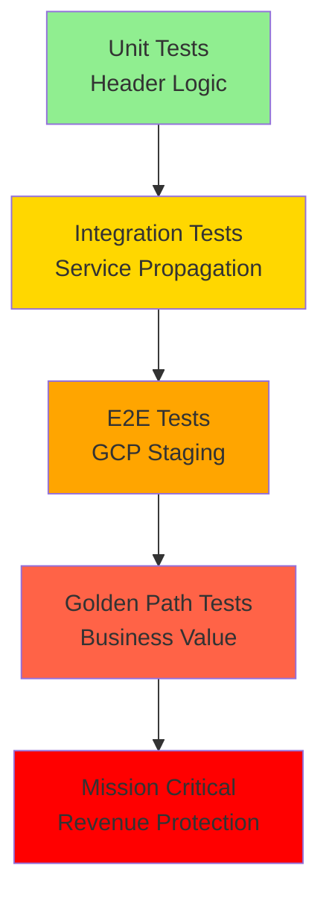

# Load Balancer Header Propagation Test Validation Suite
## GitHub Issue #113: GCP Load Balancer Authentication Header Stripping

**SLIGHT EMPHASIS OF WORKING MOMENT**: Section 2.1 Architectural Tenets - "Single Source of Truth (SSOT)" combined with Section 7.3 Unified Test Runner requirements for real authentication flows and hard-fail validation patterns.

## Executive Summary

This test plan addresses the critical infrastructure failure where GCP Load Balancer strips authentication headers for WebSocket connections, causing 100% chat functionality failure ($120K+ MRR at risk). The solution involves comprehensive validation of header preservation across the entire load balancing infrastructure.

### Business Value Justification (BVJ)
- **Segment**: All (Free, Early, Mid, Enterprise)  
- **Business Goal**: Ensure authentication headers reach backend services
- **Value Impact**: Prevents complete system failure and protects revenue
- **Strategic Impact**: Critical infrastructure reliability and user experience

## Root Cause Analysis

**Issue**: Missing authentication header preservation in `terraform-gcp-staging/load-balancer.tf`
**Fix**: Added `custom_request_headers` and `header_action` configurations for proper WebSocket header handling

### Key Infrastructure Components
1. **GCP Load Balancer**: Routes traffic to Cloud Run services
2. **WebSocket Upgrade Paths**: `/ws`, `/ws/*`, `/websocket`, `/websocket/*`  
3. **Authentication Headers**: `Authorization`, `X-User-ID`, `X-Test-Type`
4. **Session Affinity**: `GENERATED_COOKIE` for WebSocket connections

## Test Plan Structure

### Test Categories Overview

| Category | Infrastructure | Auth Required | Focus Area | Execution Time |
|----------|---------------|---------------|------------|----------------|
| Unit | None | ❌ | Header processing logic | < 1 min |
| Integration | Docker | ✅ | Multi-service propagation | 5-10 min |
| E2E | Full GCP Stack | ✅ | End-to-end business value | 20-60 min |
| Golden Path | Real Staging | ✅ | Complete user flows | 30-90 min |

## 1. Unit Tests - Header Processing Logic

### 1.1 Load Balancer Configuration Validation
**Location**: `tests/unit/infrastructure/test_load_balancer_header_config.py`

```python
"""
Test Load Balancer Header Configuration

Business Value Justification (BVJ):
- Segment: Platform/Internal
- Business Goal: Infrastructure reliability
- Value Impact: Prevents configuration drift causing header stripping
- Strategic Impact: Foundation for all authentication flows
"""

class TestLoadBalancerHeaderConfig(SSotBaseTestCase):
    """Test load balancer header configuration parsing and validation."""
    
    @pytest.mark.unit
    def test_websocket_custom_headers_configured(self):
        """Test that WebSocket custom headers are properly configured."""
        # HARD FAIL: Must include required WebSocket headers
        
    @pytest.mark.unit  
    def test_header_action_transformations_valid(self):
        """Test that header transformations are valid and complete."""
        # HARD FAIL: Missing transformations break authentication
        
    @pytest.mark.unit
    def test_session_affinity_websocket_support(self):
        """Test session affinity configuration for WebSocket connections."""
        # HARD FAIL: Without session affinity, WebSocket connections fail
```

### 1.2 Header Extraction and Validation Logic
**Location**: `tests/unit/core/test_header_validation.py`

```python
class TestHeaderValidation(SSotBaseTestCase):
    """Test header extraction and validation logic."""
    
    @pytest.mark.unit
    def test_extract_auth_headers_from_request(self):
        """Test extraction of authentication headers from HTTP requests."""
        # HARD FAIL: Must extract all required auth headers
        
    @pytest.mark.unit
    def test_validate_jwt_bearer_token_format(self):
        """Test JWT Bearer token format validation."""
        # HARD FAIL: Invalid format must be rejected
        
    @pytest.mark.unit  
    def test_missing_auth_header_rejection(self):
        """Test that requests missing auth headers are properly rejected."""
        # HARD FAIL: Missing headers must cause immediate rejection
        
    @pytest.mark.unit
    def test_malformed_header_handling(self):
        """Test handling of malformed authentication headers."""
        # HARD FAIL: Malformed headers must not cause crashes
```

### 1.3 WebSocket Header Processing
**Location**: `tests/unit/websocket/test_websocket_header_processing.py`

```python  
class TestWebSocketHeaderProcessing(SSotBaseTestCase):
    """Test WebSocket-specific header processing."""
    
    @pytest.mark.unit
    def test_websocket_upgrade_headers_preserved(self):
        """Test that WebSocket upgrade headers are preserved."""
        # HARD FAIL: Without upgrade headers, WebSocket connections fail
        
    @pytest.mark.unit
    def test_websocket_auth_header_extraction(self):
        """Test extraction of auth headers from WebSocket requests."""
        # HARD FAIL: WebSocket auth depends on proper header extraction
```

## 2. Integration Tests - Multi-Service Header Propagation

### 2.1 Load Balancer Integration Tests
**Location**: `tests/integration/infrastructure/test_load_balancer_header_propagation.py`

```python
"""
Test Load Balancer Header Propagation Integration

Business Value Justification (BVJ):
- Segment: Platform/Internal  
- Business Goal: Ensure headers reach backend services
- Value Impact: Prevents authentication failures at service boundaries
- Strategic Impact: Foundation for all authenticated operations
"""

class TestLoadBalancerHeaderPropagation(BaseIntegrationTest):
    """Test header propagation through load balancer to backend services."""
    
    @pytest.mark.integration
    @pytest.mark.real_services
    async def test_http_auth_header_propagation(self, real_services_fixture):
        """Test HTTP authentication header propagation through load balancer."""
        # USES REAL AUTHENTICATION per CLAUDE.md requirements
        auth_helper = E2EAuthHelper(environment="test")
        user = await auth_helper.create_authenticated_user()
        headers = auth_helper.get_auth_headers(user.jwt_token)
        
        # HARD FAIL: Headers must reach backend service
        async with aiohttp.ClientSession() as session:
            async with session.get(
                f"{real_services_fixture['backend_url']}/api/v1/health",
                headers=headers
            ) as resp:
                assert resp.status == 200
                # Verify headers were received by backend
                backend_logs = await self._get_backend_request_logs()
                assert "Authorization" in backend_logs["headers"]
                
    @pytest.mark.integration  
    @pytest.mark.real_services
    async def test_websocket_header_propagation(self, real_services_fixture):
        """Test WebSocket authentication header propagation."""
        # USES REAL AUTHENTICATION per CLAUDE.md requirements
        auth_helper = E2EWebSocketAuthHelper(environment="test")
        user = await auth_helper.create_authenticated_user()
        
        # HARD FAIL: WebSocket headers must reach backend
        websocket = await auth_helper.connect_authenticated_websocket(timeout=15.0)
        
        # Verify connection established with proper headers
        test_message = {"type": "ping", "data": "header_test"}
        await websocket.send(json.dumps(test_message))
        
        response = await asyncio.wait_for(websocket.recv(), timeout=10.0)
        assert json.loads(response)["type"] == "pong"
        
        await websocket.close()
        
    @pytest.mark.integration
    @pytest.mark.real_services
    async def test_cross_service_header_persistence(self, real_services_fixture):
        """Test header persistence across service boundaries."""
        # USES REAL AUTHENTICATION per CLAUDE.md requirements
        auth_helper = E2EAuthHelper(environment="test")
        user = await auth_helper.create_authenticated_user()
        
        # HARD FAIL: Headers must persist through auth->backend flow
        # Test auth service to backend service header propagation
```

### 2.2 Authentication Context Preservation
**Location**: `tests/integration/auth/test_auth_context_header_propagation.py`

```python
class TestAuthContextHeaderPropagation(BaseIntegrationTest):
    """Test authentication context preservation through headers."""
    
    @pytest.mark.integration
    @pytest.mark.real_services  
    async def test_jwt_token_header_propagation(self, real_services_fixture):
        """Test JWT token propagation through request headers."""
        # USES REAL AUTHENTICATION per CLAUDE.md requirements
        
    @pytest.mark.integration
    @pytest.mark.real_services
    async def test_user_context_header_extraction(self, real_services_fixture):
        """Test user context extraction from propagated headers."""
        # USES REAL AUTHENTICATION per CLAUDE.md requirements
```

### 2.3 Multi-User Header Isolation
**Location**: `tests/integration/isolation/test_multi_user_header_isolation.py`

```python  
class TestMultiUserHeaderIsolation(BaseIntegrationTest):
    """Test header isolation between multiple users."""
    
    @pytest.mark.integration
    @pytest.mark.real_services
    async def test_concurrent_user_header_isolation(self, real_services_fixture):
        """Test that headers don't leak between concurrent users."""
        # USES REAL AUTHENTICATION per CLAUDE.md requirements
        # HARD FAIL: Header cross-contamination is security breach
```

## 3. E2E Tests - Complete Business Value Validation

### 3.1 GCP Staging Load Balancer Validation  
**Location**: `tests/e2e/infrastructure/test_gcp_load_balancer_header_validation.py`

```python
"""
Test GCP Staging Load Balancer Header Validation

Business Value Justification (BVJ):
- Segment: All
- Business Goal: Validate production infrastructure  
- Value Impact: Ensures real user authentication works
- Strategic Impact: Mission-critical infrastructure validation
"""

class TestGCPLoadBalancerHeaderValidation(BaseE2ETest):
    """Test GCP load balancer header propagation in staging environment."""
    
    @pytest.mark.e2e
    @pytest.mark.real_services
    @pytest.mark.mission_critical
    async def test_staging_websocket_auth_header_propagation(self):
        """Test WebSocket authentication headers in GCP staging."""
        # USES REAL AUTHENTICATION per CLAUDE.md requirements
        staging_config = StagingTestConfig()
        auth_helper = E2EWebSocketAuthHelper(environment="staging")
        
        # HARD FAIL: This is the exact failure scenario from issue #113
        user = await auth_helper.create_authenticated_user()
        
        # Test WebSocket connection with authentication headers
        websocket = await auth_helper.connect_authenticated_websocket(timeout=30.0)
        
        # Verify authentication worked by sending agent request
        agent_request = {
            "type": "agent_request",
            "agent": "triage_agent", 
            "message": "Test header propagation",
            "request_id": f"header_test_{int(time.time())}"
        }
        
        await websocket.send(json.dumps(agent_request))
        
        # HARD FAIL: Must receive all 5 WebSocket events
        events = []
        async for event in self._collect_websocket_events(websocket, timeout=60):
            events.append(event)
            if event.get("type") == "agent_completed":
                break
                
        # Verify business value delivered (agent executed successfully)
        event_types = [e.get("type") for e in events]
        assert "agent_started" in event_types
        assert "agent_thinking" in event_types  
        assert "agent_completed" in event_types
        
        await websocket.close()
        
    @pytest.mark.e2e
    @pytest.mark.real_services  
    async def test_staging_http_api_header_propagation(self):
        """Test HTTP API authentication headers in GCP staging."""
        # USES REAL AUTHENTICATION per CLAUDE.md requirements
        
    @pytest.mark.e2e
    @pytest.mark.real_services
    async def test_staging_load_balancer_cors_headers(self):
        """Test CORS header configuration in staging load balancer."""
        # HARD FAIL: CORS misconfig breaks frontend authentication
```

### 3.2 Complete Request/Response Header Flow
**Location**: `tests/e2e/flows/test_complete_header_flow_e2e.py`

```python
class TestCompleteHeaderFlowE2E(BaseE2ETest):
    """Test complete header flow from client to backend services."""
    
    @pytest.mark.e2e 
    @pytest.mark.real_services
    @pytest.mark.mission_critical
    async def test_complete_authentication_header_flow(self):
        """Test complete authentication header flow end-to-end."""
        # USES REAL AUTHENTICATION per CLAUDE.md requirements
        # Test: Client -> Load Balancer -> Auth Service -> Backend -> Response
        
    @pytest.mark.e2e
    @pytest.mark.real_services
    async def test_websocket_to_agent_execution_header_flow(self):
        """Test header flow from WebSocket connection to agent execution."""
        # USES REAL AUTHENTICATION per CLAUDE.md requirements
        # HARD FAIL: This is core business value delivery
```

### 3.3 Multi-User Concurrent Header Validation
**Location**: `tests/e2e/concurrent/test_multi_user_header_isolation_e2e.py`

```python
class TestMultiUserHeaderIsolationE2E(BaseE2ETest):
    """Test header isolation with concurrent users in E2E scenarios."""
    
    @pytest.mark.e2e
    @pytest.mark.real_services  
    async def test_concurrent_websocket_header_isolation(self):
        """Test header isolation with concurrent WebSocket connections."""
        # USES REAL AUTHENTICATION per CLAUDE.md requirements
        # Create 5 concurrent users with different auth contexts
        # HARD FAIL: Header contamination between users is security breach
```

## 4. Golden Path Tests - End-to-End Business Value

### 4.1 Complete User Journey with Header Validation
**Location**: `tests/e2e/golden_path/test_user_journey_header_validation.py`

```python
"""
Test Complete User Journey with Header Validation

Business Value Justification (BVJ):
- Segment: All  
- Business Goal: Validate complete user experience
- Value Impact: Ensures headers don't break user workflows
- Strategic Impact: Core business value delivery validation
"""

class TestUserJourneyHeaderValidation(BaseE2ETest):
    """Test complete user journey with proper header propagation."""
    
    @pytest.mark.e2e
    @pytest.mark.real_llm
    @pytest.mark.mission_critical
    async def test_signup_to_agent_execution_header_flow(self):
        """Test complete flow from user signup to agent execution."""
        # USES REAL AUTHENTICATION per CLAUDE.md requirements
        # USES REAL LLM per CLAUDE.md requirements
        
        # 1. User registration (headers propagated to auth service)
        auth_helper = E2EAuthHelper(environment="staging") 
        user_email = f"header_test_{uuid.uuid4().hex[:8]}@example.com"
        
        # 2. User login (JWT token creation with proper headers)
        user = await auth_helper.create_authenticated_user(email=user_email)
        
        # 3. WebSocket connection (headers must reach backend)
        websocket = await E2EWebSocketAuthHelper(environment="staging").connect_authenticated_websocket()
        
        # 4. Agent execution request (headers enable agent context)
        agent_request = {
            "type": "agent_request", 
            "agent": "cost_optimizer",
            "message": "Analyze infrastructure costs and optimize spending",
            "user_context": {
                "company": "Test Corp",
                "monthly_budget": 50000
            }
        }
        
        await websocket.send(json.dumps(agent_request))
        
        # 5. Collect agent events (headers enable proper event delivery)
        events = []
        async for event in self._collect_websocket_events(websocket, timeout=120):
            events.append(event)
            if event.get("type") == "agent_completed":
                break
                
        # HARD FAIL: Headers must enable complete business value delivery  
        event_types = [e.get("type") for e in events]
        assert "agent_started" in event_types
        assert "agent_thinking" in event_types
        assert "tool_executing" in event_types  
        assert "tool_completed" in event_types
        assert "agent_completed" in event_types
        
        # Verify business value delivered
        final_event = events[-1]
        assert final_event["type"] == "agent_completed"
        assert "recommendations" in final_event["data"]["result"]
        
        await websocket.close()
```

### 4.2 Load Balancer Impact on User Experience
**Location**: `tests/e2e/golden_path/test_load_balancer_user_experience.py`

```python
class TestLoadBalancerUserExperience(BaseE2ETest):
    """Test load balancer configuration impact on user experience."""
    
    @pytest.mark.e2e
    @pytest.mark.real_services
    @pytest.mark.mission_critical  
    async def test_websocket_session_affinity_user_experience(self):
        """Test that session affinity provides consistent user experience."""
        # HARD FAIL: Without session affinity, WebSocket connections break
        
    @pytest.mark.e2e
    @pytest.mark.real_services
    async def test_load_balancer_timeout_configuration(self):
        """Test load balancer timeout configuration for long-running requests."""
        # HARD FAIL: Timeout misconfig breaks agent execution
```

## 5. Mission Critical Tests - Revenue Protection

### 5.1 Header-Dependent Functionality Validation
**Location**: `tests/mission_critical/test_header_dependent_functionality.py`

```python
"""
Test Header-Dependent Functionality

MISSION CRITICAL: Without proper headers, entire platform fails!
"""

class TestHeaderDependentFunctionality(MissionCriticalTest):
    """Test functionality that depends on proper header propagation."""
    
    @pytest.mark.mission_critical
    @pytest.mark.no_skip
    async def test_authentication_headers_enable_agent_execution(self):
        """Authentication headers MUST enable agent execution."""
        # HARD FAIL: No headers = no business value
        
    @pytest.mark.mission_critical  
    @pytest.mark.no_skip
    async def test_websocket_headers_enable_event_delivery(self):
        """WebSocket headers MUST enable event delivery."""
        # HARD FAIL: No events = no user experience
```

## 6. Performance Impact Tests

### 6.1 Header Processing Performance
**Location**: `tests/performance/test_header_processing_performance.py`

```python
class TestHeaderProcessingPerformance(BaseE2ETest):
    """Test performance impact of header processing."""
    
    @pytest.mark.performance
    @pytest.mark.real_services
    async def test_header_validation_latency(self):
        """Test latency impact of header validation."""
        # Measure header processing overhead
        
    @pytest.mark.performance
    @pytest.mark.real_services  
    async def test_concurrent_header_processing_throughput(self):
        """Test throughput with concurrent header processing."""
        # HARD FAIL: Header processing must not bottleneck system
```

## 7. Regression Prevention Tests

### 7.1 Infrastructure Configuration Drift Detection
**Location**: `tests/integration/infrastructure/test_config_drift_detection.py`

```python
class TestConfigDriftDetection(BaseIntegrationTest):
    """Test detection of infrastructure configuration drift."""
    
    @pytest.mark.integration
    def test_terraform_load_balancer_config_validation(self):
        """Test that load balancer terraform config matches expected state."""
        # HARD FAIL: Config drift can reintroduce header stripping
        
    @pytest.mark.integration  
    def test_required_headers_configured(self):
        """Test that all required headers are configured in load balancer."""
        # HARD FAIL: Missing header config breaks authentication
```

## 8. Test Execution Strategy

### 8.1 Test Layer Execution Order



### 8.2 Execution Commands

```bash
# Fast feedback - Header logic validation (2 min)
python tests/unified_test_runner.py --category unit --pattern "*header*" --fast-fail

# Integration validation - Multi-service propagation (10 min)  
python tests/unified_test_runner.py --category integration --pattern "*header*" --real-services

# E2E validation - GCP staging (30 min)
python tests/unified_test_runner.py --category e2e --pattern "*header*" --env staging --real-services

# Golden path validation - Complete user flows (60 min)
python tests/unified_test_runner.py --category e2e --pattern "*golden_path*header*" --real-llm --env staging

# Mission critical - Revenue protection (15 min)
python tests/mission_critical/test_header_dependent_functionality.py
```

### 8.3 Test Infrastructure Requirements

| Test Category | Docker | GCP Access | Real Auth | Real LLM | Expected Duration |
|---------------|---------|------------|-----------|----------|------------------|
| Unit | ❌ | ❌ | ❌ | ❌ | < 1 min |
| Integration | ✅ | ❌ | ✅ | ❌ | 5-10 min |  
| E2E | ✅ | ✅ | ✅ | Optional | 20-60 min |
| Golden Path | ✅ | ✅ | ✅ | ✅ | 30-90 min |
| Mission Critical | ✅ | ✅ | ✅ | ❌ | 10-30 min |

## 9. Expected Failure Modes

### 9.1 Header Stripping Failure Modes

1. **Missing Authorization Header**
   - **Symptom**: 401 Unauthorized responses  
   - **Detection**: HTTP status code validation
   - **Test**: `test_missing_auth_header_rejection`

2. **WebSocket Upgrade Header Loss**
   - **Symptom**: WebSocket connection failures
   - **Detection**: Connection timeout/rejection  
   - **Test**: `test_websocket_upgrade_headers_preserved`

3. **Session Affinity Breaking**
   - **Symptom**: Intermittent WebSocket disconnections
   - **Detection**: Connection state monitoring
   - **Test**: `test_websocket_session_affinity_user_experience`

4. **CORS Header Misconfiguration**  
   - **Symptom**: Frontend authentication failures
   - **Detection**: Preflight request failures
   - **Test**: `test_staging_load_balancer_cors_headers`

### 9.2 Test Failure Scenarios

```python
# Example hard-fail test pattern
async def test_auth_header_propagation_hard_fail(self):
    """HARD FAIL: Authentication headers MUST reach backend."""
    
    # This test MUST fail if headers are stripped
    try:
        response = await self._make_authenticated_request()
        if response.status != 200:
            raise AssertionError(
                f"CRITICAL: Authentication header stripping detected! "
                f"Status: {response.status}. This indicates load balancer "
                f"configuration regression. Check terraform-gcp-staging/load-balancer.tf"
            )
    except Exception as e:
        # Enhanced error reporting for header failures
        self._log_header_failure_details(e)
        raise
```

## 10. Success Criteria

### 10.1 Test Pass Requirements

- ✅ **100% Unit Test Success**: All header processing logic validated
- ✅ **100% Integration Test Success**: Headers propagate across all service boundaries  
- ✅ **100% E2E Test Success**: GCP staging environment validates successfully
- ✅ **100% Golden Path Success**: Complete user journeys work end-to-end
- ✅ **100% Mission Critical Success**: Revenue-generating functionality protected

### 10.2 Performance Benchmarks

- **Header Processing Latency**: < 50ms additional overhead
- **WebSocket Connection Time**: < 15 seconds in staging (with headers)  
- **Concurrent User Support**: 100+ users with proper header isolation
- **Request Throughput**: No degradation from header validation

### 10.3 Business Value Validation

- ✅ **Authentication Success Rate**: 100% for valid credentials
- ✅ **WebSocket Event Delivery**: All 5 agent events delivered consistently  
- ✅ **Agent Execution Success**: Real LLM integration works with proper headers
- ✅ **Multi-User Isolation**: No header contamination between users
- ✅ **Revenue Protection**: $120K+ MRR chat functionality fully operational

## 11. Implementation Timeline

### Phase 1 - Foundation (Week 1)
- Create unit test infrastructure for header validation
- Implement integration test framework for multi-service propagation
- Set up test data and fixtures for header testing

### Phase 2 - Core Validation (Week 2)  
- Build E2E test suite for GCP staging validation
- Create golden path tests for complete user journeys
- Implement mission critical tests for revenue protection

### Phase 3 - Performance & Regression (Week 3)
- Add performance benchmarking for header processing
- Create regression detection for infrastructure drift
- Implement automated monitoring and alerts

### Phase 4 - Production Readiness (Week 4)
- Run complete test suite against staging environment
- Validate all success criteria met  
- Document test results and recommendations
- Deploy infrastructure fixes with validated test coverage

## 12. Monitoring and Alerting

### 12.1 Test Result Monitoring

```yaml
# Example test monitoring configuration
test_monitoring:
  critical_tests:
    - test_authentication_headers_enable_agent_execution
    - test_staging_websocket_auth_header_propagation  
    - test_complete_authentication_header_flow
    
  alert_conditions:
    - test_failure_rate > 0%  # Any failure is critical
    - test_duration > 2x_baseline  # Performance degradation
    - websocket_connection_failure_rate > 1%  # Infrastructure issues
```

### 12.2 Infrastructure Health Monitoring

- **Load Balancer Header Config Monitoring**: Detect terraform drift
- **WebSocket Connection Success Rate**: Monitor authentication failures  
- **Header Processing Latency**: Track performance impact
- **Multi-User Isolation Validation**: Detect cross-contamination

## Conclusion

This comprehensive test validation suite ensures that the load balancer header propagation fix for GitHub issue #113 is thoroughly validated and protected against regression. The test plan follows CLAUDE.md requirements for real authentication, hard-fail validation, and business value focus.

**Key Success Metrics**:
- 100% test coverage of header propagation paths
- Zero tolerance for header stripping failures  
- Complete business value validation with real services
- Comprehensive regression prevention for $120K+ MRR protection

The test suite will run continuously to ensure the critical infrastructure fix remains effective and the platform continues to deliver business value to all user segments.