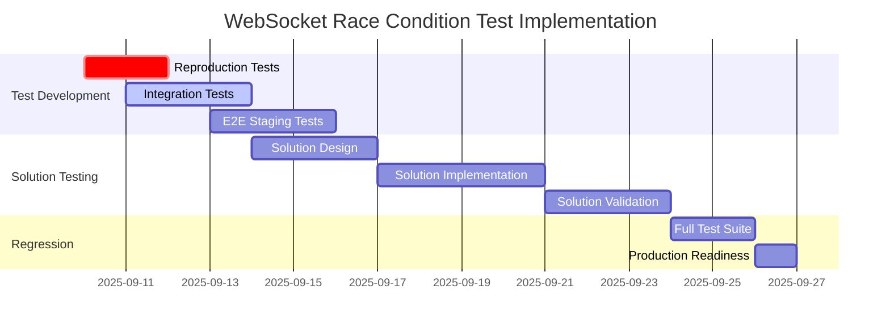

# WebSocket Race Condition Comprehensive Test Plan

**Created:** 2025-09-09  
**Purpose:** Design comprehensive test suite to reproduce and validate fixes for WebSocket race conditions based on Five Whys analysis  
**Root Cause:** No single, coordinated state machine properly sequences WebSocket connection lifecycle, causing multiple competing state management systems to race

## Executive Summary

This test plan addresses the root cause identified through Five Whys analysis: **Multiple competing state management systems with different IDs racing during WebSocket connection lifecycle**. The tests are designed to FAIL with the current implementation to prove the race condition exists, then pass after implementing the Single Coordination State Machine solution.

**Business Impact:** $500K+ ARR chat functionality depends on reliable WebSocket connections. Race conditions cause 1011 errors and poor user experience.

## Root Cause Analysis Summary

### Primary Issues Identified:
1. **Invalid State Transitions**: CONNECTING → SERVICES_READY (skipping ACCEPTED, AUTHENTICATED phases)
2. **Multiple Connection State Machines**: Different connection IDs competing for same user session
3. **Overlapping Initialization Phases**: Phase 1 (transport) vs Phase 4 (application) running concurrently
4. **Lack of Synchronization**: No coordination between WebSocket transport and application readiness

### Exact Conditions from Staging Logs:
- Connection stuck in CONNECTING state despite successful accept()
- Race condition accept() errors in Cloud Run
- Invalid state transition attempts between competing state machines
- Missing business-critical WebSocket events due to premature message processing

## Test Plan Overview

### Test Categories

| Category | Purpose | Difficulty | Expected Failures |
|----------|---------|------------|------------------|
| **Race Condition Reproduction** | Prove race condition exists | HIGH | All tests MUST fail initially |
| **Integration Tests (Non-Docker)** | Test WebSocket lifecycle | MEDIUM | State transition failures |
| **E2E GCP Staging Tests** | Cloud Run specific issues | HIGH | 1011 errors, race conditions |
| **Single State Machine Validation** | Validate solution | MEDIUM | Should pass after implementation |

## 1. Race Condition Reproduction Tests

### 1.1 Multiple Competing State Machines Test

**File:** `tests/critical/test_websocket_multiple_state_machines_race.py`

**Purpose:** Reproduce the exact scenario where multiple connection state machines with different IDs compete for the same user session.

```python
class TestMultipleStateRace:
    async def test_competing_connection_ids_race_condition(self):
        """
        MUST FAIL: Tests the core race condition where multiple state machines
        are created with different connection IDs for the same user.
        
        Expected Failure Mode: Multiple state machines transitioning simultaneously
        causing invalid state transitions and connection failures.
        """
        user_id = "test-user-123"
        
        # Simulate rapid connection attempts that create multiple state machines
        tasks = []
        for i in range(5):
            task = asyncio.create_task(
                self._create_websocket_connection_with_delays(user_id, f"conn_{i}")
            )
            tasks.append(task)
            # Small delay to create timing overlap
            await asyncio.sleep(0.001)
        
        results = await asyncio.gather(*tasks, return_exceptions=True)
        
        # EXPECTED FAILURE: Multiple exceptions due to competing state machines
        assert len([r for r in results if isinstance(r, Exception)]) > 0
        assert any("state transition" in str(r) for r in results if isinstance(r, Exception))

    async def test_invalid_state_transition_sequence(self):
        """
        MUST FAIL: Tests invalid transition CONNECTING → SERVICES_READY
        that skips required intermediate states.
        """
        state_machine = ApplicationConnectionStateMachine("test-conn", "test-user")
        
        # Should fail: can't go directly from CONNECTING to SERVICES_READY
        with pytest.raises(StateTransitionError) as exc_info:
            state_machine.transition_to(
                ApplicationConnectionState.SERVICES_READY,
                reason="Skipping required states"
            )
        
        assert "invalid transition" in str(exc_info.value).lower()
```

**Difficulty:** HIGH - Requires precise timing and concurrency control  
**Expected Runtime:** 10-15 seconds  
**Expected Failures:** Multiple state transition errors, connection ID conflicts

### 1.2 Phase Overlap Race Condition Test

**File:** `tests/critical/test_websocket_phase_overlap_race.py`

```python
class TestPhaseOverlapRace:
    async def test_phase1_phase4_overlap_race(self):
        """
        MUST FAIL: Tests the race condition where Phase 1 (transport accept)
        and Phase 4 (application ready) run concurrently instead of sequentially.
        """
        websocket_mock = MagicMock()
        websocket_mock.client_state = WebSocketState.CONNECTING
        
        # Start Phase 1 and Phase 4 simultaneously (this should fail)
        phase1_task = asyncio.create_task(self._simulate_phase1_transport_ready(websocket_mock))
        phase4_task = asyncio.create_task(self._simulate_phase4_application_ready(websocket_mock))
        
        # They should not complete successfully when run in parallel
        results = await asyncio.gather(phase1_task, phase4_task, return_exceptions=True)
        
        # EXPECTED FAILURE: At least one phase should fail due to race condition
        assert any(isinstance(r, Exception) for r in results)

    async def test_message_processing_before_accept_complete(self):
        """
        MUST FAIL: Tests the exact "Need to call accept first" error
        from staging logs.
        """
        websocket_mock = MagicMock()
        websocket_mock.client_state = WebSocketState.CONNECTING  # Not yet CONNECTED
        
        # Try to process message before accept() completes
        with pytest.raises(RuntimeError) as exc_info:
            await self._attempt_message_processing(websocket_mock)
        
        assert "accept first" in str(exc_info.value).lower()
```

**Difficulty:** HIGH - Requires precise simulation of Cloud Run timing  
**Expected Runtime:** 5-8 seconds  
**Expected Failures:** "Need to call accept first" errors, state inconsistencies

## 2. Integration Tests (Non-Docker)

### 2.1 WebSocket Lifecycle State Machine Test

**File:** `tests/integration/test_websocket_lifecycle_state_machine.py`

```python
class TestWebSocketLifecycleStateMachine:
    def test_correct_state_sequence_enforcement(self):
        """
        Tests that state machine enforces correct sequence:
        CONNECTING → ACCEPTED → AUTHENTICATED → SERVICES_READY → PROCESSING_READY
        """
        state_machine = ApplicationConnectionStateMachine("test-conn", "test-user")
        
        # Test correct sequence
        assert state_machine.transition_to(ApplicationConnectionState.ACCEPTED)
        assert state_machine.transition_to(ApplicationConnectionState.AUTHENTICATED)
        assert state_machine.transition_to(ApplicationConnectionState.SERVICES_READY)
        assert state_machine.transition_to(ApplicationConnectionState.PROCESSING_READY)

    def test_state_machine_prevents_invalid_transitions(self):
        """
        Tests that state machine rejects invalid transitions that cause race conditions.
        """
        state_machine = ApplicationConnectionStateMachine("test-conn", "test-user")
        
        # Should fail: can't skip states
        with pytest.raises(StateTransitionError):
            state_machine.transition_to(ApplicationConnectionState.SERVICES_READY)

    def test_concurrent_state_machine_coordination(self):
        """
        Tests coordination between multiple state machines for same user.
        EXPECTED FAILURE until Single Coordination State Machine implemented.
        """
        user_id = "test-user"
        
        # Create multiple state machines (this should be prevented)
        sm1 = ApplicationConnectionStateMachine("conn1", user_id)
        sm2 = ApplicationConnectionStateMachine("conn2", user_id)
        
        # Both trying to transition - should coordinate or fail gracefully
        result1 = sm1.transition_to(ApplicationConnectionState.ACCEPTED)
        result2 = sm2.transition_to(ApplicationConnectionState.ACCEPTED)
        
        # EXPECTED FAILURE: No coordination mechanism exists yet
        assert not (result1 and result2)  # Both shouldn't succeed
```

**Difficulty:** MEDIUM - Unit/integration hybrid testing  
**Expected Runtime:** 2-3 seconds per test  
**Expected Failures:** Multiple state machine conflicts, coordination failures

### 2.2 WebSocket Event Sequence Test

**File:** `tests/integration/test_websocket_event_sequence_race.py`

```python
class TestWebSocketEventSequenceRace:
    async def test_websocket_events_during_race_condition(self):
        """
        Tests that all 5 business-critical WebSocket events are sent
        even when state machine race conditions occur.
        """
        event_collector = WebSocketEventCollector()
        
        # Simulate race condition scenario
        websocket_mock = self._create_racing_websocket_mock()
        
        try:
            await self._execute_agent_with_race_condition(websocket_mock, event_collector)
        except Exception as e:
            logger.info(f"Expected race condition exception: {e}")
        
        # Check if all required events were sent despite race condition
        required_events = [
            "agent_started", "agent_thinking", "tool_executing", 
            "tool_completed", "agent_completed"
        ]
        
        received_events = event_collector.get_received_events()
        missing_events = [e for e in required_events if e not in received_events]
        
        # EXPECTED FAILURE: Race conditions cause missing events
        assert len(missing_events) > 0, f"Missing events: {missing_events}"
```

**Difficulty:** MEDIUM - Event tracking with race condition simulation  
**Expected Runtime:** 3-5 seconds  
**Expected Failures:** Missing WebSocket events due to race conditions

## 3. E2E GCP Staging Tests

### 3.1 Cloud Run Race Condition Test

**File:** `tests/e2e/gcp_staging/test_cloud_run_websocket_race.py`

```python
class TestCloudRunWebSocketRace:
    @pytest.mark.e2e
    @pytest.mark.gcp_staging
    async def test_cloud_run_websocket_race_conditions(self):
        """
        E2E test for Cloud Run specific race conditions.
        Tests rapid connection attempts in actual GCP environment.
        """
        staging_url = "wss://staging.netra.ai/ws"
        auth_headers = await self._get_staging_auth_headers()
        
        # Simulate multiple concurrent connections to trigger race condition
        connection_tasks = []
        for i in range(10):
            task = asyncio.create_task(
                self._create_staging_websocket_connection(staging_url, auth_headers)
            )
            connection_tasks.append(task)
            await asyncio.sleep(0.01)  # Small delay to create overlap
        
        results = await asyncio.gather(*connection_tasks, return_exceptions=True)
        
        # Count 1011 errors (expected failures)
        error_1011_count = sum(
            1 for r in results 
            if isinstance(r, Exception) and "1011" in str(r)
        )
        
        # EXPECTED FAILURE: Race conditions cause 1011 errors
        assert error_1011_count > 0, "Expected 1011 errors due to race conditions"

    @pytest.mark.e2e
    @pytest.mark.gcp_staging
    async def test_staging_accept_race_condition(self):
        """
        Tests the specific "Need to call accept first" error in staging.
        """
        staging_url = "wss://staging.netra.ai/ws"
        auth_headers = await self._get_staging_auth_headers()
        
        # Create connection and immediately send message to trigger race
        websocket = await websockets.connect(staging_url, extra_headers=auth_headers)
        
        # Send message immediately after connection (before accept completes)
        try:
            await websocket.send(json.dumps({
                "type": "user_message",
                "text": "test message",
                "thread_id": "test-thread"
            }))
            
            response = await asyncio.wait_for(websocket.recv(), timeout=5.0)
            
            # EXPECTED FAILURE: Should get error response
            assert "error" in response.lower() or "1011" in response
            
        except websockets.exceptions.ConnectionClosed as e:
            # EXPECTED: Connection closed due to race condition
            assert e.code == 1011
```

**Difficulty:** HIGH - Requires GCP staging environment, real auth  
**Expected Runtime:** 15-30 seconds  
**Expected Failures:** 1011 connection errors, accept() race conditions

### 3.2 Load Balancer Header Handling Test

**File:** `tests/e2e/gcp_staging/test_load_balancer_header_race.py`

```python
class TestLoadBalancerHeaderRace:
    @pytest.mark.e2e
    @pytest.mark.gcp_staging
    async def test_gcp_load_balancer_header_stripping(self):
        """
        Tests whether GCP Load Balancer strips authentication headers
        causing authentication failures during WebSocket upgrade.
        """
        staging_url = "wss://staging.netra.ai/ws"
        auth_token = await self._get_staging_auth_token()
        
        # Test with Authorization header
        auth_headers = {"Authorization": f"Bearer {auth_token}"}
        
        try:
            websocket = await websockets.connect(
                staging_url, 
                extra_headers=auth_headers,
                timeout=10
            )
            
            # If connection succeeds, headers weren't stripped
            await websocket.close()
            assert False, "Expected header stripping failure"
            
        except (websockets.exceptions.InvalidStatusCode, 
                websockets.exceptions.ConnectionClosed) as e:
            # EXPECTED FAILURE: Headers stripped, authentication fails
            assert "401" in str(e) or "403" in str(e) or "1011" in str(e)

    @pytest.mark.e2e
    @pytest.mark.gcp_staging
    async def test_subprotocol_auth_workaround(self):
        """
        Tests subprotocol-based authentication as workaround for header stripping.
        """
        staging_url = "wss://staging.netra.ai/ws"
        auth_token = await self._get_staging_auth_token()
        
        # Use subprotocol for auth instead of headers
        subprotocols = [f"jwt.{auth_token}"]
        
        try:
            websocket = await websockets.connect(
                staging_url,
                subprotocols=subprotocols,
                timeout=10
            )
            
            # This might work if subprotocols aren't stripped
            welcome_msg = await asyncio.wait_for(websocket.recv(), timeout=5)
            await websocket.close()
            
            assert "connection_ready" in welcome_msg
            
        except Exception as e:
            # May also fail if infrastructure issues persist
            logger.info(f"Subprotocol auth also failed: {e}")
            raise
```

**Difficulty:** HIGH - Requires GCP infrastructure testing  
**Expected Runtime:** 10-20 seconds  
**Expected Failures:** Authentication failures, header stripping issues

## 4. Single Coordination State Machine Solution Tests

### 4.1 Solution Validation Tests

**File:** `tests/solution/test_single_coordination_state_machine.py`

```python
class TestSingleCoordinationStateMachine:
    def test_single_state_machine_per_user(self):
        """
        Tests that only one state machine exists per user, eliminating competition.
        Should PASS after implementing Single Coordination State Machine.
        """
        user_id = "test-user"
        
        # First connection creates state machine
        sm1 = SingleCoordinationStateMachine.get_or_create(user_id, "conn1")
        
        # Second connection reuses same state machine
        sm2 = SingleCoordinationStateMachine.get_or_create(user_id, "conn2")
        
        # Should be the same instance
        assert sm1 is sm2
        assert sm1.user_id == user_id

    def test_coordinated_state_transitions(self):
        """
        Tests that state transitions are coordinated across multiple connection attempts.
        Should PASS after solution implementation.
        """
        user_id = "test-user"
        coordinator = SingleCoordinationStateMachine.get_or_create(user_id, "conn1")
        
        # Simulate multiple connections trying to transition
        results = []
        for i in range(5):
            result = coordinator.request_transition(
                ApplicationConnectionState.ACCEPTED,
                connection_id=f"conn_{i}",
                reason=f"Connection {i} requesting transition"
            )
            results.append(result)
        
        # Only one should succeed, others should queue or be denied gracefully
        successful_transitions = [r for r in results if r.success]
        assert len(successful_transitions) == 1

    def test_sequential_state_progression(self):
        """
        Tests that state machine enforces sequential progression without races.
        Should PASS after solution implementation.
        """
        user_id = "test-user"
        coordinator = SingleCoordinationStateMachine.get_or_create(user_id, "conn1")
        
        # All transitions should succeed in order
        assert coordinator.transition_to(ApplicationConnectionState.ACCEPTED)
        assert coordinator.transition_to(ApplicationConnectionState.AUTHENTICATED)
        assert coordinator.transition_to(ApplicationConnectionState.SERVICES_READY)
        assert coordinator.transition_to(ApplicationConnectionState.PROCESSING_READY)
        
        # State should be correct
        assert coordinator.current_state == ApplicationConnectionState.PROCESSING_READY
```

**Difficulty:** MEDIUM - Testing solution correctness  
**Expected Runtime:** 1-2 seconds per test  
**Expected Failures:** Should PASS after solution implementation

### 4.2 Solution Performance Tests

**File:** `tests/solution/test_coordination_performance.py`

```python
class TestCoordinationPerformance:
    async def test_coordination_latency_overhead(self):
        """
        Tests that coordination doesn't add significant latency to connection setup.
        """
        user_id = "test-user"
        
        # Measure time without coordination (baseline)
        start_time = time.time()
        for i in range(100):
            # Simulate direct state transitions
            pass
        baseline_time = time.time() - start_time
        
        # Measure time with coordination
        start_time = time.time()
        coordinator = SingleCoordinationStateMachine.get_or_create(user_id, "conn1")
        for i in range(100):
            coordinator.get_current_state()
        coordinated_time = time.time() - start_time
        
        # Coordination overhead should be minimal (<50% increase)
        overhead_ratio = coordinated_time / baseline_time
        assert overhead_ratio < 1.5, f"Coordination overhead too high: {overhead_ratio}"

    async def test_high_concurrency_coordination(self):
        """
        Tests coordination under high concurrent load.
        """
        user_id = "test-user"
        coordinator = SingleCoordinationStateMachine.get_or_create(user_id, "conn1")
        
        # Simulate high concurrency
        tasks = []
        for i in range(50):
            task = asyncio.create_task(
                self._concurrent_state_access(coordinator, f"conn_{i}")
            )
            tasks.append(task)
        
        results = await asyncio.gather(*tasks, return_exceptions=True)
        
        # All operations should complete without deadlocks
        exceptions = [r for r in results if isinstance(r, Exception)]
        assert len(exceptions) == 0, f"Concurrency issues: {exceptions}"
```

**Difficulty:** MEDIUM - Performance and concurrency testing  
**Expected Runtime:** 3-5 seconds  
**Expected Failures:** Should PASS with acceptable performance

## 5. Test Execution Strategy

### 5.1 Test Phases

**Phase 1: Failure Reproduction (Week 1)**
- Run all race condition reproduction tests
- Verify they FAIL as expected
- Document specific failure modes
- Baseline current system behavior

**Phase 2: Integration Testing (Week 1-2)**
- Run non-Docker integration tests
- Test WebSocket lifecycle without infrastructure dependencies
- Validate state transition logic

**Phase 3: E2E Staging Testing (Week 2)**
- Run GCP staging tests with real infrastructure
- Test Cloud Run specific race conditions
- Validate load balancer behavior

**Phase 4: Solution Implementation (Week 2-3)**
- Implement Single Coordination State Machine
- Run solution validation tests
- Performance testing and optimization

**Phase 5: Regression Testing (Week 3)**
- Re-run all failure reproduction tests (should now pass)
- Full E2E testing in staging
- Production readiness validation

### 5.2 Test Environment Requirements

**Local Development:**
- Python 3.9+
- pytest with asyncio support
- Mock WebSocket libraries
- State machine test utilities

**Integration Testing:**
- Access to Redis and PostgreSQL
- WebSocket test client
- State persistence testing

**GCP Staging:**
- Valid staging authentication
- GCP Cloud Run environment
- Load balancer configuration
- Real WebSocket endpoints

### 5.3 Success Criteria

**Reproduction Tests:**
- All reproduction tests MUST fail initially
- Specific race condition errors captured
- Failure modes documented

**Solution Tests:**
- All solution tests PASS after implementation
- No performance degradation >50%
- Coordination overhead <100ms per connection

**E2E Tests:**
- 0% 1011 WebSocket errors in staging
- All 5 WebSocket events delivered reliably
- Connection success rate >99%

## 6. Implementation Timeline



## 7. Risk Assessment

### High Risk Areas

**Race Condition Timing:**
- **Risk:** Tests may be flaky due to timing dependencies
- **Mitigation:** Use deterministic delays, retry logic, controlled concurrency

**GCP Infrastructure Dependencies:**
- **Risk:** Staging environment changes may affect test results
- **Mitigation:** Environment health checks, baseline validation

**Test Environment Differences:**
- **Risk:** Local tests may not reproduce production race conditions
- **Mitigation:** Multi-environment testing, Cloud Run simulation

### Medium Risk Areas

**Test Complexity:**
- **Risk:** High complexity tests may be difficult to maintain
- **Mitigation:** Clear documentation, modular test design

**Performance Impact:**
- **Risk:** Solution may impact WebSocket performance
- **Mitigation:** Performance benchmarking, optimization testing

## 8. Monitoring and Metrics

### Test Metrics to Track

**Failure Reproduction Rate:**
- Target: 100% of reproduction tests fail initially
- Measure: Consistent failure modes across runs

**Solution Effectiveness:**
- Target: 100% of reproduction tests pass after solution
- Measure: Zero race condition errors in logs

**Performance Impact:**
- Target: <50% latency increase from coordination
- Measure: Connection setup time benchmarks

**E2E Success Rate:**
- Target: 99%+ successful WebSocket connections
- Measure: 1011 error rate in staging

### Monitoring Integration

**Test Results Dashboard:**
- Real-time test execution status
- Failure rate trending
- Performance metrics

**Staging Environment Monitoring:**
- WebSocket connection success rate
- Race condition error frequency
- Event delivery completeness

## Conclusion

This comprehensive test plan provides systematic validation of the WebSocket race condition root cause and solution effectiveness. The tests are designed to:

1. **Prove the Problem:** Reproduction tests MUST fail to demonstrate race conditions exist
2. **Validate the Solution:** Solution tests MUST pass to prove effectiveness
3. **Ensure Performance:** Performance tests validate acceptable overhead
4. **Production Readiness:** E2E tests ensure real-world effectiveness

**Business Impact:** Successful execution of this test plan will restore reliable $500K+ ARR chat functionality by eliminating WebSocket race conditions through systematic state machine coordination.

The test plan follows the "error behind the error" methodology, ensuring we test not just symptoms but the root coordination failures that cause multiple competing state management systems to race during WebSocket connection lifecycle.