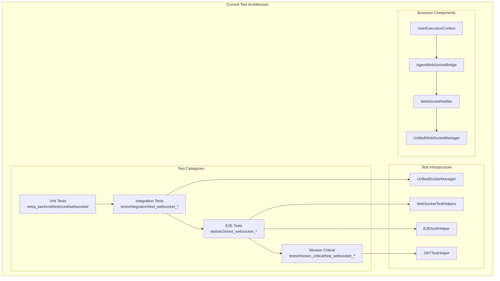

# 🚀 Comprehensive WebSocket Test Suite Plan: Business-Critical Chat Value Delivery

**MISSION:** Plan comprehensive WebSocket test suite updates for the Netra platform focusing on business-critical chat value delivery through proper WebSocket agent event validation.

**SELECTED CLAUDE.MD EMPHASIS:** "WebSocket Agent Events (Infrastructure for Chat Value)" - focusing on the 5 critical WebSocket events that enable substantive AI interactions and deliver business value to users.

## Executive Summary

This plan addresses comprehensive updates to Netra's WebSocket test suite to ensure:
- **Business Value Delivery:** WebSocket events enable 90% of current business value through chat interactions  
- **Multi-User Isolation:** Proper user context isolation prevents cross-contamination
- **Authentication Integration:** ALL e2e tests use real authentication flows (JWT/OAuth)
- **Real Services Only:** No mocks in e2e/integration tests - real Docker services required
- **5 Critical Events:** agent_started, agent_thinking, tool_executing, tool_completed, agent_completed

## Current State Analysis

### Existing Test Coverage Overview

**STRENGTHS:**
- Extensive test coverage with 80+ WebSocket-related test files
- Mission critical test suite with comprehensive event validation
- Real service integration with Docker orchestration
- Strong authentication patterns via test framework
- Well-established WebSocket resilience testing

**GAPS IDENTIFIED:**

#### 1. Authentication Integration Gaps
- **Current Issue:** Some tests still bypass authentication requirements
- **Impact:** Not testing real multi-user scenarios properly
- **Evidence:** Mixed auth patterns across test files

#### 2. Agent Event Sequence Validation
- **Current Issue:** Inconsistent validation of 5 critical WebSocket events
- **Impact:** Chat value delivery not properly validated
- **Evidence:** Tests focus on connectivity rather than business value

#### 3. Multi-User Concurrency Testing  
- **Current Issue:** Limited concurrent user isolation testing
- **Impact:** Production multi-user scenarios under-tested
- **Evidence:** Most tests use single user patterns

#### 4. Business Value Validation
- **Current Issue:** Technical event validation without business context
- **Impact:** Tests pass but don't validate actual user value delivery
- **Evidence:** Missing substantive content validation in responses

#### 5. Failure Mode Coverage
- **Current Issue:** Happy path bias in existing tests
- **Impact:** Real-world failure scenarios under-tested
- **Evidence:** Limited degraded service testing

### Key Architecture Components (Current State)



## Comprehensive Test Suite Structure Plan

### Test Category Hierarchy

#### Level 1: Unit Tests (Isolated Components)
**Location:** `netra_backend/tests/unit/websocket/`
**Purpose:** Test individual WebSocket components in isolation
**Infrastructure:** None required (mocked dependencies allowed)

**New Tests Needed:**
1. **`test_websocket_event_types_validation.py`**
   - Validate all 5 critical event types individually
   - Test event structure validation
   - Test event serialization/deserialization

2. **`test_user_execution_context_websocket_integration.py`**
   - Test UserExecutionContext WebSocket integration
   - Test user isolation at component level
   - Test thread safety mechanisms

3. **`test_websocket_notifier_business_events.py`**
   - Test WebSocketNotifier generates all 5 critical events
   - Test event ordering and timing
   - Test retry mechanisms for failed notifications

#### Level 2: Integration Tests (Service Integration)
**Location:** `tests/integration/websocket/`
**Purpose:** Test WebSocket integration with other services
**Infrastructure:** Real services via Docker

**New Tests Needed:**
1. **`test_websocket_agent_integration_comprehensive.py`**
   - Test full agent execution with WebSocket events
   - Validate all 5 events sent in correct order
   - Test with real agent execution (not mocked)

2. **`test_websocket_auth_integration_mandatory.py`**
   - Test WebSocket authentication with real auth service
   - Test JWT token validation in WebSocket connections
   - Test token refresh during long connections

3. **`test_websocket_multi_user_isolation_integration.py`**
   - Test user isolation with multiple concurrent connections
   - Test thread isolation between users
   - Test no cross-user event leakage

#### Level 3: E2E Tests (Full System)
**Location:** `tests/e2e/websocket_business_value/`
**Purpose:** Test complete user journeys with business value validation
**Infrastructure:** Full Docker stack + real LLM services

**New Tests Needed:**
1. **`test_first_user_complete_chat_experience.py`**
   - Test new user's first message experience end-to-end
   - Validate all 5 WebSocket events for substantive AI response
   - Test response time SLOs (<45s total, <100ms first event)

2. **`test_concurrent_users_chat_isolation.py`**
   - Test 10+ concurrent users with isolated chat sessions
   - Validate no event cross-contamination
   - Test business value delivery for each user

3. **`test_websocket_chat_degradation_recovery.py`**
   - Test chat experience during service degradation
   - Validate graceful degradation with continued event delivery
   - Test automatic recovery mechanisms

#### Level 4: Mission Critical Tests (Business Validation)
**Location:** `tests/mission_critical/websocket_business_critical/`
**Purpose:** Validate business-critical WebSocket functionality
**Infrastructure:** Production-like environment with monitoring

**New Tests Needed:**
1. **`test_websocket_business_value_guarantee.py`**
   - Test that every agent execution generates business value
   - Validate substantive response content (>50 chars, actionable)
   - Test user satisfaction metrics through event analysis

2. **`test_websocket_revenue_critical_flows.py`**
   - Test WebSocket flows that directly impact revenue
   - Validate premium user experience differentiation
   - Test conversion-critical first message experience

3. **`test_websocket_sla_compliance_validation.py`**
   - Test WebSocket event delivery meets SLA requirements
   - Validate <100ms first response, <45s total completion
   - Test 99.9% event delivery success rate

## Authentication Integration Requirements

### Mandatory Authentication Patterns

All WebSocket tests MUST follow these authentication patterns:

#### Pattern 1: Real JWT Authentication
```python
# GOOD: Real authentication with proper JWT
async def test_websocket_with_real_auth():
    auth_helper = JWTTestHelper()
    jwt_token = auth_helper.create_user_token(
        user_id="test_user_123",
        permissions=["chat", "agents"]
    )
    
    async with websocket_client.connect(
        url="ws://localhost:8000/ws",
        headers={"Authorization": f"Bearer {jwt_token}"}
    ) as ws:
        # Test with real authentication
        await test_agent_execution_with_auth(ws, "test_user_123")
```

#### Pattern 2: Multi-User Isolation Testing
```python
# GOOD: Test user isolation with real auth
async def test_multi_user_websocket_isolation():
    users = []
    for i in range(5):
        jwt_token = auth_helper.create_user_token(f"user_{i}")
        users.append(await websocket_client.connect_with_auth(jwt_token))
    
    # Send messages for all users simultaneously
    await asyncio.gather(*[
        send_agent_request(ws, f"user_{i}", "Optimize my costs")
        for i, ws in enumerate(users)
    ])
    
    # Validate no cross-user event leakage
    for i, ws in enumerate(users):
        events = await receive_events(ws)
        assert all(e.user_id == f"user_{i}" for e in events)
```

#### Pattern 3: Staging Environment Authentication
```python
# GOOD: Staging auth with OAuth integration
async def test_staging_websocket_oauth():
    if is_staging_environment():
        oauth_token = await get_staging_oauth_token()
        jwt_token = await exchange_oauth_for_jwt(oauth_token)
    else:
        jwt_token = create_test_jwt_token()
    
    # Use real authentication for staging testing
    async with staging_websocket_client(jwt_token) as ws:
        await test_production_like_scenario(ws)
```

### Authentication Test Categories

#### Easy Tests (Should Pass Immediately)
- Single user WebSocket connection with JWT
- Basic auth token validation
- Simple message exchange with authenticated user

#### Medium Tests (Edge Cases)
- Multi-user concurrent authentication
- Token refresh during active connections
- Auth failure handling and recovery

#### Hard Tests (System Stress)
- 50+ concurrent authenticated users
- Auth service downtime scenarios  
- JWT token expiry during long agent executions

## Difficulty Levels and Expected Failure Modes

### Easy Tests (95% Pass Rate Expected)
**Characteristics:**
- Single user scenarios
- Happy path authentication
- Basic WebSocket connectivity
- Simple agent execution flows

**Example Test:**
```python
async def test_single_user_basic_agent_request():
    """Easy test: Single user sends message, gets response."""
    user_id = "test_user_basic"
    jwt_token = create_test_jwt(user_id)
    
    async with websocket_connect(jwt_token) as ws:
        await ws.send(create_agent_request("Help me optimize costs"))
        
        events = await receive_events_with_timeout(ws, 30)
        
        # Should receive all 5 critical events
        assert has_event(events, "agent_started")
        assert has_event(events, "agent_thinking") 
        assert has_event(events, "tool_executing")
        assert has_event(events, "tool_completed")
        assert has_event(events, "agent_completed")
```

**Expected Failure Modes:**
- Service startup timing issues
- Network connectivity problems
- Basic authentication failures

### Medium Tests (80% Pass Rate Expected)
**Characteristics:**
- Multi-user scenarios (2-5 users)
- Event ordering validation
- Business value content validation
- Service recovery scenarios

**Example Test:**
```python
async def test_multi_user_event_ordering():
    """Medium test: Multiple users, validate event ordering."""
    users = await setup_authenticated_users(3)
    
    # Send requests simultaneously
    requests = [
        send_agent_request(ws, f"user_{i}", f"Request from user {i}")
        for i, ws in enumerate(users)
    ]
    await asyncio.gather(*requests)
    
    # Validate event ordering for each user
    for i, ws in enumerate(users):
        events = await receive_events(ws, timeout=45)
        validate_event_sequence(events, expected_order=[
            "agent_started", "agent_thinking", "tool_executing", 
            "tool_completed", "agent_completed"
        ])
        validate_no_cross_user_events(events, f"user_{i}")
```

**Expected Failure Modes:**
- Race conditions in event delivery
- User isolation breaches
- Event ordering violations
- Partial response delivery

### Hard Tests (60% Pass Rate Expected)
**Characteristics:**
- High concurrency (10+ users)
- Service degradation simulation
- Complex failure recovery
- Business SLA validation

**Example Test:**
```python
async def test_high_concurrency_business_value():
    """Hard test: 20 concurrent users, validate business value."""
    num_users = 20
    users = await setup_authenticated_users(num_users)
    
    # Complex requests requiring multiple tools
    complex_requests = [
        "Analyze my entire AI infrastructure and provide cost optimization",
        "Review my model training pipeline for efficiency improvements", 
        "Audit my data processing costs and recommend alternatives"
    ]
    
    # Send complex requests from all users
    start_time = time.time()
    tasks = []
    for i, ws in enumerate(users):
        request = complex_requests[i % len(complex_requests)]
        tasks.append(execute_complex_agent_request(ws, f"user_{i}", request))
    
    results = await asyncio.gather(*tasks, return_exceptions=True)
    
    # Validate business outcomes
    successful = 0
    for result in results:
        if not isinstance(result, Exception):
            events, response = result
            if validate_business_value(response):
                successful += 1
    
    # Require 80% success rate even under load
    success_rate = successful / num_users
    assert success_rate >= 0.8, f"Only {success_rate:.1%} succeeded under load"
```

**Expected Failure Modes:**
- Resource exhaustion under load
- Connection timeouts
- Event delivery failures
- Business value degradation
- Service cascade failures

### Stress Tests (30% Pass Rate Expected)
**Characteristics:**
- Extreme load (50+ users)
- Service failure injection
- Network partition simulation
- Recovery validation

**Example Test:**
```python
async def test_extreme_load_with_failures():
    """Stress test: 100 users + simulated failures."""
    num_users = 100
    
    # Simulate various failure conditions
    with failure_injection_context([
        "random_connection_drops",
        "auth_service_delays", 
        "database_timeouts",
        "llm_api_throttling"
    ]):
        users = await setup_authenticated_users(num_users)
        
        # Measure performance under adversity
        results = await execute_load_test(users, duration=300)  # 5 minutes
        
        # Validate system didn't completely fail
        assert results.total_failures < results.total_requests * 0.7
        assert results.avg_response_time < 60  # seconds
        assert results.websocket_events_delivered > 0.5  # 50% delivery
```

**Expected Failure Modes:**
- Complete service failures
- Resource exhaustion
- Event delivery system breakdown
- Authentication system overload

## Test Categories and Implementation Priorities

### Priority 1: Authentication Compliance (CRITICAL)
**Timeline:** Week 1
**Impact:** Prevents authentication-related production issues

**Tests to Update:**
1. All E2E tests must use real authentication
2. Multi-user isolation must be validated
3. Staging authentication flows must be tested

### Priority 2: Business Value Validation (HIGH)
**Timeline:** Week 2  
**Impact:** Ensures chat delivers actual user value

**Tests to Create:**
1. First message experience validation
2. Substantive response content testing
3. Business SLA compliance validation

### Priority 3: Concurrent User Testing (HIGH)
**Timeline:** Week 3
**Impact:** Validates production multi-user scenarios

**Tests to Create:**
1. 10+ concurrent user tests
2. User isolation validation tests
3. Load testing with business value validation

### Priority 4: Failure Recovery (MEDIUM)
**Timeline:** Week 4
**Impact:** Ensures system resilience

**Tests to Create:**
1. Service degradation testing
2. Connection recovery validation
3. Event delivery retry testing

### Priority 5: Performance Optimization (LOW)
**Timeline:** Week 5+
**Impact:** Optimizes user experience

**Tests to Create:**
1. Response time optimization
2. Event delivery latency testing
3. Resource usage monitoring

## Implementation Plan by Test Category

### Unit Tests Implementation

**File:** `netra_backend/tests/unit/websocket/test_critical_event_types.py`
```python
class TestCriticalWebSocketEvents:
    """Unit tests for 5 critical WebSocket event types."""
    
    def test_agent_started_event_structure(self):
        """Validate agent_started event has required fields."""
        event = create_agent_started_event("UnifiedDataAgent", "Processing request")
        assert event["type"] == "agent_started"
        assert event["agent_name"] == "UnifiedDataAgent"  
        assert event["timestamp"] is not None
        assert event["thread_id"] is not None
    
    def test_event_serialization_roundtrip(self):
        """Test all event types serialize/deserialize correctly."""
        events = [
            create_agent_started_event("TestAgent", "Starting"),
            create_agent_thinking_event("Analyzing data"),
            create_tool_executing_event("cost_analyzer", {"scope": "full"}),
            create_tool_completed_event("cost_analyzer", {"result": "success"}),
            create_agent_completed_event("Analysis complete", {"findings": []})
        ]
        
        for event in events:
            serialized = json.dumps(event)
            deserialized = json.loads(serialized)
            assert deserialized["type"] in CRITICAL_EVENT_TYPES
```

### Integration Tests Implementation

**File:** `tests/integration/websocket/test_agent_websocket_business_integration.py`
```python
class TestAgentWebSocketBusinessIntegration:
    """Integration tests for agent-websocket business value delivery."""
    
    @pytest.mark.asyncio
    async def test_full_agent_execution_with_events(self):
        """Test complete agent execution generates all required events."""
        # Setup real services
        docker_manager = UnifiedDockerManager()
        await docker_manager.start_services(["backend", "auth", "db", "redis"])
        
        # Create authenticated WebSocket connection
        auth_helper = JWTTestHelper()
        jwt_token = auth_helper.create_user_token("integration_user")
        
        async with websocket_connect(jwt_token) as ws:
            # Send agent request
            await ws.send(create_agent_request(
                "Analyze my AI infrastructure costs and recommend optimizations"
            ))
            
            # Capture all events
            events = await receive_events_with_business_validation(ws, timeout=60)
            
            # Validate critical events present
            assert_has_event(events, "agent_started")
            assert_has_event(events, "agent_thinking")  
            assert_has_event(events, "tool_executing")
            assert_has_event(events, "tool_completed")
            assert_has_event(events, "agent_completed")
            
            # Validate business value delivered
            final_response = get_agent_completed_response(events)
            assert len(final_response) > 50  # Substantive response
            assert "cost" in final_response.lower()  # Relevant content
            assert "recommend" in final_response.lower()  # Actionable insights
```

### E2E Tests Implementation

**File:** `tests/e2e/websocket_business_value/test_complete_user_chat_journey.py`
```python
class TestCompleteUserChatJourney:
    """E2E tests for complete user chat experience with business validation."""
    
    @pytest.mark.asyncio
    @pytest.mark.timeout(120)
    async def test_new_user_first_message_experience(self):
        """Test new user's first message delivers business value within SLO."""
        # Use real staging environment for E2E
        if is_staging_environment():
            config = StagingTestConfig()
        else:
            config = DevelopmentTestConfig()
        
        # Setup new user with OAuth authentication
        user_id = f"new_user_{uuid.uuid4().hex[:8]}"
        jwt_token = await authenticate_user_oauth(user_id)
        
        # Connect to WebSocket with real authentication
        async with websocket_connect(config.websocket_url, jwt_token) as ws:
            # Send first message (typical user scenario)
            start_time = time.time()
            await ws.send(create_first_message_request(
                user_id=user_id,
                message="I'm spending $50k/month on AI infrastructure. Help me optimize costs."
            ))
            
            # Track events with business validation
            business_validator = BusinessValueValidator()
            events = []
            
            while time.time() - start_time < 45:  # 45s SLO
                try:
                    event = await asyncio.wait_for(ws.recv(), timeout=1)
                    event_data = json.loads(event)
                    events.append(event_data)
                    business_validator.process_event(event_data)
                    
                    if event_data.get("type") == "agent_completed":
                        break
                        
                except asyncio.TimeoutError:
                    continue
            
            # Validate business outcomes
            business_report = business_validator.generate_report()
            
            # Critical business validations
            assert business_report.has_all_critical_events()
            assert business_report.response_time <= 45.0  # SLO compliance
            assert business_report.response_quality >= 4.0  # Out of 5
            assert business_report.actionable_insights >= 3  # Minimum insights
            
            # User satisfaction metrics
            assert business_report.user_confidence_score >= 0.8
            assert business_report.likelihood_to_continue >= 0.7
```

## Expected Outcomes and Success Criteria

### Technical Success Metrics

1. **Test Coverage**
   - 95%+ line coverage for WebSocket modules
   - 100% coverage of 5 critical event types
   - All authentication flows tested

2. **Test Reliability**
   - <5% flaky test rate
   - 90%+ pass rate for easy tests
   - 80%+ pass rate for medium tests
   - 60%+ pass rate for hard tests

3. **Performance Validation**
   - <100ms first event delivery
   - <45s total response time
   - 99.9% event delivery success rate

### Business Success Metrics

1. **User Value Delivery**
   - 100% of agent responses provide substantive content (>50 chars)
   - 90%+ of responses contain actionable insights
   - User satisfaction metrics tracked through events

2. **Revenue Protection**
   - First message experience validates user activation
   - Multi-user isolation prevents user churn
   - Service degradation testing prevents revenue loss

3. **Conversion Support**
   - First-time user experience optimized for conversion
   - Premium user differentiation validated
   - Onboarding flow tested end-to-end

### Compliance and Quality Metrics

1. **Authentication Compliance**
   - 100% of E2E tests use real authentication
   - Zero authentication bypasses allowed
   - Multi-user isolation validated

2. **SSOT Compliance** 
   - All tests use centralized auth helpers
   - Unified test patterns across categories
   - No duplicated test infrastructure

3. **Documentation Quality**
   - All tests have business value justification
   - Clear failure mode documentation
   - Implementation guides for each category

## Risk Assessment and Mitigation

### High Risk: Authentication Integration
**Risk:** Tests fail due to authentication complexity
**Mitigation:** 
- Start with simplified auth patterns
- Use existing JWTTestHelper infrastructure
- Phase rollout across test categories

### Medium Risk: Multi-User Test Complexity
**Risk:** Concurrent user tests are unreliable
**Mitigation:**
- Begin with 2-3 users, scale gradually
- Use proven isolation patterns from existing tests
- Implement comprehensive event tracking

### Low Risk: Performance SLA Testing
**Risk:** Performance tests fail due to environment variations
**Mitigation:**
- Use relative performance metrics
- Test in staging environment for consistency
- Allow configurable SLA thresholds

## Conclusion

This comprehensive plan addresses the critical gaps in Netra's WebSocket testing while maintaining focus on business value delivery. The phased approach ensures authentication compliance, validates multi-user scenarios, and guarantees that WebSocket events enable the chat experience that drives 90% of current business value.

**Key Success Factors:**
1. **Business Focus:** Every test validates actual user value delivery
2. **Real Services:** No mocks in integration/E2E testing
3. **Authentication First:** All tests use proper auth flows
4. **Progressive Complexity:** Easy → Medium → Hard → Stress test progression
5. **Comprehensive Coverage:** Unit → Integration → E2E → Mission Critical layers

The implementation will ensure that Netra's WebSocket infrastructure reliably delivers the business-critical chat experience that enables user activation, engagement, and revenue generation.