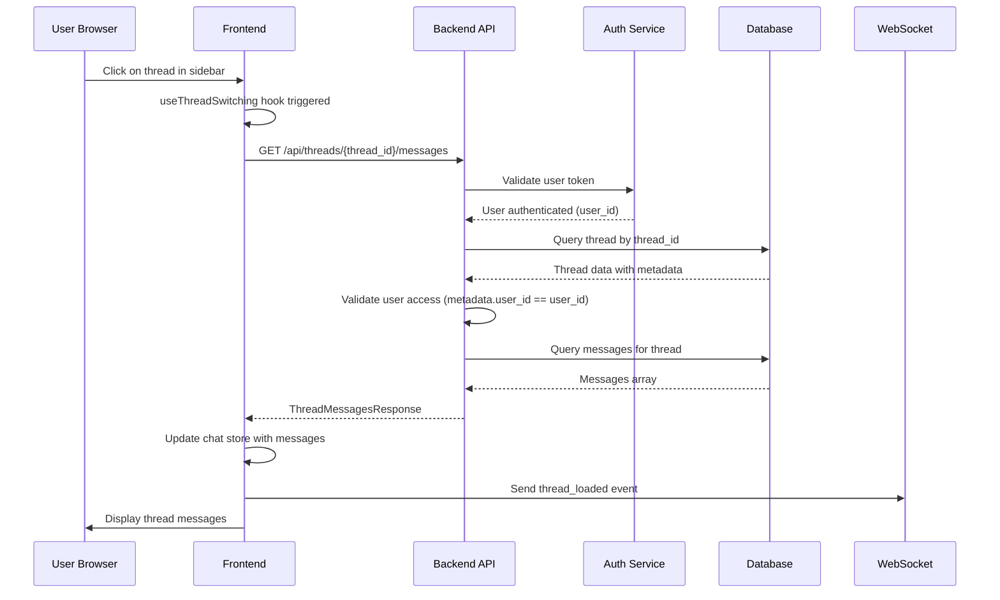
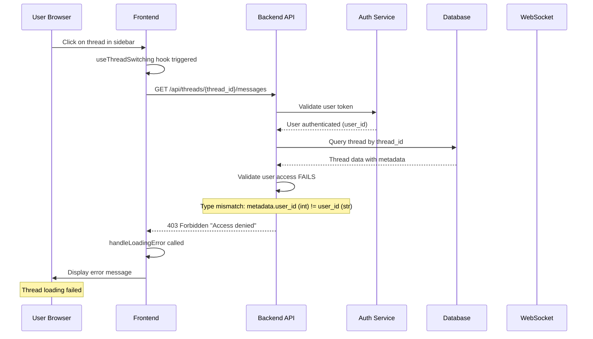
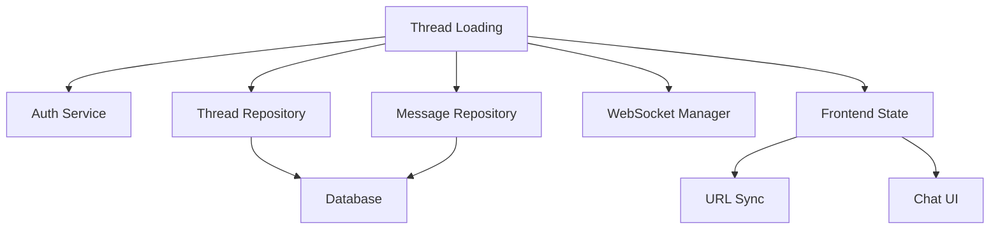

# Thread Loading Bug Analysis Report

## Executive Summary
The thread loading functionality in the Netra platform is experiencing failures when loading existing threads. This report provides a comprehensive analysis using the Five Whys method and detailed architecture diagrams to identify root causes and failure points.

## Five Whys Analysis

### Problem Statement
**Loading existing threads throws an error in both backend and potentially frontend systems.**

### Five Whys Investigation

#### Why #1: Why does thread loading fail?
**Answer:** The thread loading process fails because of a mismatch or validation error when attempting to retrieve thread data from the database.

#### Why #2: Why is there a validation error when retrieving thread data?
**Answer:** The validation logic in `thread_validators.py` checks user access by comparing `thread.metadata_.get("user_id")` with the current user ID, and this comparison may be failing due to:
- Type mismatches between stored and current user IDs
- Missing or null metadata fields
- Inconsistent user ID format (string vs integer)

#### Why #3: Why are there type mismatches or missing metadata?
**Answer:** The thread creation and update processes may not be consistently:
- Initializing the metadata_ field properly
- Storing user_id in the correct format
- Handling legacy threads that may have different metadata structures

#### Why #4: Why is metadata handling inconsistent?
**Answer:** Multiple code paths handle thread metadata:
- `thread_creators.py`: Creates new metadata during thread creation
- `thread_handlers.py`: Updates metadata during thread updates
- `thread_builders.py`: Reads and formats metadata for responses
Each may have different assumptions about metadata structure and required fields.

#### Why #5: Why do different code paths have different assumptions?
**Answer:** The system lacks a centralized, strongly-typed metadata schema that enforces:
- Required fields and their types
- Consistent serialization/deserialization
- Migration strategies for legacy data
- Validation at the data layer

## Architecture Diagrams

### Ideal Working State


### Current Failure State


## Critical Failure Points Identified

### 1. Backend Validation Layer (`thread_validators.py:16-24`)
```python
def validate_thread_access(thread, user_id: str) -> None:
    # Type conversion attempts to handle mismatches
    thread_user_id = str(thread.metadata_.get("user_id")) if thread.metadata_.get("user_id") is not None else None
    current_user_id = str(user_id)
    
    if thread_user_id != current_user_id:
        raise HTTPException(status_code=403, detail="Access denied")
```
**Issues:**
- Assumes metadata_ exists and is a dict
- String conversion may not handle all cases (e.g., numeric strings vs actual numbers)
- No logging of actual vs expected values for debugging

### 2. Thread Creation (`thread_creators.py`)
```python
def prepare_thread_metadata(thread_data, user_id: str):
    # May store user_id in different formats
    metadata = thread_data.metadata or {}
    metadata["user_id"] = user_id  # String? Int? UUID?
    return metadata
```
**Issues:**
- No type enforcement for user_id
- No validation of metadata structure
- Inconsistent with how user_id is stored elsewhere

### 3. Frontend Error Handling (`useThreadSwitching.ts:358-392`)
```typescript
const handleLoadingError = (error: unknown, threadId: string, ...) => {
    // Generic error handling without specific cases
    const threadError = createThreadError(threadId, error);
    // No retry logic for auth/validation errors
}
```
**Issues:**
- Doesn't differentiate between validation errors and network errors
- No automatic retry with refreshed auth token
- Doesn't provide actionable user feedback

### 4. Database Schema
**Potential Issues:**
- Thread table metadata column may store JSON differently
- Legacy threads may have different metadata structure
- No database-level constraints on metadata format

## System-Wide Impact Analysis

### Affected Components:
1. **Thread Loading Flow** - Primary failure point
2. **Thread Creation** - May create threads with incorrect metadata
3. **Thread Updates** - May corrupt metadata during updates
4. **User Experience** - Users cannot access their threads
5. **WebSocket Events** - Thread events not sent due to early failure

### Cross-System Dependencies:


## Root Causes Summary

1. **Primary Cause:** Inconsistent user_id type handling between thread creation and validation
2. **Secondary Cause:** Lack of centralized metadata schema and validation
3. **Tertiary Cause:** Missing error recovery mechanisms in frontend
4. **Contributing Factor:** No comprehensive logging of validation failures
5. **System Design Issue:** Tight coupling between metadata structure and access control

## Recommended Fixes

### Immediate Fixes (Priority 1):
1. Fix type consistency in `thread_validators.py`
2. Add comprehensive logging for validation failures
3. Ensure user_id is consistently stored as string

### Short-term Fixes (Priority 2):
1. Create centralized metadata validation
2. Add database migration for legacy threads
3. Improve frontend error handling with retry logic

### Long-term Fixes (Priority 3):
1. Implement strongly-typed metadata schema
2. Add database constraints for metadata
3. Create metadata versioning system
4. Implement comprehensive test coverage

## Test Cases to Implement

1. **Thread Loading with String User ID**
2. **Thread Loading with Integer User ID** 
3. **Thread Loading with Legacy Metadata**
4. **Thread Loading with Missing Metadata**
5. **Thread Creation and Immediate Load**
6. **Thread Update and Load**
7. **Concurrent Thread Operations**

## Monitoring and Observability

### Metrics to Track:
- Thread loading success rate
- Validation failure reasons
- Metadata type distribution
- User ID format distribution

### Logs to Add:
- Validation comparison details
- Metadata structure on creation
- Type conversion attempts
- User context in all thread operations

## Business Impact

- **User Experience:** Users cannot access chat history
- **Data Integrity:** Potential data access violations
- **System Reliability:** Core chat functionality broken
- **Revenue Impact:** Users may abandon platform if unable to access threads

## Next Steps

1. Implement immediate fixes in validation layer
2. Add comprehensive logging
3. Deploy fixes with feature flags
4. Monitor success rates
5. Proceed with short-term fixes once stabilized

---

**Report Generated:** 2025-09-03
**Severity:** CRITICAL
**Affected Users:** Potentially all users with existing threads
**Estimated Fix Time:** 2-4 hours for immediate fixes