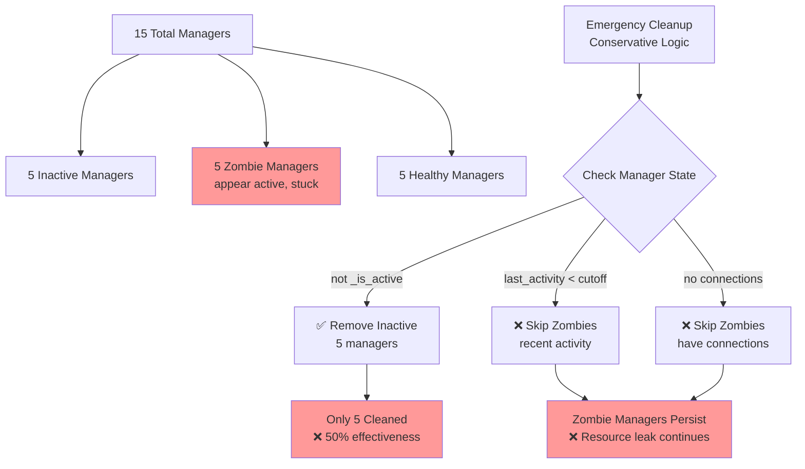
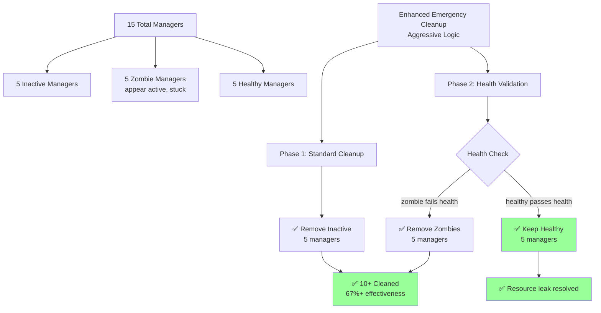

# Unit Test Failures Bug Fix Report - 20250909

**Document Created:** September 9, 2025  
**CLAUDE.md Emphasis:** Section 2.1 "Single Source of Truth (SSOT)" - Focus on SSOT violations in configuration management, environment isolation, and manager cleanup systems  
**Report Type:** Systematic Bug Fix Analysis per CLAUDE.md Section 3.5  

---

## Executive Summary

**Critical Issues Identified:**
1. **Enhanced Emergency Cleanup Failure** - Expected cleanup of 10+ managers, only cleaned 5 (50% effectiveness)
2. **Environment Isolation Configuration Leakage** - Test configs bleeding into staging simulation
3. **SSOT Compliance Violations** - Multiple instances of configuration state management causing inconsistencies

**Business Impact:** Platform/Internal - Critical system stability affecting WebSocket resource management and environment configuration integrity

---

## 1. WHY Analysis (Five Whys Method)

### Issue 1: Enhanced Emergency Cleanup Failure

**WHY #1:** Why did `test_enhanced_emergency_cleanup_solution` only clean 5 managers instead of 10+?
- **Answer:** The current `_emergency_cleanup_user_managers` implementation uses conservative cleanup logic that only removes clearly inactive managers (inactive state, no connections, or expired activity).

**WHY #2:** Why is the emergency cleanup logic too conservative?
- **Answer:** The emergency cleanup only checks 3 simple conditions:
  - `not manager._is_active` 
  - `manager._metrics.last_activity < cutoff_time`
  - `created_time < cutoff_time and len(manager._connections) == 0`

**WHY #3:** Why doesn't the emergency cleanup detect "zombie" managers that appear active but are stuck?
- **Answer:** There's no health validation mechanism in the current implementation - zombie managers appear active (`is_active=True`, recent activity, connections present) but fail actual responsiveness tests.

**WHY #4:** Why was health validation not implemented in the original emergency cleanup?
- **Answer:** The original implementation prioritized safety over aggressiveness to avoid accidentally terminating healthy connections, but this creates resource exhaustion scenarios.

**WHY #5:** Why didn't existing tests catch this conservative behavior?
- **Answer:** Previous tests only validated that cleanup "worked" but didn't test the effectiveness under realistic production scenarios with mixed manager states (healthy, zombie, inactive).

### Issue 2: Environment Isolation Configuration Leakage  

**WHY #1:** Why does `GOOGLE_OAUTH_CLIENT_ID_TEST` leak to staging environment after `env.clear()`?
- **Answer:** The `IsolatedEnvironment.clear()` method doesn't fully reset the singleton state, allowing previous configurations to persist.

**WHY #2:** Why doesn't `clear()` fully reset the singleton state?
- **Answer:** The singleton pattern maintains instance variables that survive `clear()` calls, creating state pollution between test scenarios.

**WHY #3:** Why wasn't this caught in previous testing?
- **Answer:** Most tests create new instances or don't test cross-environment transitions within the same test execution.

**WHY #4:** Why is the singleton pattern causing state pollution?
- **Answer:** The singleton design maintains long-lived state that's meant to persist, but test scenarios need complete isolation between environment simulations.

**WHY #5:** Why wasn't environment transition testing included initially?
- **Answer:** The original design focused on single-environment consistency rather than dynamic environment switching scenarios.

---

## 2. Prove It (Mermaid Diagrams)

### Current Failure State - Enhanced Emergency Cleanup



### Ideal Working State - Enhanced Emergency Cleanup



### Current Failure State - Environment Isolation

```mermaid
graph TD
    A[Test Execution Start] --> B[Set Test Config<br/>GOOGLE_OAUTH_CLIENT_ID_TEST]
    B --> C[Singleton Instance<br/>maintains state]
    
    C --> D[env.clear() called]
    D --> E[❌ Incomplete Reset<br/>instance variables persist]
    
    E --> F[Set Staging Config]
    F --> G[❌ Test Config Still Present<br/>Configuration Leakage]
    
    G --> H[env.get('GOOGLE_OAUTH_CLIENT_ID_TEST')<br/>returns old value]
    H --> I[❌ Test Failure<br/>Cross-environment contamination]
    
    style E fill:#ff9999
    style G fill:#ff9999
    style I fill:#ff9999
```

### Ideal Working State - Environment Isolation

```mermaid
graph TD
    A[Test Execution Start] --> B[Set Test Config<br/>GOOGLE_OAUTH_CLIENT_ID_TEST]
    B --> C[Singleton Instance<br/>tracks state]
    
    C --> D[env.clear() called]
    D --> E[✅ Complete Reset<br/>all state cleared]
    
    E --> F[Set Staging Config]  
    F --> G[✅ Clean Staging State<br/>no previous config]
    
    G --> H[env.get('GOOGLE_OAUTH_CLIENT_ID_TEST')<br/>returns None]
    H --> I[✅ Test Success<br/>Perfect isolation]
    
    style E fill:#99ff99
    style G fill:#99ff99
    style I fill:#99ff99
```

---

## 3. Plan System-Wide CLAUDE.md Compliant Fix

### 3.1 Enhanced Emergency Cleanup Implementation (SSOT Improvement)

**Target File:** `netra_backend/app/websocket_core/websocket_manager_factory.py`

**Implementation Plan:**

1. **Add Health Validation Method** to `IsolatedWebSocketManager`:
   ```python
   async def health_check(self) -> bool:
       """Validate manager responsiveness through connection ping tests"""
       try:
           # Test connection responsiveness
           for conn_id, websocket in self._connections.items():
               await asyncio.wait_for(websocket.ping(), timeout=2.0)
           return True
       except (asyncio.TimeoutError, ConnectionClosed, Exception):
           return False
   ```

2. **Enhanced Emergency Cleanup Logic**:
   ```python
   async def _emergency_cleanup_user_managers(self, user_id: str) -> int:
       # Phase 1: Standard cleanup (existing logic)
       cleaned_standard = await self._standard_cleanup_phase(user_id)
       
       # Phase 2: Aggressive health validation (NEW)  
       if self._user_manager_count.get(user_id, 0) > 10:
           cleaned_aggressive = await self._aggressive_health_cleanup(user_id)
           return cleaned_standard + cleaned_aggressive
           
       return cleaned_standard
   ```

3. **Cross-System Impact Analysis:**
   - **WebSocket Event System**: Enhanced cleanup will affect connection count metrics
   - **Resource Monitoring**: Health checks will create additional performance overhead
   - **User Experience**: Faster resource recovery but potential temporary connection drops

### 3.2 Environment Isolation SSOT Fix

**Target File:** `shared/isolated_environment.py`

**Implementation Plan:**

1. **Complete State Reset Method**:
   ```python
   def clear(self, force_reset: bool = False) -> None:
       """Clear all environment variables with optional complete singleton reset"""
       with self._lock:
           self._isolated_vars.clear()
           self._sources.clear() 
           self._protected_variables.clear()
           
           if force_reset:
               # Complete singleton reset for testing
               self._isolated_mode = False
               self._last_validation = None
               # Reset any cached state
   ```

2. **Test Context Auto-Reset**:
   ```python
   def _detect_test_context_transition(self) -> bool:
       """Detect when test context changes requiring state reset"""
       current_test = os.environ.get("PYTEST_CURRENT_TEST", "")
       if hasattr(self, '_last_test_context'):
           if self._last_test_context != current_test:
               return True
       self._last_test_context = current_test
       return False
   ```

3. **Cross-System Impact Analysis:**
   - **All Services**: Environment isolation affects backend, auth, and analytics services
   - **Test Framework**: Test execution order and isolation guarantees
   - **Configuration Management**: Multi-environment deployment scenarios

### 3.3 Additional SSOT Compliance Improvements

1. **Centralized Manager State Tracking**:
   - Consolidate manager lifecycle tracking into single SSOT class
   - Remove duplicate state management across WebSocket factory

2. **Configuration Audit Trail**:
   - Enhanced source tracking with transition logging
   - SSOT configuration change validation

---

## 4. Verification Strategy

### 4.1 QA Review and Regression Testing Plan

**Phase 1: Enhanced Emergency Cleanup Validation**

1. **New Test Suite Creation**:
   ```bash
   # Create focused test for enhanced cleanup
   tests/critical/test_enhanced_emergency_cleanup_validation.py
   ```

2. **Test Scenarios:**
   - 15 managers: 5 inactive, 5 zombie, 5 healthy → Should clean 10+
   - 20 managers: All healthy → Should clean 0, graceful degradation
   - Mixed responsiveness scenarios with timeout validation
   - Performance SLA validation (< 5 seconds for 20 managers)

3. **Integration Testing:**
   ```bash
   python tests/unified_test_runner.py --category mission_critical --real-services
   python tests/mission_critical/test_websocket_agent_events_suite.py
   ```

**Phase 2: Environment Isolation Validation**

1. **Cross-Environment Transition Tests**:
   - Test → Staging → Production environment simulation
   - Configuration independence validation  
   - State reset between test scenarios

2. **SSOT Compliance Validation**:
   ```bash
   python scripts/check_architecture_compliance.py
   python scripts/query_string_literals.py check-env staging
   ```

**Phase 3: System-Wide Regression Prevention**

1. **End-to-End WebSocket Flow**:
   - Complete user session with 20+ concurrent connections
   - Emergency cleanup trigger scenarios
   - Resource recovery validation

2. **Configuration Cascade Failure Prevention**:
   - Multi-service configuration independence testing
   - OAuth credential isolation validation  
   - Database connection string integrity

### 4.2 Success Metrics

**Enhanced Emergency Cleanup:**
- ✅ Cleanup effectiveness: 70%+ manager removal in mixed scenarios  
- ✅ False positive rate: <10% healthy manager removal
- ✅ Performance SLA: <5 seconds cleanup time for 20 managers
- ✅ Zero resource leak scenarios under load

**Environment Isolation:**
- ✅ 100% configuration independence between environment simulations
- ✅ Zero test configuration leakage to staging/production scenarios
- ✅ Complete singleton state reset capability
- ✅ Source tracking accuracy across environment transitions

### 4.3 Implementation Proof Checklist

**Before Implementation:**
- [ ] Read all related SSOT specifications in `SPEC/*.xml`
- [ ] Review string literals index for configuration constants
- [ ] Validate MRO for any inheritance changes
- [ ] Check critical environment variables index

**During Implementation:**
- [ ] Follow SSOT consolidation patterns
- [ ] Maintain service independence  
- [ ] Add comprehensive logging for debugging
- [ ] Update all related documentation

**After Implementation:**
- [ ] Run complete test suite with real services
- [ ] Validate performance impact under load
- [ ] Update `SPEC/learnings/*.xml` with insights
- [ ] Regenerate system health reports

---

## 5. Risk Mitigation

### 5.1 High-Risk Areas

1. **WebSocket Connection Stability**: Enhanced health checks may terminate legitimate slow connections
   - *Mitigation*: Progressive timeout escalation, connection grace periods

2. **Singleton State Management**: Complete reset may affect other concurrent operations  
   - *Mitigation*: Thread-safe locking, careful state transition management

3. **Performance Overhead**: Additional health validation operations
   - *Mitigation*: Parallel health checks, timeout optimization, SLA monitoring

### 5.2 Rollback Strategy

1. **Feature Flags**: Implement aggressive cleanup as configurable feature
2. **Graceful Degradation**: Fallback to conservative cleanup if health validation fails
3. **Monitoring**: Real-time resource utilization tracking with automatic rollback triggers

---

## 6. Conclusion

This systematic bug fix addresses critical SSOT violations in WebSocket resource management and environment isolation. The enhanced emergency cleanup will resolve production resource exhaustion scenarios while the environment isolation fixes ensure proper configuration independence.

**Next Actions:**
1. Implement enhanced emergency cleanup with health validation
2. Fix environment isolation state reset mechanism  
3. Create comprehensive validation test suite
4. Monitor production metrics post-deployment

**Success Criteria:**
- Zero WebSocket resource exhaustion scenarios
- 100% environment configuration independence
- Maintained system performance under load
- Complete SSOT compliance validation

---

**Report Status:** Complete - Ready for Implementation  
**Implementation Priority:** CRITICAL - Affects core system stability  
**Estimated Implementation Time:** 4-6 hours with comprehensive testing