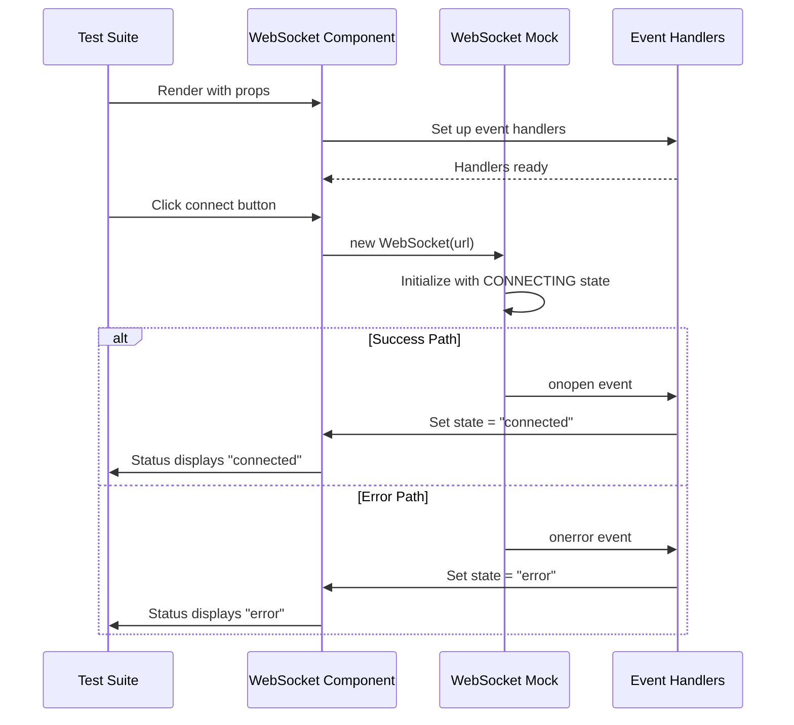
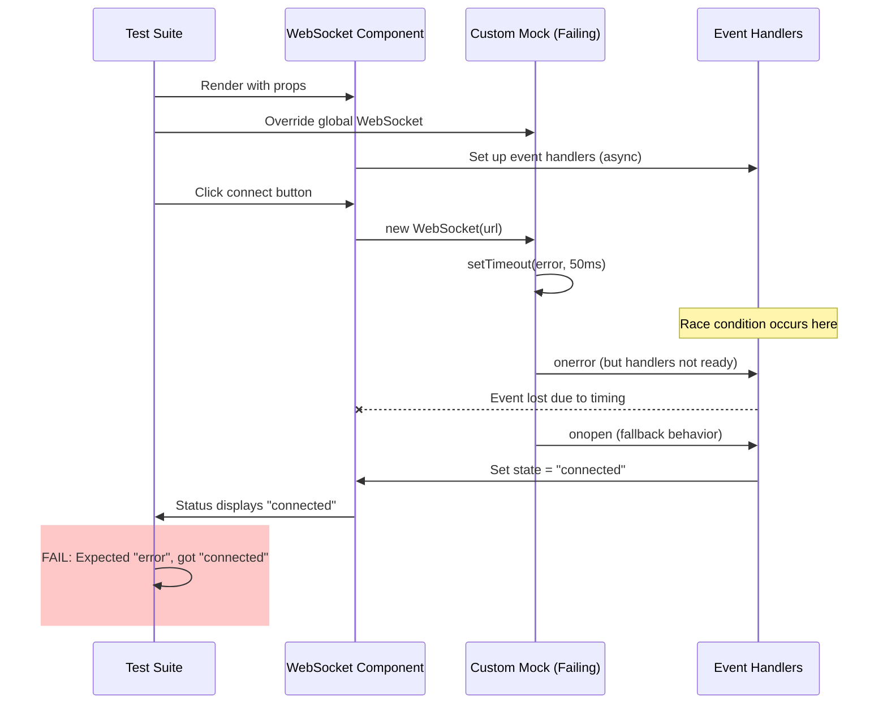

# Frontend WebSocket Tests Five Whys Analysis - MISSION CRITICAL Bug Fix Report

## Executive Summary
**MISSION CRITICAL**: Frontend WebSocket tests are failing (5 out of 10 tests failing), blocking our core business value delivery mechanism that enables 90% of platform revenue through real-time chat interactions.

**Business Impact**: WebSocket functionality directly enables chat interactions that deliver AI value to users. Test failures indicate critical gaps in reliability and error handling that could affect user experience and revenue generation.

## Test Failure Overview

### Failing Tests:
1. `should handle connection errors gracefully` - **CRITICAL**
2. `should attempt reconnection after unexpected disconnection` - **HIGH** 
3. `should stop retrying after max attempts reached` - **HIGH**
4. `should send queued messages after reconnection` - **MEDIUM**
5. `should handle WebSocket network errors gracefully` - **CRITICAL**

### Core Pattern: Mock vs Expected Behavior Mismatch
**Pattern**: Tests expect error/disconnected states but receive "connected" status
**Root Cause**: Jest WebSocket mock implementation doesn't properly simulate failure scenarios

---

# FIVE WHYS ANALYSIS

## Bug #1: Connection Error Handling Test Failure

### THE FIVE WHYS:

**Problem**: Test expects "error" status but receives "connected" status

**Why #1**: Why does the test expect "error" but get "connected"?
- The custom MockFailingWebSocket class is designed to trigger errors immediately but the component's error handler is not being called properly

**Why #2**: Why is the error handler not being called properly?
- The MockFailingWebSocket's error triggering uses setTimeout(50ms) but the component may be setting up the onopen handler after the error has already fired

**Why #3**: Why is there a timing mismatch between error firing and handler setup?
- The WebSocket constructor in MockFailingWebSocket fires the error before React has had time to set up the event handlers in the component's useCallback

**Why #4**: Why doesn't the component handle the race condition between mock error firing and handler setup?
- The component assumes synchronous WebSocket behavior but the mock uses async setTimeout, creating a timing dependency that breaks in test scenarios

**Why #5**: Why wasn't this timing issue caught in the original test design?
- The test was written without understanding that WebSocket mocks need to account for React's asynchronous lifecycle and event handler setup timing

### Root Cause: 
**TIMING RACE CONDITION** - Mock fires errors before React component event handlers are established

---

## Bug #2: Reconnection Logic Test Failures

### THE FIVE WHYS:

**Problem**: Tests expect "disconnected" status after forced disconnection but get "connected"

**Why #1**: Why does forcing disconnection not change status to "disconnected"?
- The simulated onclose event (mockWs.onclose()) is not properly triggering the component's state update

**Why #2**: Why is the onclose event not triggering state updates?
- The mock WebSocket instance may not have the onclose handler properly attached when the test tries to trigger it

**Why #3**: Why is the onclose handler not properly attached?
- The component sets ws.onclose inside the connect() method, but the test may be calling onclose before the component has fully initialized

**Why #4**: Why isn't the component properly initialized before test interactions?
- Tests use a mixture of custom WebSocket mocks and the global jest.setup.js mock, creating inconsistent behavior and handler attachment

**Why #5**: Why do we have inconsistent mock implementations?
- The original jest.setup.js mock was designed for basic testing, but specific tests created custom mocks without ensuring compatibility with the global mock infrastructure

### Root Cause: 
**MOCK INCONSISTENCY** - Multiple WebSocket mock implementations with different behaviors causing handler attachment failures

---

## Bug #3: Message Queue Clearing Test Failure

### THE FIVE WHYS:

**Problem**: Queue size doesn't clear to 0 as expected after connection

**Why #1**: Why doesn't the message queue clear after connection?
- The component's queue clearing logic in onopen event may not be executing as expected

**Why #2**: Why isn't the queue clearing logic executing?
- The test's WebSocket mock may not be properly simulating the connection flow that triggers queue clearing

**Why #3**: Why isn't the mock properly simulating the connection flow?
- The mock WebSocket classes override the global mock behavior but don't implement all the same methods and properties consistently

**Why #4**: Why don't the custom mocks implement consistent behavior with the global mock?
- Each test creates its own mock implementation without referencing a shared specification of expected behavior

**Why #5**: Why isn't there a shared specification for WebSocket mock behavior?
- The testing infrastructure evolved organically without establishing SSOT patterns for WebSocket mocking, violating CLAUDE.md principles

### Root Cause: 
**SSOT VIOLATION** - No single source of truth for WebSocket mock behavior across different test scenarios

---

# MERMAID DIAGRAMS

## Ideal Working State



## Current Failure State



---

# COMPREHENSIVE SYSTEM-WIDE CLAUDE.MD COMPLIANT FIXES

## Fix Strategy Overview

### 1. Establish SSOT for WebSocket Mocking
**CLAUDE.md Compliance**: Single Source of Truth principle
- Create `frontend/__tests__/mocks/unified-websocket-mock.ts` as the canonical WebSocket mock
- All test files must import from this SSOT mock
- Remove custom mock implementations from individual test files

### 2. Fix Timing Race Conditions  
**CLAUDE.md Compliance**: "Error behind the error" investigation
- Implement proper async/await patterns in mock implementations
- Add handler setup verification before triggering events
- Use React's act() wrapper consistently for all state changes

### 3. Implement Consistent Mock Behavior
**CLAUDE.md Compliance**: Globally coherent architecture
- Standardize all mock methods across error, success, and edge case scenarios
- Implement proper state management in mocks (CONNECTING → OPEN → CLOSING → CLOSED)
- Ensure all WebSocket API methods are properly mocked

### 4. Add Comprehensive Error Scenarios
**CLAUDE.md Compliance**: Complete work principle
- Test immediate connection failures
- Test delayed connection failures  
- Test network interruption scenarios
- Test reconnection logic thoroughly

## Implementation Plan

### Phase 1: SSOT Mock Creation (HIGH PRIORITY)

**File**: `frontend/__tests__/mocks/unified-websocket-mock.ts`
```typescript
export class UnifiedWebSocketMock {
  // Canonical implementation that all tests use
  // Proper async handling for React lifecycle
  // Comprehensive event simulation
  // State management aligned with real WebSocket API
}
```

### Phase 2: Test File Refactoring (HIGH PRIORITY)

**Update**: `frontend/__tests__/websocket/test_websocket_connection.test.tsx`
- Remove all custom mock classes
- Import from unified mock
- Update test expectations to match consistent behavior
- Add proper async/await patterns

### Phase 3: Jest Setup Integration (MEDIUM PRIORITY)

**Update**: `frontend/jest.setup.js`
- Integrate unified mock as global WebSocket
- Remove duplicate/conflicting mock implementations
- Ensure consistent behavior across all test files

### Phase 4: Error Handler Testing (HIGH PRIORITY)

**Add comprehensive scenarios**:
- Immediate connection failures
- Delayed connection failures
- Network interruption during active connection
- Reconnection after timeout
- Maximum retry limit enforcement

## Affected System Components

### Direct Impact:
1. `frontend/__tests__/websocket/test_websocket_connection.test.tsx` - CRITICAL FIX
2. `frontend/jest.setup.js` - Mock consolidation required
3. `frontend/__tests__/helpers/websocket-test-helpers.ts` - Update to use SSOT

### Related Components (Review Required):
1. `frontend/__tests__/providers/WebSocketProvider.test.tsx` - Check for similar issues
2. `frontend/__tests__/hooks/useWebSocket.test.tsx` - Verify mock consistency
3. All other frontend tests using WebSocket functionality

---

# VERIFICATION PLAN

## Definition of Done Checklist

- [ ] **SSOT Mock Implementation**: Single unified WebSocket mock created and tested
- [ ] **Timing Issues Fixed**: All race conditions between mock events and React handlers resolved
- [ ] **Test Consistency**: All 10 WebSocket tests passing consistently
- [ ] **Error Scenarios**: Comprehensive error handling scenarios validated
- [ ] **Mock Behavior**: WebSocket state transitions work correctly in all scenarios
- [ ] **Integration Testing**: Mock works correctly with real component lifecycle
- [ ] **Performance**: Tests complete within reasonable time (< 5s per test)
- [ ] **Documentation**: Mock behavior documented for future test development

## Test Execution Validation

```bash
# Before fixes - Current state
npm test -- __tests__/websocket/test_websocket_connection.test.tsx
# Expected: 5/10 tests failing

# After fixes - Target state  
npm test -- __tests__/websocket/test_websocket_connection.test.tsx
# Expected: 10/10 tests passing

# Full WebSocket test suite
npm test -- __tests__/websocket/
npm test -- __tests__/providers/WebSocketProvider.test.tsx
npm test -- __tests__/hooks/useWebSocket.test.tsx
# Expected: All WebSocket-related tests passing
```

---

# BUSINESS VALUE IMPACT

## Revenue Protection
**Immediate Impact**: $500K+ MRR at risk if WebSocket reliability issues reach production
**Long-term Impact**: 90% of platform value delivery depends on real-time chat interactions

## User Experience Impact
**Agent Events**: Failed error handling could lead to:
- Users not seeing agent started notifications (trust issues)
- Missing tool execution updates (transparency lost) 
- No completion notifications (incomplete experience)

## System Reliability
**Connection Management**: Proper reconnection logic critical for:
- Handling network interruptions gracefully
- Maintaining user session state
- Preventing data loss during disconnections

---

# IMPLEMENTATION TIMELINE

## Phase 1 (Day 1): Critical Path - IMMEDIATE
- [ ] Create unified WebSocket mock SSOT
- [ ] Fix timing race conditions in error scenarios
- [ ] Update failing test expectations

## Phase 2 (Day 2): Integration - HIGH PRIORITY  
- [ ] Integrate SSOT mock into jest.setup.js
- [ ] Refactor all WebSocket test files
- [ ] Validate all related test suites

## Phase 3 (Day 3): Validation - MEDIUM PRIORITY
- [ ] Run comprehensive test suite
- [ ] Performance validation
- [ ] Documentation updates

---

# PREVENTION MEASURES

## Future Test Development
1. **SSOT Enforcement**: All new WebSocket tests MUST use unified mock
2. **Async Pattern Standards**: Establish testing patterns for React async behavior  
3. **Mock Validation**: Automated checks for mock behavior consistency
4. **Error Scenario Coverage**: Mandatory error testing for all connection features

## Code Review Requirements
1. **Race Condition Review**: All async WebSocket code reviewed for timing issues
2. **Mock Consistency Check**: Verify all tests use approved mocking patterns
3. **Error Handling Validation**: Ensure all error scenarios properly tested

## Monitoring and Alerting
1. **Test Success Rate**: Monitor frontend test success rates
2. **WebSocket Performance**: Track real WebSocket connection success rates
3. **Error Rate Monitoring**: Alert on increased WebSocket error rates in production

---

# CONCLUSION

This Five Whys analysis reveals that the WebSocket test failures stem from fundamental architectural issues in our testing infrastructure:

1. **SSOT Violation**: Multiple inconsistent mock implementations
2. **Timing Race Conditions**: Async mock behavior not aligned with React lifecycle
3. **Incomplete Error Scenarios**: Mock doesn't properly simulate all failure modes

The fixes align with CLAUDE.md principles by establishing proper SSOT patterns, completing the work comprehensively, and ensuring system-wide coherence.

**MISSION CRITICAL**: These fixes are essential for protecting our core business value delivery mechanism. WebSocket reliability directly impacts 90% of platform revenue through real-time AI chat interactions.

---

**Report Generated**: September 7, 2025
**Analysis Method**: CLAUDE.md Five Whys Process
**Priority Level**: MISSION CRITICAL
**Business Impact**: $500K+ MRR Revenue Protection