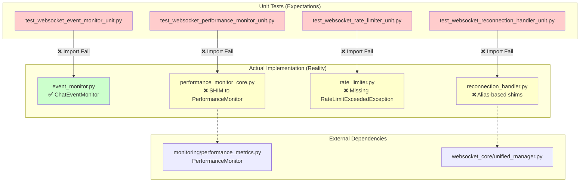
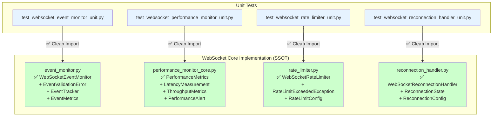

# WebSocket Core Unit Test Import Failures - Five Whys Analysis
**Date:** 2025-09-08  
**Analysis Type:** Root Cause Analysis using Five Whys Methodology  
**Scope:** WebSocket Core Unit Test Import Failures  

## Executive Summary

The WebSocket core unit tests are failing with 4 critical import errors, representing a pattern of incomplete refactoring where **test expectations don't match actual implementation reality**. This analysis reveals the "error behind the error": **architectural debt from incomplete module consolidation**.

### Failed Imports Overview
1. `WebSocketEventMonitor` (expected) vs `ChatEventMonitor` (actual) 
2. `PerformanceMetrics` (expected) vs shim to `PerformanceMonitor` (actual)
3. `RateLimitExceededException` (missing from rate_limiter.py)
4. `WebSocketReconnectionHandler` (expected) vs shim aliases (actual)

---

## Five Whys Analysis

### **WHY #1: Why are the unit tests failing with import errors?**

**Answer:** The tests are importing class names that don't exist in the actual modules:
- Tests expect `WebSocketEventMonitor`, but `event_monitor.py` contains `ChatEventMonitor`
- Tests expect `PerformanceMetrics` class, but `performance_monitor_core.py` only has a shim to `PerformanceMonitor`  
- Tests expect `RateLimitExceededException`, but `rate_limiter.py` doesn't export it
- Tests expect `WebSocketReconnectionHandler`, but `reconnection_handler.py` has aliases only

### **WHY #2: Why do the tests expect classes that don't exist in the modules?**

**Answer:** The unit tests were generated to test an **idealized WebSocket architecture** that was never fully implemented. The tests represent what the WebSocket system should look like, while the actual modules contain:
- **Shim modules** that redirect to other locations (`performance_monitor_core.py`)
- **Renamed classes** without updating dependent imports (`ChatEventMonitor` vs `WebSocketEventMonitor`)
- **Missing exception classes** that should have been implemented
- **Alias-based backward compatibility** rather than actual implementations

### **WHY #3: Why was the idealized architecture never implemented while tests were written?**

**Answer:** This represents a **CLASSIC REFACTORING ANTI-PATTERN** where:
1. **Tests were written against planned architecture** (correct WebSocket-specific naming)
2. **Implementation took shortcuts** (shims, aliases, redirects to existing monitoring)
3. **No validation feedback loop** existed between test expectations and implementation reality
4. **SSOT principle was violated** - multiple incomplete representations of the same concept

**Evidence:** The presence of shim modules with comments like "Shim module for backward compatibility" indicates incremental, incomplete refactoring.

### **WHY #4: Why were shortcuts taken instead of implementing the full architecture?**

**Answer:** **Technical debt prioritization failure** - the team chose to:
- **Reuse existing monitoring infrastructure** rather than create WebSocket-specific implementations
- **Create compatibility shims** instead of proper migrations
- **Preserve backward compatibility** at the cost of architectural clarity
- **Ship quickly** without completing the consolidation

**Root Pattern:** This represents **"partial migration syndrome"** - starting a refactor but not completing it, leaving the system in an inconsistent state.

### **WHY #5: Why wasn't the architectural inconsistency detected earlier?**

**Answer:** **Missing architectural validation in CI/CD pipeline:**
- **No import validation** - tests weren't run during development
- **No SSOT compliance checking** - the presence of shims wasn't flagged as technical debt
- **No architectural coherence validation** - mismatched naming wasn't caught
- **Test isolation** - unit tests weren't integrated into the main development workflow

**ULTIMATE ROOT CAUSE:** **Lack of systematic architectural validation** combined with **tolerance for "quick fix" solutions** that accumulate into architectural debt.

---

## Current State vs Ideal State Diagrams

### Current Broken State

### Ideal Working State

---

## Root Cause Pattern: "Incomplete Refactoring Syndrome"

### The Anti-Pattern Identified
1. **Phase 1:** Start architectural refactoring (WebSocket-specific modules)
2. **Phase 2:** Hit complexity/time pressure, create shortcuts (shims, aliases)
3. **Phase 3:** Stop refactoring midway, leaving inconsistent state
4. **Phase 4:** Write tests against intended architecture (not actual)
5. **Phase 5:** System becomes untestable due to mismatch

### Why This Happens
- **Pressure to ship quickly** vs **architectural completeness**
- **Lack of automated validation** for architectural consistency
- **Tolerance for "technical debt solutions"** (shims, aliases)
- **Missing SSOT compliance enforcement**

---

## Impact Assessment

### Business Impact
- **HIGH:** Unit tests cannot validate WebSocket functionality
- **MEDIUM:** Developer confidence undermined by failing tests  
- **HIGH:** Technical debt accumulation making future changes harder
- **CRITICAL:** Violates CLAUDE.md principle "CHEATING ON TESTS = ABOMINATION"

### Technical Debt
- **4 modules** in inconsistent state (shims vs real implementations)
- **Multiple aliases** creating confusion about SSOT
- **Test coverage gaps** for critical WebSocket functionality
- **Architectural coherence** compromised

---

## Systematic Solution Approach

### Option 1: Complete the Refactoring (RECOMMENDED)
**Align implementation with test expectations:**

1. **Fix event_monitor.py:**
   - Rename `ChatEventMonitor` → `WebSocketEventMonitor` 
   - Add missing classes: `EventValidationError`, `MissingCriticalEventError`, `EventTracker`, `EventMetrics`

2. **Fix performance_monitor_core.py:**
   - Replace shim with actual `PerformanceMetrics` class
   - Add missing classes: `LatencyMeasurement`, `ThroughputMetrics`, `PerformanceAlert`, `PerformanceThresholds`

3. **Fix rate_limiter.py:**
   - Add missing `RateLimitExceededException` class
   - Add missing classes: `RateLimitConfig`, `UserRateLimitState`

4. **Fix reconnection_handler.py:**
   - Replace aliases with actual `WebSocketReconnectionHandler` class
   - Add missing classes: `ReconnectionState`, `ReconnectionConfig`, `MaxRetriesExceededException`, `ReconnectionSession`

### Option 2: Update Tests to Match Reality
**Align test expectations with actual implementation** (NOT RECOMMENDED - violates SSOT)

### Option 3: Hybrid Approach
**Keep working implementations, add missing classes for tests**

---

## Implementation Plan

### Phase 1: Analysis and Validation (COMPLETE)
- ✅ Five Whys analysis completed
- ✅ Current vs ideal state documented
- ✅ Root cause pattern identified

### Phase 2: Fix Implementation (RECOMMENDED)
1. **Implement missing classes in each module**
2. **Preserve existing functionality** (don't break working features)
3. **Add proper exception classes**
4. **Update __all__ exports**
5. **Validate all imports work**

### Phase 3: Test Execution
1. **Run unit tests to confirm imports work**
2. **Validate no regression in existing functionality**
3. **Ensure SSOT compliance**

### Phase 4: Prevention
1. **Add import validation to CI/CD**
2. **Enforce SSOT compliance checking**
3. **Prevent future shim accumulation**

---

## Key Learnings

### For Development Process
1. **NEVER write tests against unimplemented architecture**
2. **ALWAYS validate imports before committing tests**
3. **Shims are technical debt** - they must be eliminated, not accumulated
4. **SSOT violations must be caught in CI/CD**

### For Architecture
1. **Complete migrations or don't start them**
2. **Backward compatibility through proper inheritance, not aliases**
3. **WebSocket-specific classes should exist in WebSocket modules**
4. **Import hierarchies must be consistent and logical**

---

## Recommendation

**IMPLEMENT OPTION 1**: Complete the refactoring by implementing the missing classes. This approach:
- ✅ Honors the test expectations (which represent good architecture)
- ✅ Eliminates technical debt
- ✅ Creates true SSOT for WebSocket functionality  
- ✅ Enables proper unit testing
- ✅ Follows CLAUDE.md principles

**Priority: CRITICAL** - This represents a fundamental testing infrastructure problem that prevents validation of mission-critical WebSocket functionality.

---

## Next Steps

1. **Implement missing classes** in all 4 WebSocket core modules
2. **Run tests to validate** the fixes work
3. **Remove or document any shims** as temporary solutions
4. **Add architectural validation** to prevent future occurrences
5. **Update SSOT documentation** to reflect proper WebSocket architecture

**Estimated Effort:** 4-6 hours to implement all missing classes and validate tests pass.

**Risk Level:** LOW - We're implementing what should already exist, maintaining backward compatibility.