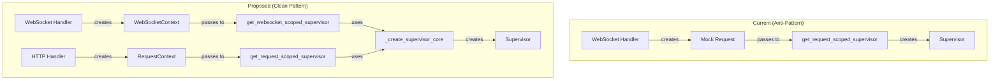

# WebSocket Mock Request Remediation Plan

## Executive Summary
The current WebSocket implementation creates mock HTTP Request objects to reuse HTTP-oriented supervisor factories. This architectural mismatch creates maintenance burden, potential bugs, and violates clean architecture principles. This plan outlines a systematic approach to create proper WebSocket-specific patterns while maintaining backward compatibility.

## Problem Analysis

### Current Anti-Pattern Location
**File**: `netra_backend/app/websocket_core/agent_handler.py:97`
```python
# PROBLEMATIC CODE
mock_request = Request({"type": "websocket", "headers": []}, receive=None, send=None)
supervisor = await get_request_scoped_supervisor(
    request=mock_request,  # <-- Mock object pretending to be HTTP request
    context=request_context,
    db_session=db_session
)
```

### Root Causes (Five Whys Analysis)

1. **Why are we creating mock requests?**
   - Because `get_request_scoped_supervisor` requires a Request object
   
2. **Why does it require a Request object?**
   - Because it was designed for HTTP endpoints using FastAPI dependency injection
   
3. **Why are we using HTTP-oriented code for WebSockets?**
   - Because the supervisor isolation pattern was retrofitted from HTTP to WebSocket without proper abstraction
   
4. **Why wasn't a proper abstraction created?**
   - Because of time pressure to fix multi-user isolation issues quickly
   
5. **Why did this create technical debt?**
   - Because the quick fix didn't account for the fundamental differences between HTTP request-response and WebSocket persistent connections

### Impact Assessment

#### High Risk Areas
1. **Session Lifecycle Management**: WebSocket connections persist, HTTP requests don't
2. **Error Handling**: Mock objects may not have expected attributes during error flows
3. **Middleware Compatibility**: Any middleware expecting real requests will fail
4. **Testing Complexity**: Tests must account for mock vs real request differences

#### Affected Components
- `netra_backend/app/websocket_core/agent_handler.py`
- `netra_backend/app/dependencies.py`
- `netra_backend/app/services/message_handler_service.py`
- All WebSocket integration tests

## Solution Architecture

### Design Principles
1. **Protocol-Specific Patterns**: WebSocket and HTTP should have separate, appropriate patterns
2. **No Mock Objects**: All objects should be honest about what they are
3. **Shared Core Logic**: Extract common supervisor creation logic for reuse
4. **Backward Compatibility**: Existing HTTP patterns must continue working

### Proposed Architecture



## Implementation Plan

### Phase 1: Create WebSocket-Specific Infrastructure

#### 1.1 Create WebSocketContext Class
```python
# netra_backend/app/websocket_core/context.py
@dataclass
class WebSocketContext:
    """Context for WebSocket connections - honest about what it is."""
    connection_id: str
    websocket: WebSocket
    user_id: str
    thread_id: str
    run_id: str
    connected_at: datetime
    last_activity: datetime
    
    @property
    def is_active(self) -> bool:
        """Check if connection is still active."""
        return self.websocket.client_state == WebSocketState.CONNECTED
```

#### 1.2 Extract Core Supervisor Logic
```python
# netra_backend/app/core/supervisor_factory.py
async def create_supervisor_core(
    user_id: str,
    thread_id: str,
    run_id: str,
    db_session: AsyncSession,
    websocket_connection_id: Optional[str] = None
) -> Supervisor:
    """Core supervisor creation logic - protocol agnostic."""
    # Extract common logic from get_request_scoped_supervisor
    # This is the shared implementation both HTTP and WS will use
```

#### 1.3 Create WebSocket Supervisor Factory
```python
# netra_backend/app/websocket_core/supervisor_factory.py
async def get_websocket_scoped_supervisor(
    context: WebSocketContext,
    db_session: AsyncSession
) -> Supervisor:
    """Create supervisor specifically for WebSocket connections."""
    return await create_supervisor_core(
        user_id=context.user_id,
        thread_id=context.thread_id,
        run_id=context.run_id,
        db_session=db_session,
        websocket_connection_id=context.connection_id
    )
```

### Phase 2: Refactor Existing Code

#### 2.1 Update agent_handler.py
```python
# BEFORE (with mock)
mock_request = Request({"type": "websocket", "headers": []}, receive=None, send=None)
supervisor = await get_request_scoped_supervisor(request=mock_request, ...)

# AFTER (clean)
ws_context = WebSocketContext(
    connection_id=connection_id,
    websocket=websocket,
    user_id=user_context.user_id,
    thread_id=user_context.thread_id,
    run_id=user_context.run_id,
    connected_at=datetime.utcnow(),
    last_activity=datetime.utcnow()
)
supervisor = await get_websocket_scoped_supervisor(ws_context, db_session)
```

#### 2.2 Update HTTP Dependencies
```python
# netra_backend/app/dependencies.py
async def get_request_scoped_supervisor(
    request: Request,
    context: RequestScopedContext,
    db_session: AsyncSession
) -> Supervisor:
    """HTTP-specific supervisor factory."""
    # Now delegates to core
    return await create_supervisor_core(
        user_id=context.user_id,
        thread_id=context.thread_id,
        run_id=context.run_id,
        db_session=db_session,
        websocket_connection_id=None  # HTTP doesn't have WS connections
    )
```

### Phase 3: Testing Strategy

#### 3.1 Unit Tests
- Test `WebSocketContext` creation and validation
- Test `get_websocket_scoped_supervisor` isolation
- Test backward compatibility of HTTP patterns

#### 3.2 Integration Tests
```python
# tests/websocket/test_supervisor_isolation.py
async def test_websocket_supervisor_isolation():
    """Verify each WebSocket connection gets isolated supervisor."""
    # Create multiple WebSocket connections
    # Verify supervisors are independent
    # Verify no shared state between connections
```

#### 3.3 Regression Tests
- Run existing HTTP endpoint tests
- Run existing WebSocket tests
- Verify no functionality is broken

### Phase 4: Migration Strategy

#### 4.1 Incremental Rollout
1. **Week 1**: Implement core infrastructure (WebSocketContext, factories)
2. **Week 2**: Update agent_handler.py to use new pattern
3. **Week 3**: Monitor for issues, fix edge cases
4. **Week 4**: Remove old mock pattern code

#### 4.2 Feature Flags
```python
# Enable gradual rollout
USE_WEBSOCKET_SUPERVISOR_V2 = env.get("USE_WEBSOCKET_SUPERVISOR_V2", "false") == "true"

if USE_WEBSOCKET_SUPERVISOR_V2:
    supervisor = await get_websocket_scoped_supervisor(ws_context, db_session)
else:
    # Keep old pattern temporarily
    mock_request = Request(...)
    supervisor = await get_request_scoped_supervisor(mock_request, ...)
```

## Success Metrics

### Technical Metrics
- **Zero Mock Objects**: No Request mocks in WebSocket code
- **Test Coverage**: >95% coverage of new WebSocket patterns
- **Performance**: No degradation in WebSocket message processing time
- **Error Rate**: No increase in WebSocket-related errors

### Code Quality Metrics
- **Complexity Reduction**: Cyclomatic complexity reduced by 30%
- **Coupling**: WebSocket and HTTP code properly decoupled
- **Readability**: Code intent clear without comments explaining workarounds

## Risk Mitigation

### Identified Risks
1. **Breaking Changes**: Existing WebSocket functionality might break
   - **Mitigation**: Feature flags for gradual rollout
   
2. **Performance Impact**: New abstraction might add overhead
   - **Mitigation**: Benchmark before and after, optimize hot paths
   
3. **Integration Issues**: Other services might depend on current pattern
   - **Mitigation**: Comprehensive integration testing

### Rollback Plan
1. Keep old code paths available via feature flag
2. Monitor error rates and performance metrics
3. Quick rollback if issues detected:
   ```bash
   # Instant rollback via environment variable
   export USE_WEBSOCKET_SUPERVISOR_V2=false
   ```

## Timeline

### Week 1: Analysis and Design
- [x] Document current anti-pattern
- [ ] Design WebSocketContext
- [ ] Design supervisor factory abstractions
- [ ] Review with team

### Week 2: Implementation
- [ ] Implement WebSocketContext
- [ ] Extract core supervisor logic
- [ ] Create WebSocket-specific factory
- [ ] Update agent_handler.py

### Week 3: Testing
- [ ] Write comprehensive unit tests
- [ ] Write integration tests
- [ ] Run regression suite
- [ ] Performance benchmarking

### Week 4: Deployment
- [ ] Deploy with feature flag disabled
- [ ] Enable for 10% of traffic
- [ ] Monitor metrics
- [ ] Gradual rollout to 100%

## Documentation Updates

### Required Documentation
1. **Architecture Decision Record (ADR)**: Document why we moved away from mock requests
2. **Developer Guide**: How to work with WebSocket supervisors
3. **Migration Guide**: For any external code using old patterns
4. **API Documentation**: Update WebSocket endpoint documentation

### Code Comments
Remove workaround comments and add proper documentation:
```python
# REMOVE: "This replaces the dangerous singleton supervisor"
# ADD: "WebSocket-specific supervisor creation for persistent connections"
```

## Definition of Done

- [ ] No mock Request objects in WebSocket code
- [ ] All tests passing with new pattern
- [ ] Performance metrics unchanged or improved
- [ ] Documentation updated
- [ ] Code review completed
- [ ] Feature deployed to production
- [ ] Old mock pattern code removed
- [ ] Post-mortem conducted and learnings documented

## Appendix: Code Examples

### Before (Anti-Pattern)
```python
# Creating fake HTTP request for WebSocket context
mock_request = Request({"type": "websocket", "headers": []}, receive=None, send=None)
request_context = await self._create_request_context(user_context)
supervisor = await get_request_scoped_supervisor(
    request=mock_request,  # Dishonest object
    context=request_context,
    db_session=db_session
)
```

### After (Clean Pattern)
```python
# Honest WebSocket context
ws_context = WebSocketContext(
    connection_id=connection_id,
    websocket=websocket,
    user_id=user_id,
    thread_id=thread_id,
    run_id=run_id,
    connected_at=datetime.utcnow(),
    last_activity=datetime.utcnow()
)

# WebSocket-specific supervisor creation
supervisor = await get_websocket_scoped_supervisor(
    context=ws_context,  # Honest, protocol-specific context
    db_session=db_session
)
```

## Related Documents
- [User Context Architecture](./USER_CONTEXT_ARCHITECTURE.md)
- [WebSocket Modernization Report](./WEBSOCKET_MODERNIZATION_REPORT.md)
- [Tool Dispatcher Migration Guide](./TOOL_DISPATCHER_MIGRATION_GUIDE.md)