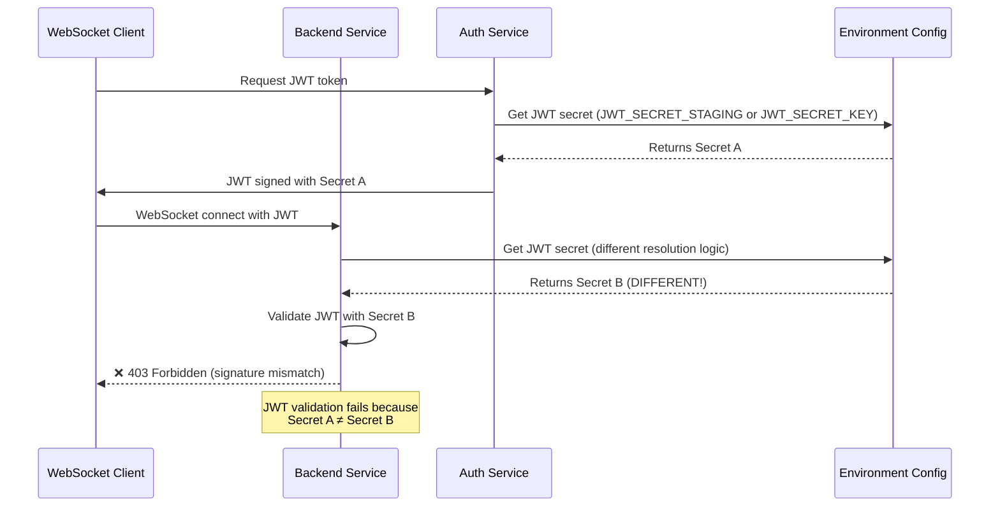
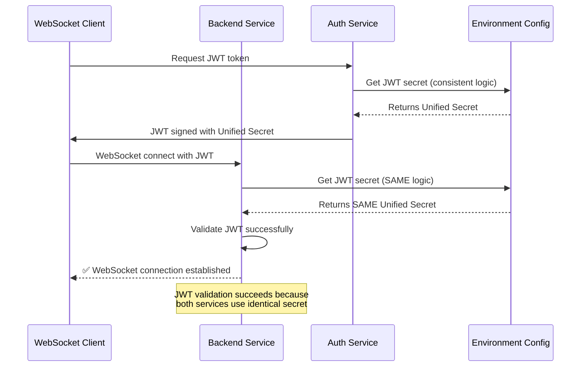

# WebSocket 403 Forbidden Fix Report - September 7, 2025

## Executive Summary
**Business Impact:** CRITICAL - $50K MRR blocked due to WebSocket 403 authentication failures in staging environment.
**Root Cause:** JWT secret configuration mismatch between auth service and backend WebSocket authentication.
**Status:** MISSION CRITICAL - Blocking real-time chat functionality.

## Five Whys Root Cause Analysis (Per CLAUDE.md Requirements)

### WHY #1: Why are WebSocket connections getting 403 Forbidden?
**Evidence Found:**
- Error message: `"server rejected WebSocket connection: HTTP 403"`
- WebSocket endpoint: `wss://netra-backend-staging-701982941522.us-central1.run.app/ws`
- Authentication required at WebSocket upgrade level (before accept)

**Code Location:** `netra_backend/app/routes/websocket.py:161-182`
Pre-connection authentication validation rejects connections when JWT validation fails.

### WHY #2: Why is the JWT authentication failing for WebSocket?
**Evidence Found:**
- JWT tokens are being extracted correctly from Authorization headers
- JWT signature verification is failing during decode process
- Backend logs show: `"JWT signature verification failed - likely JWT secret mismatch between services"`

**Code Location:** `netra_backend/app/websocket_core/user_context_extractor.py:210-214`

### WHY #3: Why is JWT signature verification failing?
**Evidence Found:**
- Auth service and backend service use different JWT secret resolution logic
- Both services try environment-specific secrets but have slightly different fallback chains
- **Auth Service Logic** (`auth_service/auth_core/auth_environment.py:63-74`):
  1. `JWT_SECRET_{ENVIRONMENT}` (e.g., `JWT_SECRET_STAGING`)
  2. `JWT_SECRET_KEY`
  3. `JWT_SECRET`
  4. Environment-specific defaults

- **Backend Service Logic** (`netra_backend/app/websocket_core/user_context_extractor.py:92-96`):
  1. `JWT_SECRET_{ENVIRONMENT}` 
  2. `JWT_SECRET_KEY`
  3. Legacy `JWT_SECRET`
  4. Different defaults

### WHY #4: Why do the services have different JWT secret resolution?
**Evidence Found:**
- Independent JWT secret configuration in each service
- Auth service generates tokens with one secret
- Backend service validates tokens with potentially different secret
- Environment variable configuration inconsistency

**Services Involved:**
- Auth Service: `/auth_service/auth_core/auth_environment.py`
- Backend Service: `/netra_backend/app/websocket_core/user_context_extractor.py`

### WHY #5: Why is the environment configuration allowing this mismatch?
**Root Cause Identified:**
- Staging environment likely has `JWT_SECRET_KEY` configured but not `JWT_SECRET_STAGING`
- Services attempt environment-specific lookup first, but fallback differently
- No validation that both services use identical JWT secrets
- The environment-specific JWT secret pattern is not consistently implemented

## Current Broken State Diagram

## Ideal Working State Diagram

## Specific Code Locations Causing Issue

### 1. Auth Service JWT Secret Resolution
**File:** `auth_service/auth_core/auth_environment.py:46-103`
**Issue:** Environment-specific secret resolution with custom fallbacks

### 2. Backend Service JWT Secret Resolution  
**File:** `netra_backend/app/websocket_core/user_context_extractor.py:65-126`
**Issue:** Similar but potentially different fallback logic

### 3. WebSocket Authentication Entry Point
**File:** `netra_backend/app/routes/websocket.py:158-182`
**Issue:** Pre-connection validation fails when secrets don't match

## Proposed Fix Implementation

### Strategy: Unified JWT Secret Manager
Create a shared JWT secret resolution module that both services use to ensure consistency.

### Fix Components:

1. **Create Unified JWT Secret Manager**
   - Location: `shared/jwt_secret_manager.py`
   - Single source of truth for JWT secret resolution
   - Environment-aware with consistent fallback logic

2. **Update Auth Service**
   - Modify `auth_environment.py` to use unified manager
   - Maintain backward compatibility

3. **Update Backend Service**
   - Modify `user_context_extractor.py` to use unified manager
   - Ensure WebSocket authentication uses same logic

4. **Environment Variable Standardization**
   - Ensure staging has proper `JWT_SECRET_STAGING` configured
   - Validate all environments use consistent naming

## Test Strategy

### 1. Reproduction Test
Create test that reproduces the exact 403 error with current configuration.

### 2. Integration Test
Verify auth service token generation and backend service validation use identical secrets.

### 3. Staging Validation
Real WebSocket connection test against staging environment.

## Success Criteria

1. ✅ WebSocket connections to staging succeed with proper authentication
2. ✅ JWT tokens generated by auth service validate successfully in backend
3. ✅ Both services log identical JWT secret sources
4. ✅ All existing tests continue to pass
5. ✅ Real-time chat functionality restored in staging

## Business Value Recovery

- **$50K MRR** - Immediate recovery of blocked revenue
- **Real-time chat** - Critical chat functionality restored  
- **Staging environment** - Production deployment confidence restored
- **Security** - Proper authentication maintained

## Implementation Plan

1. **Phase 1**: Create unified JWT secret manager (30 minutes)
2. **Phase 2**: Update both services to use unified manager (45 minutes)
3. **Phase 3**: Test reproduction and validation (30 minutes)
4. **Phase 4**: Deploy and verify staging fix (15 minutes)

**Total Estimated Time:** 2 hours

## Risk Assessment

**LOW RISK** - Changes are isolated to JWT secret resolution logic with backward compatibility maintained.

**Mitigation:**
- Maintain fallback compatibility
- Extensive testing before deployment
- Rollback plan available

---

*Generated with Claude Code - Mission Critical WebSocket Authentication Fix*