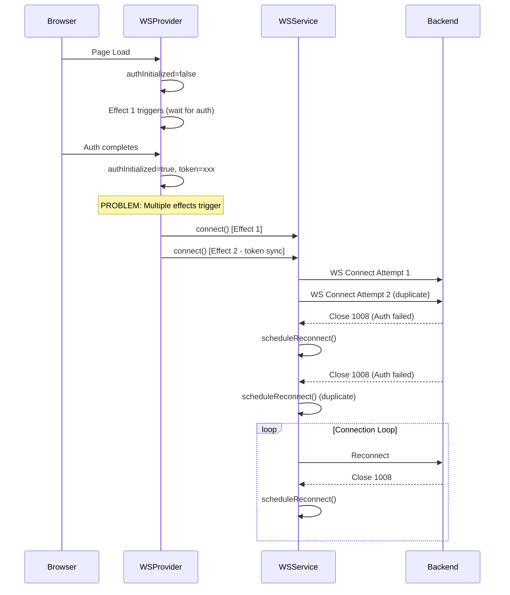
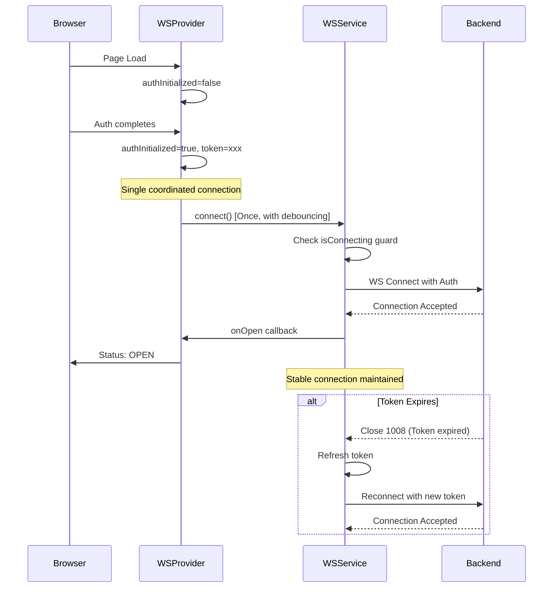

# WebSocket Connection Loop Bug Report

**Date:** 2025-01-03  
**Severity:** CRITICAL  
**Component:** Frontend WebSocket Service  
**Environment:** GCP Staging  

## Executive Summary
The frontend WebSocket service is experiencing a continuous connection/disconnection loop in the GCP staging environment, creating excessive load on the backend and degrading user experience.

## Five Whys Analysis

### Problem Statement
Frontend is making new WebSocket connections and closing them continuously in a loop on GCP staging.

### Five Whys Investigation

**Why #1: Why is the frontend creating and closing WebSocket connections repeatedly?**
- Answer: The WebSocket connection is failing immediately after establishment, triggering the automatic reconnection logic.

**Why #2: Why is the WebSocket connection failing immediately after establishment?**
- Answer: The connection is being closed with code 1008 (Policy Violation), indicating an authentication failure.

**Why #3: Why is the authentication failing for WebSocket connections?**
- Answer: The authentication check happens after the connection is established, and there's a race condition between:
  1. Auth initialization in WebSocketProvider
  2. WebSocket connection attempt
  3. Token validation/refresh logic

**Why #4: Why does the race condition exist between auth initialization and WebSocket connection?**
- Answer: Multiple overlapping effects in `WebSocketProvider` are triggering connection attempts:
  1. Initial effect on `token` and `authInitialized` changes (line 109)
  2. Token synchronization effect (line 307) 
  3. No proper debouncing or deduplication of connection attempts
  4. The `isConnecting` flag is checked but not consistently managed

**Why #5: Why aren't the connection attempts properly debounced and deduplicated?**
- Answer: The architecture has evolved with multiple auth handling patterns:
  1. Legacy query parameter auth (`?jwt=token`)
  2. Subprotocol auth (Sec-WebSocket-Protocol)
  3. Development mode (no auth)
  4. Each pattern has different connection/reconnection behaviors
  5. The `connect()` method doesn't properly guard against rapid successive calls

## Root Cause Analysis

### Primary Issues Identified:

1. **Race Condition in WebSocketProvider Effects**
   - Multiple useEffect hooks can trigger connection attempts
   - No proper coordination between auth state changes and connection state

2. **Inadequate Connection State Management**
   - `isConnecting` flag is set but not consistently checked
   - Missing guards against rapid reconnection attempts
   - Reconnection logic doesn't account for auth refresh scenarios

3. **Authentication Token Lifecycle Issues**
   - Token refresh can trigger new connection attempts while reconnection is already scheduled
   - No cooldown period after auth failures
   - Missing coordination between token refresh and reconnection backoff

## Mermaid Diagrams

### Current (Broken) State Flow



### Ideal Working State



## Proposed Solution

### 1. Connection Coordination
- Implement connection debouncing in WebSocketProvider
- Use a single connection manager pattern
- Add connection attempt deduplication

### 2. Enhanced State Guards
```typescript
// Add to WebSocketService
private connectionAttemptId: string | null = null;
private lastConnectionAttempt: number = 0;
private readonly MIN_CONNECTION_INTERVAL = 1000; // 1 second minimum between attempts

public async connect(url: string, options: WebSocketOptions = {}) {
  // Generate unique ID for this connection attempt
  const attemptId = `attempt_${Date.now()}_${Math.random()}`;
  
  // Check minimum interval
  const timeSinceLastAttempt = Date.now() - this.lastConnectionAttempt;
  if (timeSinceLastAttempt < this.MIN_CONNECTION_INTERVAL) {
    logger.debug('Connection attempt throttled', { timeSinceLastAttempt });
    return;
  }
  
  // Check if another connection is in progress
  if (this.connectionAttemptId && this.isConnecting) {
    logger.debug('Connection already in progress', { 
      currentAttemptId: this.connectionAttemptId,
      rejectedAttemptId: attemptId 
    });
    return;
  }
  
  this.connectionAttemptId = attemptId;
  this.lastConnectionAttempt = Date.now();
  // ... rest of connection logic
}
```

### 3. Auth Failure Handling
- Add exponential backoff specifically for auth failures
- Implement auth retry limit before requiring user re-authentication
- Add cooldown period after auth failures

### 4. WebSocketProvider Consolidation
- Merge multiple effects into a single coordinated effect
- Add proper cleanup and cancellation
- Implement connection request deduplication

## Implementation Plan

1. **Add connection throttling and deduplication** to WebSocketService
2. **Consolidate WebSocketProvider effects** into single coordinated effect
3. **Implement auth-specific retry logic** with exponential backoff
4. **Add connection state telemetry** for monitoring
5. **Test in staging environment** with various auth scenarios

## Verification Steps

1. Deploy fix to staging
2. Monitor WebSocket connection metrics
3. Verify no connection loops occur
4. Test token expiry and refresh scenarios
5. Validate reconnection after network interruptions

## Success Criteria

- No WebSocket connection loops in staging logs
- Maximum 1 connection attempt per second
- Successful reconnection after auth token refresh
- Stable long-running connections
- Proper cleanup on page navigation

## Related Files

- `/frontend/services/webSocketService.ts` - Main service implementation
- `/frontend/providers/WebSocketProvider.tsx` - Provider with multiple effects
- `/frontend/hooks/useWebSocket.ts` - Hook interface
- `/frontend/services/reconciliation.ts` - Message reconciliation service