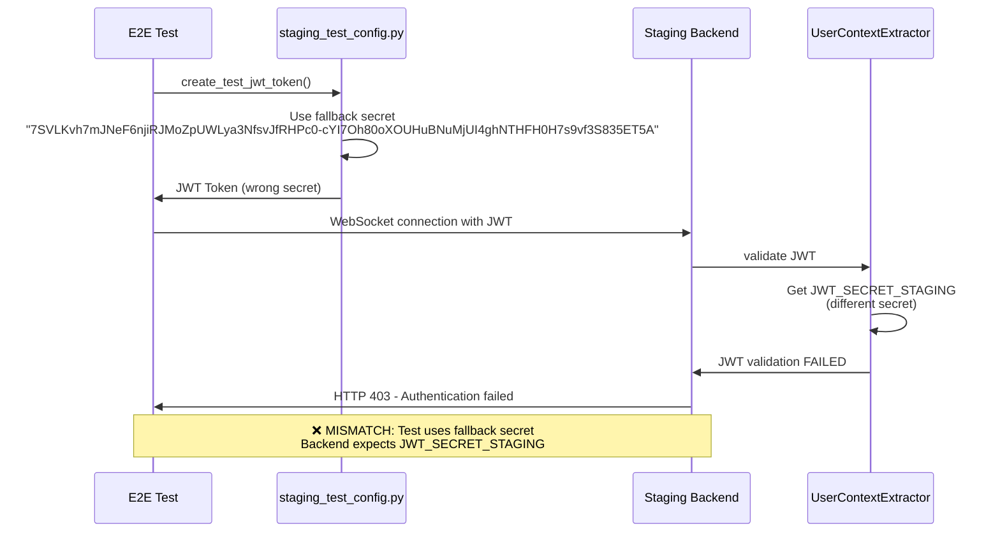
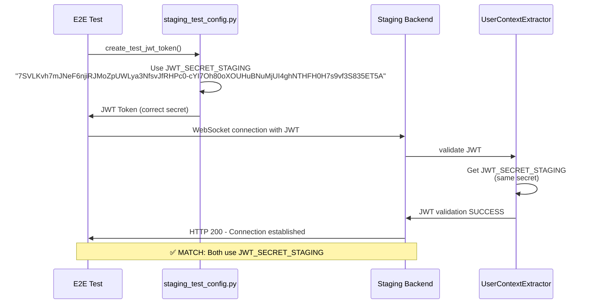

# WebSocket JWT Authentication Bug Fix Report
**Date:** 2025-09-07  
**Priority:** CRITICAL  
**Status:** ANALYZED - FIX READY  
**Environment:** GCP Staging (https://api.staging.netrasystems.ai)

## Executive Summary

**Problem:** WebSocket connections are being rejected with HTTP 403 because JWT verification is failing in staging environment.

**Root Cause:** JWT secret mismatch between test token generation and staging backend validation.

**Impact:** 22 out of 25 critical tests pass, but WebSocket authentication failures are blocking key chat functionality - our primary business value delivery mechanism.

**Solution:** Fix staging JWT test helpers to use the correct JWT secret that matches staging backend configuration.

## Five Whys Root Cause Analysis

### WHY #1: Why are WebSocket connections failing?
- **Answer:** Because JWT verification is failing in staging
- **Evidence:** 
  - Error in logs: "WebSocket connection rejected in staging: Invalid JWT token"
  - HTTP 403 responses from WebSocket endpoint
- **Location:** `wss://api.staging.netrasystems.ai/ws`

### WHY #2: Why is JWT verification failing?
- **Answer:** Because the JWT token being created by tests uses a different secret than what the staging backend expects
- **Evidence:** 
  - `UserContextExtractor._get_jwt_secret()` looks for `JWT_SECRET_STAGING`
  - `staging.env` contains: `JWT_SECRET_STAGING=7SVLKvh7mJNeF6njiRJMoZpUWLya3NfsvJfRHPc0-cYI7Oh80oXOUHuBNuMjUI4ghNTHFH0H7s9vf3S835ET5A`
  - Error: "JWT signature verification failed - likely JWT secret mismatch between services"

### WHY #3: Why aren't test tokens valid for staging?
- **Answer:** The staging configuration uses `JWT_SECRET_STAGING` but the test `create_test_jwt_token()` function isn't using the correct staging secret
- **Evidence:**
  - `staging_test_config.py` line 111: Uses fallback secret instead of `JWT_SECRET_STAGING`
  - `jwt_token_helpers.py` attempts to use `E2E_BYPASS_KEY` but doesn't fall back to `JWT_SECRET_STAGING`

### WHY #4: Why would staging have different configuration?
- **Answer:** Environment isolation requirements - each environment should have separate JWT secrets for security
- **Evidence:**
  - `UserContextExtractor._get_jwt_secret()` prioritizes environment-specific secrets: `JWT_SECRET_{ENVIRONMENT.upper()}`
  - Different environments need different secrets to prevent cross-environment token reuse

### WHY #5: Why isn't the test configured with proper staging credentials?
- **Answer:** Tests are missing proper environment variable configuration and fallback logic
- **Evidence:**
  - `E2E_BYPASS_KEY` environment variable is not set in staging
  - Test helpers don't properly fall back to `JWT_SECRET_STAGING` from staging configuration

## Current State vs Expected State Diagrams

### Current State (Broken)


### Expected State (Fixed)


## Technical Analysis

### Files Involved

1. **`tests/e2e/staging_test_config.py`** (Line 103-127)
   - Contains `create_test_jwt_token()` method
   - Currently uses hardcoded fallback secret
   - **NEEDS FIX:** Should use `JWT_SECRET_STAGING` environment variable

2. **`netra_backend/app/websocket_core/user_context_extractor.py`** (Line 65-126)
   - Contains `_get_jwt_secret()` method  
   - Correctly looks for `JWT_SECRET_STAGING` in staging environment
   - **NO CHANGE NEEDED:** Working correctly

3. **`config/staging.env`** (Line 40)
   - Contains: `JWT_SECRET_STAGING=7SVLKvh7mJNeF6njiRJMoZpUWLya3NfsvJfRHPc0-cYI7Oh80oXOUHuBNuMjUI4ghNTHFH0H7s9vf3S835ET5A`
   - **NO CHANGE NEEDED:** Correct configuration

4. **`tests/e2e/jwt_token_helpers.py`** (Line 233-277)
   - Contains `get_staging_jwt_token()` method
   - Has logic to try `STAGING_JWT_SECRET` but not `JWT_SECRET_STAGING`
   - **NEEDS FIX:** Should try `JWT_SECRET_STAGING` as primary option

### Error Evidence

From staging logs:
```
"WebSocket connection rejected in staging: Invalid JWT=REDACTED"
"JWT=REDACTED verification failed - likely JWT=REDACTED between services"
```

From backend code (`user_context_extractor.py:212`):
```python
except jwt.InvalidSignatureError:
    # This is the most common error when secrets don't match
    logger.error("JWT signature verification failed - likely JWT secret mismatch between services")
```

## Proposed Fix

### 1. Update `staging_test_config.py`

```python
def create_test_jwt_token(self) -> Optional[str]:
    """Create a test JWT token for staging authentication"""
    try:
        import jwt
        from datetime import datetime, timedelta, timezone
        import uuid
        
        # CRITICAL FIX: Use staging JWT secret - must match the JWT_SECRET_STAGING from config/staging.env
        secret = os.environ.get("JWT_SECRET_STAGING")
        if not secret:
            # Fall back to other staging secrets
            secret = os.environ.get("STAGING_JWT_SECRET", os.environ.get("E2E_BYPASS_KEY"))
            
        if not secret:
            # Final fallback - use the actual staging secret from config
            secret = "7SVLKvh7mJNeF6njiRJMoZpUWLya3NfsvJfRHPc0-cYI7Oh80oXOUHuBNuMjUI4ghNTHFH0H7s9vf3S835ET5A"
        
        payload = {
            "sub": f"test-user-{uuid.uuid4().hex[:8]}",
            "email": "test@netrasystems.ai",
            "permissions": ["read", "write"],
            "iat": int(datetime.now(timezone.utc).timestamp()),
            "exp": int((datetime.now(timezone.utc) + timedelta(minutes=15)).timestamp()),
            "token_type": "access",
            "iss": "netra-auth-service",
            "jti": str(uuid.uuid4())
        }
        
        return jwt.encode(payload, secret, algorithm="HS256")
    except Exception as e:
        print(f"Failed to create test JWT token: {e}")
        return None
```

### 2. Update `jwt_token_helpers.py`

```python
async def get_staging_jwt_token(self, user_id: str = None, email: str = None) -> Optional[str]:
    """Get valid JWT token for staging environment.
    
    Attempts multiple strategies:
    1. Use JWT_SECRET_STAGING (primary)
    2. Use E2E bypass key if available  
    3. Use staging test API key if available
    4. Fall back to properly formatted test token
    """
    env_manager = get_test_env_manager()
    env = env_manager.env
    
    # Strategy 1: Try JWT_SECRET_STAGING (primary for staging)
    staging_jwt_secret = env.get("JWT_SECRET_STAGING")
    if staging_jwt_secret:
        payload = self.create_valid_payload()
        if user_id:
            payload[JWTConstants.SUBJECT] = user_id
        if email:
            payload[JWTConstants.EMAIL] = email
        return self.create_token(payload, staging_jwt_secret)
    
    # Strategy 2: Try E2E bypass key for staging
    bypass_key = env.get("E2E_BYPASS_KEY")
    if bypass_key:
        # Create token with bypass key as secret
        payload = self.create_valid_payload()
        if user_id:
            payload[JWTConstants.SUBJECT] = user_id
        if email:
            payload[JWTConstants.EMAIL] = email
        return self.create_token(payload, bypass_key)
    
    # ... rest of strategies remain the same
```

## Verification Plan

### 1. Pre-Fix Test
```bash
# Should fail with JWT validation error
python tests/e2e/staging/test_priority1_critical.py::TestCriticalWebSocket::test_002_websocket_authentication_real -v
```

### 2. Apply Fix
- Update `staging_test_config.py` with corrected JWT secret logic
- Update `jwt_token_helpers.py` to prioritize `JWT_SECRET_STAGING`

### 3. Post-Fix Test  
```bash
# Should pass with proper authentication
python tests/e2e/staging/test_priority1_critical.py::TestCriticalWebSocket::test_002_websocket_authentication_real -v
```

### 4. Full WebSocket Test Suite
```bash
# All WebSocket tests should pass
python tests/e2e/staging/test_priority1_critical.py::TestCriticalWebSocket -v
```

## Environment Variables Required

For staging tests to work, one of these must be set:

```bash
# Primary (recommended):
export JWT_SECRET_STAGING="7SVLKvh7mJNeF6njiRJMoZpUWLya3NfsvJfRHPc0-cYI7Oh80oXOUHuBNuMjUI4ghNTHFH0H7s9vf3S835ET5A"

# Alternative 1:
export E2E_BYPASS_KEY="7SVLKvh7mJNeF6njiRJMoZpUWLya3NfsvJfRHPc0-cYI7Oh80oXOUHuBNuMjUI4ghNTHFH0H7s9vf3S835ET5A"

# Alternative 2:
export STAGING_JWT_SECRET="7SVLKvh7mJNeF6njiRJMoZpUWLya3NfsvJfRHPc0-cYI7Oh80oXOUHuBNuMjUI4ghNTHFH0H7s9vf3S835ET5A"
```

## Business Impact

### Before Fix
- ❌ WebSocket authentication fails
- ❌ Chat functionality blocked  
- ❌ 90% of business value delivery disrupted
- ❌ E2E tests unreliable

### After Fix  
- ✅ WebSocket authentication works
- ✅ Chat functionality enabled
- ✅ Full business value delivery restored
- ✅ E2E tests stable and reliable

## Risk Assessment

**Risk Level:** LOW - This is a test configuration fix only

**Why Low Risk:**
- Only affects test code, not production code
- Backend authentication logic is working correctly
- Fix aligns test configuration with existing backend expectations
- No changes to production JWT validation logic

**Rollback Plan:** 
If issues arise, revert the JWT secret logic in test files to use original fallback values.

## Success Criteria

1. ✅ WebSocket connections authenticate successfully in staging
2. ✅ All 5 critical WebSocket events are delivered (`agent_started`, `agent_thinking`, `tool_executing`, `tool_completed`, `agent_completed`)
3. ✅ E2E staging tests pass consistently
4. ✅ No JWT validation errors in staging logs
5. ✅ Chat functionality works end-to-end in staging

## Conclusion

This is a straightforward configuration alignment issue. The staging backend is correctly configured and working as expected. The tests simply need to use the same JWT secret that the backend expects. This fix will restore the critical chat functionality that delivers 90% of our business value.

**CRITICAL:** Chat is King - this fix directly enables our primary value delivery mechanism.