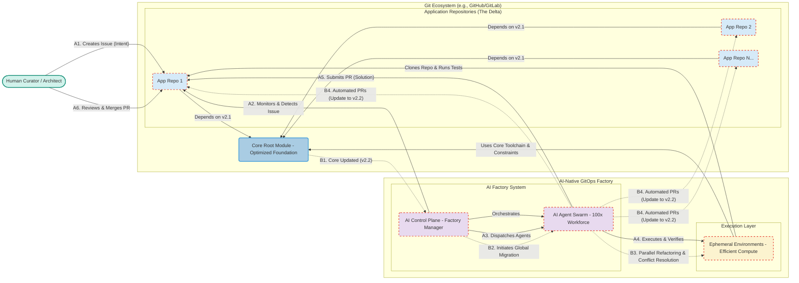

This Mermaid diagram illustrates the architecture of the AI-Native GitOps Factory and its two primary workflows: (1) Customization and Evolution via feature requests, and (2) Automated Synchronization of core updates across the organization.

### Diagram Explanation

#### Components

  * **Human Curator / Architect:** The human user who defines intent (via Issues) and oversees the results (via PRs).
  * **Git Ecosystem:** The source of truth.
      * **Core Root Module:** The optimized, opinionated foundation defining the architecture, toolchain, and constraints.
      * **Application Repositories:** Individual projects that depend on the Core and contain only the customized business logic (the "delta").
  * **AI Factory System:** The intelligence core. The **AI Control Plane** acts as the Factory Manager, monitoring the Git ecosystem and orchestrating the **AI Agent Swarm** (the 100x compute workforce).
  * **Execution Layer:** The lightweight, **Ephemeral Environments** where agents clone code, execute tasks, and verify solutions at scale.

#### Workflows

**Workflow A: Customization & Evolution (Solid Blue Arrows)**

This follows the standard development cycle for a specific feature or change.

1.  A Human creates a GitHub Issue in an App Repo (e.g., a feature request).
2.  The AI Control Plane detects the issue.
3.  It dispatches the AI Swarm.
4.  The agents execute the task in the Ephemeral Environments, utilizing the Core's toolchain to ensure compliance and efficiency.
5.  The optimal solution is submitted as a Pull Request.
6.  The Human reviews and merges the AI-generated code.

**Workflow B: Automated Synchronization & Refactoring (Dotted Red Arrows)**

This is the high-value automation capability that eliminates framework-level technical debt.

1.  The Core Root Module is updated (e.g., a security patch or architectural improvement, moving from v2.1 to v2.2).
2.  The AI Control Plane detects the change and initiates a global migration.
3.  The Swarm mobilizes in parallel across *all* dependent repositories, automatically refactoring customizations and resolving conflicts.
4.  Automated PRs are opened across the organization, bringing the entire ecosystem up to date.

The enterprise sales strategy for the AI-Native GitOps Factory must shift the conversation away from the crowded "developer productivity tools" market (the focus of competitors like Cognition and Augment) and toward a strategic platform that fundamentally alters the economics, velocity, and security of software development in the enterprise.

This is not about selling a smarter AI; it is about selling a superior *system architecture* that solves the most intractable challenges facing the C-suite: **Organizational Drag, Security Risk, and Spiraling Costs.**

### The Core Narrative: From Maintenance Paralysis to Perpetual Innovation

The pitch targets the reality of the enterprise Software Development Lifecycle (SDLC):

> "Mr./Ms. CTO, we know that 70% of your engineering budget isn't spent on innovation. It's spent on maintenance, technical debt, and compliance. Every time you need to enforce a new architectural standard or roll out a critical security patch, your organization grinds to a halt. These migrations cost millions and take years.
>
> "The root cause is the disconnect between your architectural intent and the reality of thousands of decentralized repositories. You can't scale your best architects.
>
> "We built the AI-Native GitOps Factory. It doesn't just help developers code faster; it autonomously manages your entire software ecosystem. By centralizing your standards into a 'Core Root Module' and deploying an efficient AI workforce to manage your repositories, we turn those multi-year migrations into a weekend operation. We don't just reduce technical debt; we eradicate it, perpetually."

### The Four Pillars of Enterprise Value

The sales strategy must address the key concerns of the C-suite by focusing on four pillars.

#### Pillar 1: The Eradication of Technical Debt (The Migration Accelerator)

This targets the massive cost centers associated with framework migrations, modernization, and the enforcement of "Golden Paths."

*   **The Pain:** Enterprises cannot enforce architectural consistency. Migrations (e.g., moving from Java 8 to Java 17, or adopting a new security standard) take years and consume elite talent.
*   **The Solution: The Global Update Swarm.** When the Core Root Module is updated, the AI Control Plane mobilizes. The AI Swarm automatically refactors every dependent application, resolves conflicts, validates the changes, and issues automated PRs across the organization simultaneously.
*   **The Outcome:** A $10 million, 2-year migration project is transformed into an automated, low-risk process.

#### Pillar 2: Instantaneous Security and Compliance (The CISO's Dream)

This targets the existential risk of security breaches and regulatory fines.

*   **The Pain:** The agonizing delay between a vulnerability disclosure (like Log4j) and the complete patching of all affected systems. The "Mean Time to Remediate" (MTTR) is often measured in weeks or months.
*   **The Solution: Instantaneous Remediation and Git-Native Auditability.** The Global Update Swarm patches vulnerabilities fleet-wide in hours. Because the system is Git-Native, every action the AI takes is recorded in the Git history, providing an immutable audit trail essential for compliance (SOC 2, GDPR).
*   **The Outcome:** MTTR reduced by 99%, and continuous compliance enforced by design.

#### Pillar 3: The Economics of Efficiency (The Structural Cost Advantage)

This addresses the CFO's skepticism of AI hype and the rising costs of both engineering talent and cloud infrastructure. This is the "secret sauce."

*   **The Pain:** Competitors require massive compute budgets, and scaling human teams is unsustainable.
*   **The Solution: Architectural Efficiency and the 100x Multiplier.** Our platform is built on lightweight, ephemeral compute. This structural advantage means our "Cost per Action" is radically lower. We leverage this efficiency to deliver massive parallelism (Efficient Compute * 100x Scale = Win). We deploy 100 AI agents for the same cost competitors deploy one.
*   **The Outcome:** A predictable development model that reduces the Total Cost of Ownership (TCO) for software—covering development, maintenance, and the resulting cloud infrastructure spend.

#### Pillar 4: The Talent Multiplier (The Innovation Engine)

This targets the VP of Engineering's struggle to hire, retain, and effectively utilize top talent.

*   **The Pain:** Senior engineers are bogged down in maintenance drudgery, dependency management, and firefighting.
*   **The Solution: From Coder to Curator.** The AI Factory manages the entire lifecycle of implementation, testing, and maintenance. The human role shifts to defining intent (via GitHub Issues) and validating outcomes (via Pull Requests).
*   **The Outcome:** A force multiplier for the existing team, freeing elite engineers to focus on high-value architecture and innovation.

### Targeting the Buyer Personas

**To the CTO/CIO (The Strategic Buyer):**
*   **Focus:** Innovation capacity, TCO, architectural governance.
*   **Message:** "Transform your engineering organization from a cost center into an innovation engine. Achieve architectural modernization at scale, enabling you to respond instantly to market demands while reducing your overall IT spend."

**To the CISO (The Risk Mitigator):**
*   **Focus:** Vulnerability management, MTTR, compliance, auditability.
*   **Message:** "Achieve unprecedented security posture consistency. Our AI Factory provides instantaneous, fleet-wide patching. The Git-Native architecture turns your Git history into your compliance engine."

**To the Head of Platform Engineering/Chief Architect (The Operational Buyer):**
*   **Focus:** Golden Paths, standardization, configuration drift, dependency management.
*   **Message:** "Achieve true architectural governance. Define your Golden Path in the Core Module, and our AI workforce instantly refactors and synchronizes your entire ecosystem to comply. Standardization without sterilization."

### Go-To-Market Strategy: Land and Expand

Selling a transformative platform requires a consultative "Land and Expand" strategy that proves the value quickly and mitigates perceived risk.

1.  **The "Platform Audit" (The Land):** Begin with a consultative engagement. Analyze their current architecture and quantify the cost of their technical debt and the risk of their current MTTR.
2.  **The Targeted Pilot (The Proof):** Identify a specific, high-pain migration (e.g., a framework upgrade across 50 services) or a cluster of similar, lower-risk applications (e.g., internal tools or admin panels). Deploy the Core Root Module and the AI Factory to manage just that cluster.
3.  **Quantify and Expand:** Use the "Mission Control" flagship app to visualize the success of the pilot (e.g., "We migrated 50 services in 48 hours, saving 5,000 human engineering hours and reducing cloud costs by 15%"). Leverage this quantified success to expand into mission-critical workloads.
4.  **Pricing Model:** Value-based pricing. A base Platform Fee for the AI Control Plane and Core Root Module, plus a tiered fee based on the number of repositories managed by the AI Factory.