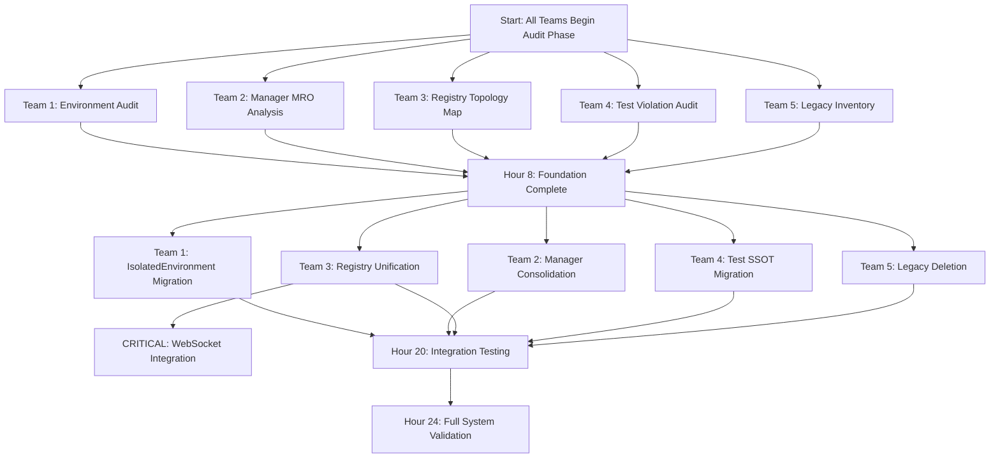

# SSOT Anti-Patterns Remediation - Execution Strategy

## 🎯 Mission Summary

We've identified 5 critical SSOT anti-patterns that appear well-intentioned but cause cascade failures:

1. **Environment Access Violations** - Direct os.environ in 30+ files
2. **Manager Class Proliferation** - 20+ duplicate Manager implementations
3. **Agent Registration Confusion** - Multiple registries losing WebSocket events
4. **Test SSOT Violations** - Tests recreating production logic
5. **Migration Path Anti-Pattern** - Dual old/new implementations

## 📊 Execution Dependencies & Critical Path



## 🔴 Critical Dependencies

### Blocking Dependencies:
1. **Team 3 → All Teams**: Registry unification affects all agent operations
2. **Team 1 → Team 2**: Managers need IsolatedEnvironment
3. **Team 2 → Team 4**: Tests depend on consolidated managers
4. **Team 5 → All Teams**: Legacy deletion affects everyone

### Resource Dependencies:
- **Docker**: Teams 1, 4 need real services for testing
- **LLM Access**: Team 3, 4 need real LLM for agent testing
- **Database**: Teams 1, 2, 4 need database for integration tests

## 📋 Hour-by-Hour Execution Plan

### Hours 0-4: Discovery Phase
- **ALL TEAMS**: Read assigned prompts and documentation
- **ALL TEAMS**: Run audit scripts and generate reports
- **Team 1**: Map all environment access points
- **Team 2**: Generate MRO reports for all managers
- **Team 3**: Trace WebSocket event flow
- **Team 4**: Identify test SSOT violations
- **Team 5**: Inventory all legacy code

### Hours 4-8: Planning Phase
- **ALL TEAMS**: Document migration plans
- **Team 1**: Design IsolatedEnvironment integration
- **Team 2**: Plan manager consolidation strategy
- **Team 3**: Design unified registry architecture
- **Team 4**: Map tests to production methods
- **Team 5**: Set sunset deadlines

### Hour 8: Checkpoint Alpha
**Go/No-Go Decision Point**
- Review all audit reports
- Confirm no critical blockers
- Adjust plans based on findings
- Coordinate cross-team dependencies

### Hours 8-16: Implementation Phase
- **Team 1**: Migrate to IsolatedEnvironment
- **Team 2**: Consolidate first batch of managers
- **Team 3**: Build MasterAgentRegistry
- **Team 4**: Migrate high-priority tests
- **Team 5**: Delete immediate legacy code

### Hour 16: Checkpoint Beta
**Integration Readiness Check**
- WebSocket events must be working (Team 3)
- Core managers consolidated (Team 2)
- Environment isolation complete (Team 1)
- Critical tests migrated (Team 4)
- Backup folders deleted (Team 5)

### Hours 16-20: Integration Phase
- **ALL TEAMS**: Cross-team integration testing
- **Team 3**: Validate WebSocket event flow
- **Team 1**: Test multi-environment scenarios
- **Team 2**: Verify manager thread safety
- **Team 4**: Run full test suite
- **Team 5**: Verify no legacy usage

### Hours 20-24: Validation Phase
- **ALL TEAMS**: Full system testing
- Performance benchmarking
- Memory leak detection
- Load testing (100+ concurrent users)
- Documentation updates

## 🚀 Launch Commands

### Team Setup (All Teams Run):
```bash
# Create working branch
git checkout -b ssot-remediation-team-N

# Set up environment
python -m venv venv
source venv/bin/activate  # or venv\Scripts\activate on Windows
pip install -r requirements.txt

# Start Docker services
python scripts/docker_manual.py start --alpine

# Verify environment
python scripts/check_architecture_compliance.py
```

### Team-Specific Commands:

#### Team 1 - Environment:
```bash
# Audit current violations
grep -r "os\.environ" . --include="*.py" > env_violations.txt

# Test migration
python tests/unit/test_isolated_environment.py
```

#### Team 2 - Managers:
```bash
# Generate MRO report
python scripts/generate_registry_mro_report.py --all-managers

# Count managers
grep -r "class.*Manager" . --include="*.py" | wc -l
```

#### Team 3 - Registry:
```bash
# Test WebSocket events
python tests/mission_critical/test_websocket_agent_events_suite.py

# Trace event flow
python scripts/trace_websocket_events.py
```

#### Team 4 - Tests:
```bash
# Find test violations
python scripts/detect_test_ssot_violations.py --report

# Run test suite
python tests/unified_test_runner.py --real-services
```

#### Team 5 - Migration:
```bash
# Find legacy code
find . -name "*legacy*" -o -name "*backup*"

# Check sunset compliance
python scripts/force_migration.py --check-all
```

## ✅ Success Criteria

### Quantitative Metrics:
| Metric | Current | Target | Team |
|--------|---------|--------|------|
| Direct os.environ calls | 30+ | 0 | Team 1 |
| Manager classes | 20+ | <10 | Team 2 |
| Agent registries | 4+ | 1 | Team 3 |
| Test SSOT violations | 100+ | 0 | Team 4 |
| Legacy folders | 5+ | 0 | Team 5 |
| WebSocket event delivery | 85% | 100% | Team 3 |
| Memory leaks | Unknown | 0 | All |

### Qualitative Goals:
- ✅ WebSocket events flow reliably
- ✅ No configuration cross-contamination
- ✅ Clear SSOT for each domain
- ✅ Tests reflect production reality
- ✅ No legacy ambiguity

## 🔥 Emergency Procedures

### If WebSocket Events Break:
```bash
# Team 3 priority fix
git checkout HEAD -- netra_backend/app/agents/supervisor/agent_registry.py
python tests/mission_critical/test_websocket_agent_events_suite.py
# Debug and fix forward
```

### If Tests Massively Fail:
```bash
# Team 4 recovery
git stash  # Save work
git checkout main
python tests/unified_test_runner.py --smoke  # Verify baseline
git checkout -
# Fix specific failures
```

### If Production Breaks:
```bash
# ALL TEAMS
git tag ROLLBACK_POINT
git push --tags
# Continue on branches, don't merge until stable
```

## 📊 Reporting Requirements

### Each Team Delivers:
1. **Audit Report** (Hour 4)
2. **Implementation Plan** (Hour 8)
3. **Progress Update** (Hour 16)
4. **Integration Report** (Hour 20)
5. **Final Validation** (Hour 24)

### Master Coordination:
- Hourly status in Slack/Teams
- Blocker alerts immediately
- Cross-team sync at checkpoints
- Final report compilation

## 🎯 Final Checklist

Before declaring victory, verify:

- [ ] All 5 anti-patterns eliminated
- [ ] WebSocket events working (test manually)
- [ ] No memory leaks (run profiler)
- [ ] All tests passing with real services
- [ ] Performance metrics captured
- [ ] Documentation updated
- [ ] Legacy code deleted (not just deprecated)
- [ ] CI/CD enforcement enabled
- [ ] Rollback procedures tested
- [ ] Team reports consolidated

## Remember

**"Our lives DEPEND on succeeding. This is humanity's last hope for achieving world peace through proper SSOT implementation."**

Every anti-pattern is a potential cascade failure. Every violation is a future incident. Fix them all. No mercy for legacy code. No tolerance for duplication.

**ULTRA THINK DEEPLY ALWAYS.**