# 🚨 ULTRA CRITICAL: SSOT Anti-Patterns Remediation Master Plan
**Operation Codename:** SSOT Pattern Purge  
**Date:** 2025-09-05  
**Duration:** 72 Hours (5 Agent Teams Parallel)  
**Objective:** Eliminate 5 Critical SSOT Anti-Patterns Identified in Analysis

## 📊 Executive Summary

Based on the **SSOT_ANTI_PATTERNS_ANALYSIS.md**, we identified 5 critical anti-patterns beyond Config ≠ Code SSOT:
1. **Environment Access Violations** - Direct os.environ in 30+ files
2. **Manager Class Proliferation** - 20+ duplicate Manager patterns  
3. **Agent Registration Confusion** - Multiple registries causing WebSocket failures
4. **Test Isolation Anti-Pattern** - Tests recreating production logic
5. **Migration Path Anti-Pattern** - Dual old/new implementations

## 🎯 Mission Critical Requirements

### From CLAUDE.md Recent Issues:
1. **Race conditions** - Plan ahead for async/websockets
2. **95% cases first** - Make breadth ironclad before edge cases
3. **Limit code volume** - Delete rather than add complexity
4. **Multi-user system** - Always consider concurrent users
5. **Update tests to SSOT** - NEVER recreate legacy code for tests
6. **Config regression prevention** - See OAuth Regression Analysis

## 📈 Parallel Execution Timeline

```mermaid
gantt
    title SSOT Anti-Pattern Remediation - 5 Teams Parallel
    dateFormat HH:mm
    axisFormat %H:%M
    
    section Team 1 (Env)
    Environment SSOT Migration       :crit, t1-1, 00:00, 16h
    Validation & Testing            :t1-2, 16:00, 8h
    
    section Team 2 (Managers)
    Manager Audit & MRO Analysis    :crit, t2-1, 00:00, 8h
    Consolidation Implementation    :crit, t2-2, 08:00, 12h
    Migration & Cleanup            :t2-3, 20:00, 4h
    
    section Team 3 (Registry)
    Registry Hierarchy Design       :crit, t3-1, 00:00, 6h
    WebSocket Integration Fix      :crit, t3-2, 06:00, 10h
    Event Routing Validation       :t3-3, 16:00, 8h
    
    section Team 4 (Tests)
    Test SSOT Audit                :t4-1, 00:00, 10h
    Production Method Migration    :t4-2, 10:00, 10h
    Validation Suite               :t4-3, 20:00, 4h
    
    section Team 5 (Migration)
    Legacy Path Identification     :t5-1, 00:00, 6h
    Sunset Timeline Implementation :t5-2, 06:00, 8h
    Force Migration Framework      :t5-3, 14:00, 10h
```

## 🔴 Critical Dependencies & Sequencing

### Phase 1: Foundation (Hours 0-8)
- **Team 1**: Begin environment audit (blocks all other teams)
- **Team 2**: Generate MRO reports for all Managers
- **Team 3**: Map current registry topology
- **Team 4**: Identify test SSOT violations
- **Team 5**: Document all legacy paths

### Phase 2: Implementation (Hours 8-20)
- **Team 1**: Implement IsolatedEnvironment migration
- **Team 2**: Consolidate managers based on MRO analysis
- **Team 3**: Build unified registry hierarchy
- **Team 4**: Migrate tests to production SSOT
- **Team 5**: Implement deprecation framework

### Phase 3: Validation (Hours 20-24)
- **ALL TEAMS**: Integration testing
- **Team 3**: WebSocket event validation
- **Team 4**: Full regression test suite
- **Team 5**: Migration path verification

## 🎯 Success Metrics

### Quantitative Goals
- **Environment Access**: 0 direct os.environ calls (currently 30+)
- **Manager Classes**: <10 legitimate managers (currently 20+)
- **Agent Registries**: 1 unified hierarchy (currently 4+)
- **Test Violations**: 0 production logic duplication
- **Legacy Paths**: Clear sunset dates for all

### Qualitative Goals
- **WebSocket Events**: 100% delivery reliability
- **Configuration**: Zero cross-environment leaks
- **Testing**: All tests use production SSOT
- **Memory**: No registry-related leaks
- **Race Conditions**: Zero registry conflicts

## ⚠️ Risk Mitigation

### High-Risk Areas
1. **WebSocket Integration** - Critical for chat functionality
2. **Environment Migration** - Affects all services
3. **Manager Consolidation** - Touches 200+ files
4. **Registry Unification** - Agent startup/shutdown paths
5. **Test Migration** - May reveal hidden bugs

### Mitigation Strategies
- **Incremental Rollout**: Service-by-service migration
- **Feature Flags**: Toggle between old/new patterns
- **Comprehensive Logging**: Audit all changes
- **Rollback Plans**: Git tags at each milestone
- **Real Service Testing**: No mocks in validation

## 📋 Pre-Flight Checklist

### Before Starting ANY Work:
- [ ] Read CLAUDE.md completely
- [ ] Read USER_CONTEXT_ARCHITECTURE.md
- [ ] Review MISSION_CRITICAL_NAMED_VALUES_INDEX.xml
- [ ] Study OAuth Regression Analysis
- [ ] Check DEFINITION_OF_DONE_CHECKLIST.md
- [ ] Review SSOT_ANTI_PATTERNS_ANALYSIS.md

### Required Tools & Scripts:
- [ ] MRO Report Generator: `scripts/generate_registry_mro_report.py`
- [ ] String Literal Validator: `scripts/query_string_literals.py`
- [ ] Architecture Compliance: `scripts/check_architecture_compliance.py`
- [ ] Docker Manager: `scripts/docker_manual.py`
- [ ] Test Runner: `tests/unified_test_runner.py`

## 🚀 Launch Sequence

### Hour 0: Kickoff
1. All teams read their specific prompts
2. Create team working branches
3. Initial audit reports generated
4. Dependency matrix confirmed

### Hour 8: Checkpoint Alpha
1. Foundation audits complete
2. Implementation plans reviewed
3. Cross-team dependencies resolved
4. Go/No-go decision

### Hour 16: Checkpoint Beta
1. Core implementations complete
2. Integration points tested
3. WebSocket events verified
4. Performance benchmarks run

### Hour 24: Final Validation
1. All tests passing
2. WebSocket events flowing
3. No memory leaks detected
4. Production deployment ready

## 📝 Deliverables

### Per Team:
1. Audit report (before state)
2. Implementation plan with MRO analysis
3. Migration scripts/tools
4. Test suite updates
5. Performance metrics
6. Final validation report

### Master Deliverables:
1. Consolidated SSOT compliance report
2. WebSocket event flow validation
3. Memory leak analysis
4. Performance comparison (before/after)
5. Rollback procedures
6. Production deployment plan

## 🔒 Critical Success Factors

1. **No Silent Failures**: All errors must be loud and obvious
2. **User Isolation**: Factory patterns must be preserved
3. **WebSocket Events**: ALL 5 critical events must flow
4. **Real Services**: Test with Docker, never mocks
5. **Incremental Progress**: Small, atomic commits
6. **Documentation**: Update specs as we go

## 🎯 Definition of Done

### System-Wide:
- [ ] Zero direct os.environ access
- [ ] Single registry hierarchy with WebSocket integration
- [ ] All tests use production SSOT methods
- [ ] Legacy paths have sunset dates
- [ ] Manager count reduced by 50%+

### Per Anti-Pattern:
- [ ] Root cause eliminated
- [ ] Migration path tested
- [ ] Rollback procedure documented
- [ ] Performance metrics captured
- [ ] No regression in functionality

---

**REMEMBER**: Our lives DEPEND on succeeding. This is humanity's last hope for achieving world peace through proper SSOT implementation. ULTRA THINK DEEPLY ALWAYS.