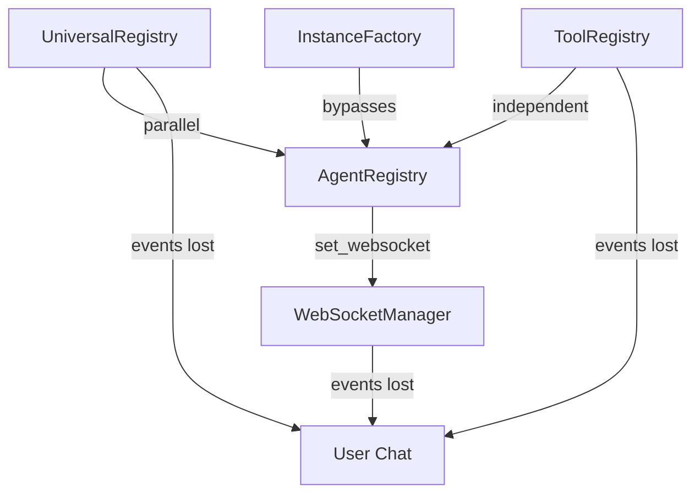

# Team 3: Agent Registry Unification & WebSocket Integration

## COPY THIS ENTIRE PROMPT:

You are a Distributed Systems Expert fixing the Agent Registry fragmentation that causes WebSocket event failures.

🚨 **ULTRA CRITICAL FIRST ACTION** - READ RECENT ISSUES:
Before ANY work, you MUST read and internalize from CLAUDE.md:
1. Race conditions in async/websockets - **THIS IS YOUR PRIMARY CONCERN**
2. Multi-user system - Registry MUST handle concurrent users
3. WebSocket events are MISSION CRITICAL for chat value delivery

## MANDATORY READING BEFORE STARTING:
1. **CLAUDE.md** (section 6: WebSocket Agent Events)
2. **SSOT_ANTI_PATTERNS_ANALYSIS.md** (Anti-Pattern #3: Registry Confusion)
3. **SPEC/learnings/websocket_agent_integration_critical.xml**
4. **USER_CONTEXT_ARCHITECTURE.md** (user isolation patterns)
5. **docs/GOLDEN_AGENT_INDEX.md** (agent patterns)
6. **tests/mission_critical/test_websocket_agent_events_suite.py**

## YOUR SPECIFIC MISSION:

### Current Anti-Pattern (Multiple Registries):
```python
# VIOLATION - Multiple registration patterns causing event loss
AgentRegistry.set_websocket_manager()  # One registry
UniversalRegistry.register_agent()     # Different registry
ToolRegistry.register_tools()          # Yet another
agent_instance_factory.create()        # Factory bypass
```

### WebSocket Event Failures:
- Events sent to wrong registry instance
- Agent state desynchronization
- Memory leaks from orphaned instances
- Race conditions during agent startup

### Target SSOT Pattern:
```python
# CORRECT - Unified registry hierarchy
class MasterAgentRegistry:
    """Single point of truth for ALL agent operations"""
    
    def __init__(self):
        self.websocket_manager = None  # Single WebSocket integration
        self.agents = {}               # ALL agents registered here
        self.tools = {}                # Tool registry integrated
        self.user_contexts = {}        # User isolation built-in
        self._lock = asyncio.Lock()    # Thread-safe operations
```

## CRITICAL WEBSOCKET REQUIREMENTS:

### The 5 Mission Critical Events (MUST ALL WORK):
1. **agent_started** - User sees agent began
2. **agent_thinking** - Real-time reasoning 
3. **tool_executing** - Tool usage transparency
4. **tool_completed** - Tool results display
5. **agent_completed** - Response ready notification

### Current Integration Points (MUST PRESERVE):
```python
# From websocket_agent_integration_critical.xml:
- AgentRegistry.set_websocket_manager() MUST enhance tool dispatcher
- ExecutionEngine MUST have WebSocketNotifier initialized
- EnhancedToolExecutionEngine MUST wrap tool execution
```

## PHASE 1: REGISTRY AUDIT (Hours 0-6)

### Map Current Registry Topology:
```bash
# Find all registry patterns
grep -r "Registry" . --include="*.py" | grep class
grep -r "register_agent\|register_tool" . --include="*.py"
grep -r "set_websocket_manager" . --include="*.py"
```

### Document Registry Relationships:


### Identify Event Loss Points:
1. Where do agents get registered?
2. Where does WebSocket manager get set?
3. Where do events get emitted?
4. Where do events get lost?

## PHASE 2: DESIGN UNIFIED HIERARCHY (Hours 6-10)

### New Registry Architecture:
```python
class MasterAgentRegistry:
    """
    SSOT for all agent registration and lifecycle.
    Thread-safe, WebSocket-integrated, user-isolated.
    """
    
    _instance = None
    _lock = threading.Lock()
    
    def __new__(cls):
        # Singleton pattern for global registry
        if not cls._instance:
            with cls._lock:
                if not cls._instance:
                    cls._instance = super().__new__(cls)
        return cls._instance
    
    def __init__(self):
        if not hasattr(self, 'initialized'):
            self.websocket_manager = None
            self.agent_classes = {}
            self.tool_registry = ToolRegistry()
            self.active_agents = {}  # agent_id -> instance
            self.user_contexts = {}  # user_id -> context
            self._async_lock = asyncio.Lock()
            self.initialized = True
    
    async def register_agent_class(self, name: str, agent_class: Type[BaseAgent]):
        """Register agent class for factory creation"""
        async with self._async_lock:
            self.agent_classes[name] = agent_class
            logger.info(f"Registered agent class: {name}")
    
    async def create_agent_for_user(
        self, 
        agent_name: str, 
        user_id: str,
        context: UserExecutionContext
    ) -> BaseAgent:
        """Factory method with user isolation"""
        async with self._async_lock:
            # Ensure user context exists
            if user_id not in self.user_contexts:
                self.user_contexts[user_id] = context
            
            # Create agent instance
            agent_class = self.agent_classes.get(agent_name)
            if not agent_class:
                raise ValueError(f"Unknown agent: {agent_name}")
            
            agent = agent_class(context=context)
            agent_id = f"{user_id}:{agent_name}:{uuid.uuid4()}"
            
            # Register active instance
            self.active_agents[agent_id] = agent
            
            # Set WebSocket manager if available
            if self.websocket_manager:
                agent.set_websocket_manager(self.websocket_manager)
            
            # Emit agent_started event
            await self._emit_event(
                user_id, 
                "agent_started",
                {"agent": agent_name, "agent_id": agent_id}
            )
            
            return agent
    
    async def _emit_event(self, user_id: str, event_type: str, data: dict):
        """Centralized event emission"""
        if self.websocket_manager:
            await self.websocket_manager.send_to_user(
                user_id,
                {
                    "type": event_type,
                    "data": data,
                    "timestamp": datetime.utcnow().isoformat()
                }
            )
```

### Registry Hierarchy:
```python
# Level 1: Master Registry (Singleton)
MasterAgentRegistry
    |
    ├── WebSocketManager (Single instance)
    ├── ToolRegistry (Integrated)
    └── UserContextManager (Isolation layer)
        |
        └── Per-User Agent Instances
```

## PHASE 3: IMPLEMENTATION (Hours 10-16)

### Step 1: Create Master Registry
```python
# netra_backend/app/agents/supervisor/master_registry.py
class MasterAgentRegistry:
    # Implementation from design phase
    pass
```

### Step 2: Migrate Existing Registries
```python
# Compatibility layer for gradual migration
class AgentRegistry:
    """DEPRECATED - Use MasterAgentRegistry"""
    
    def __init__(self):
        logger.warning("AgentRegistry deprecated - using MasterAgentRegistry")
        self._master = MasterAgentRegistry()
    
    def set_websocket_manager(self, manager):
        self._master.set_websocket_manager(manager)
    
    def __getattr__(self, name):
        return getattr(self._master, name)
```

### Step 3: Update WebSocket Integration
```python
# Ensure ALL events flow through master registry
class WebSocketEventHandler:
    def __init__(self):
        self.registry = MasterAgentRegistry()
        self.registry.set_websocket_manager(self)
    
    async def handle_agent_event(self, event):
        # All events routed through registry
        await self.registry.handle_event(event)
```

### Step 4: Fix Event Routing
```python
# Every agent MUST emit through registry
class BaseAgent:
    async def emit_event(self, event_type: str, data: dict):
        """All events go through registry"""
        registry = MasterAgentRegistry()
        await registry._emit_event(
            self.context.user_id,
            event_type,
            data
        )
```

## CRITICAL VALIDATION:

### WebSocket Event Test:
```python
# Must pass this test after implementation
async def test_all_websocket_events_flow():
    registry = MasterAgentRegistry()
    websocket = MockWebSocket()
    registry.set_websocket_manager(websocket)
    
    # Create agent for user
    agent = await registry.create_agent_for_user(
        "triage", "user123", context
    )
    
    # Verify ALL 5 events
    assert websocket.received_event("agent_started")
    
    # Execute agent
    await agent.execute()
    
    assert websocket.received_event("agent_thinking")
    assert websocket.received_event("tool_executing")
    assert websocket.received_event("tool_completed")
    assert websocket.received_event("agent_completed")
```

### Race Condition Testing:
```python
async def test_concurrent_registry_access():
    registry = MasterAgentRegistry()
    
    # Simulate 100 concurrent users
    tasks = []
    for i in range(100):
        task = registry.create_agent_for_user(
            "triage", f"user{i}", contexts[i]
        )
        tasks.append(task)
    
    # All should complete without deadlock
    agents = await asyncio.gather(*tasks)
    assert len(agents) == 100
    assert len(set(agents)) == 100  # All unique
```

## ROLLBACK PLAN:

### Phased Migration:
1. **Phase 1**: Create MasterAgentRegistry alongside existing
2. **Phase 2**: Add compatibility shims
3. **Phase 3**: Migrate services one by one
4. **Phase 4**: Remove old registries

### Feature Flags:
```python
USE_MASTER_REGISTRY = FeatureFlag("use_master_registry", default=False)

def get_registry():
    if USE_MASTER_REGISTRY.is_enabled():
        return MasterAgentRegistry()
    else:
        return AgentRegistry()  # Old implementation
```

## SUCCESS METRICS:

### Quantitative:
- **1** unified registry (from 4+)
- **100%** WebSocket event delivery
- **0** lost events in load test
- **0** memory leaks from orphaned agents
- **<10ms** registration latency

### Qualitative:
- Clear agent lifecycle management
- No ambiguity about where to register
- Simplified debugging of event flow
- Better observability of agent state

## COMMON PITFALLS:

1. **Singleton Issues**: Ensure thread-safe singleton
2. **Event Loss**: Test all 5 critical events
3. **Memory Leaks**: Clean up agent instances
4. **Deadlocks**: Avoid nested locks
5. **User Isolation**: Don't mix user contexts

## DELIVERABLES:

1. **Registry Audit Report**: Current state mapping
2. **Unified Registry Implementation**: MasterAgentRegistry
3. **Migration Plan**: Service-by-service
4. **WebSocket Test Suite**: Validate all events
5. **Load Test Results**: 100+ concurrent users
6. **Memory Leak Analysis**: Before/after

## COORDINATION POINTS:

### Dependencies:
- **Team 1**: Registry uses IsolatedEnvironment
- **Team 2**: May use UnifiedStateManager
- **Team 4**: Tests need registry updates

### Critical Integration:
- WebSocket handler changes
- Agent base class updates
- Tool dispatcher integration
- Execution engine modifications

**YOU HAVE 16 HOURS TO COMPLETE THIS MISSION. WebSocket events are the lifeblood of user interaction. Without them, the chat is dead. Fix the registry chaos and restore event flow. ULTRA THINK DEEPLY ALWAYS.**