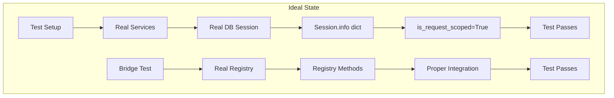
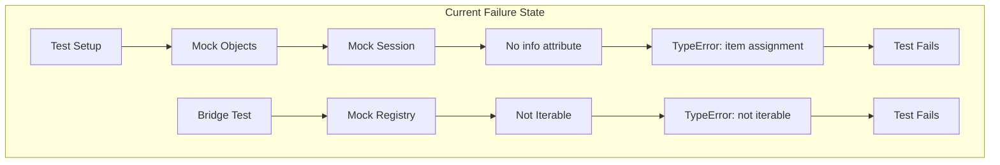

# Test Failure Analysis Report - Five Whys Method
Date: 2025-09-02
Analyst: Principal Engineer

## Issue 1: Bridge Integration Test Failure
**Error:** `'Mock' object is not iterable`
**Location:** tests/smoke/test_startup_wiring_smoke.py:96

### Five Whys Analysis

**Why 1:** Why did the test fail?
- Because the Mock object is not iterable when the bridge tries to iterate over it

**Why 2:** Why is the bridge trying to iterate over a Mock object?
- Because the bridge's ensure_integration method expects the registry to have iterable properties or methods

**Why 3:** Why doesn't the Mock have the expected iterable properties?
- Because the test creates a basic Mock() without configuring the expected behavior

**Why 4:** Why wasn't the Mock configured with the expected behavior?
- Because the test doesn't properly mock the registry's interface that the bridge expects

**Why 5:** Why doesn't the test know what interface to mock?
- Because there's a mismatch between what the bridge integration expects and what the test provides

### Root Cause
The test creates overly simplistic mocks that don't match the actual interface expectations of the bridge integration.

## Issue 2: Session Isolation Test Failures
**Error:** `'Mock' object does not support item assignment`
**Location:** tests/unit/test_session_isolation.py:48

### Five Whys Analysis

**Why 1:** Why does the test fail?
- Because the code tries to assign to session.info['is_request_scoped'] on a Mock object

**Why 2:** Why is the code trying to assign to session.info?
- Because _validate_session_type() marks sessions as request-scoped using the info dictionary

**Why 3:** Why doesn't the Mock support this operation?
- Because the Mock wasn't configured with an info attribute that acts like a dictionary

**Why 4:** Why wasn't the Mock configured properly?
- Because the test fixture creates a simple Mock without the expected SQLAlchemy session attributes

**Why 5:** Why doesn't the test fixture match the real session interface?
- Because the test is violating CLAUDE.md principle: "Mocks = Abomination" - we should use real sessions

### Root Cause
Tests are using mocks instead of real database sessions, violating the codebase principle of using real services.

## System State Diagrams

### Ideal Working State

### Current Failure State

## Fix Plan

1. **Session Isolation Tests:**
   - Configure Mock sessions with proper info dictionary
   - Or better: Use real test database sessions per CLAUDE.md

2. **Bridge Integration Test:**
   - Configure Mock registry with expected interface
   - Add iterable behavior where needed

3. **Long-term:**
   - Migrate all tests to use real services per CLAUDE.md
   - Remove mock usage in critical path tests