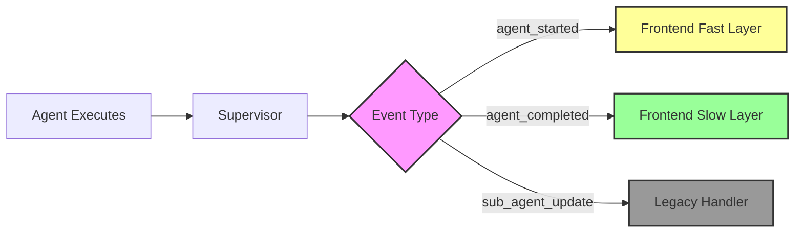
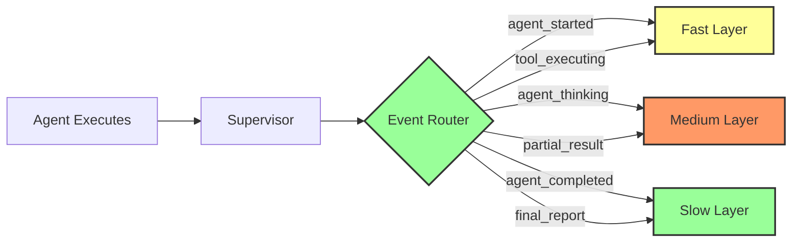

# WebSocket System Coherence Review Report
**Date:** 2025-08-11  
**Reviewer:** Claude  
**Scope:** Agent-to-Frontend Communication Analysis

## Executive Summary

This report presents findings from a comprehensive review of the Netra AI platform's WebSocket communication system, focusing on how agent workloads are transmitted to the frontend and displayed in the UI. The review identified **7 critical issues** that prevent proper real-time display of agent processing in the frontend's three-layer UI architecture.

### Key Finding
The frontend's unified chat system expects WebSocket events that the backend never sends, causing the new UI layers to remain empty or display incorrect information during agent execution.

## System Architecture Overview

### Communication Flow
```
Agents → Supervisor → WebSocket Manager → Frontend Store → UI Layers
```

### UI Layer Architecture
- **Fast Layer (0-100ms):** Immediate feedback - agent names, active tools
- **Medium Layer (100ms-1s):** Progressive updates - thoughts, partial results  
- **Slow Layer (1s+):** Final results - reports, recommendations, metrics

## Critical Issues Identified

### 1. Event Structure Mismatch ⚠️
**Severity:** Critical  
**Impact:** Inconsistent message handling

The backend uses two different message structures:
- WebSocket Manager: `{type: "error", payload: {...}}`
- Message Handler: `{event: "agent_finished", data: {...}}`

**Files Affected:**
- `app/ws_manager.py:266-274`
- `app/services/websocket/message_handler.py:86-92`

### 2. Missing Unified Events ❌
**Severity:** Critical  
**Impact:** UI layers don't update

Frontend expects these events that backend **NEVER** sends:
- `agent_thinking` - Shows intermediate reasoning
- `partial_result` - Streaming content updates
- `tool_executing` - Tool execution notifications  
- `final_report` - Complete analysis results

**Files Affected:**
- `frontend/store/unified-chat.ts:145-351` (expects events)
- `app/agents/supervisor_consolidated.py:170-175` (doesn't send them)

### 3. Incomplete Event Payloads 📦
**Severity:** High  
**Impact:** Missing UI information

Example: `agent_started` event
- **Backend sends:** `{run_id: "string"}`
- **Frontend expects:** `{run_id: "string", agent_name: "string", timestamp: number}`

Missing fields cause undefined values in UI.

### 4. Duplicate WebSocket Systems 🔄
**Severity:** Medium  
**Impact:** Conflicting event processing

Frontend has two competing systems:
- Legacy handlers in `useChatWebSocket.ts`
- Unified handlers in `unified-chat.ts`

Both process the same events differently, causing race conditions.

### 5. Event Name Misalignment 🏷️
**Severity:** Medium  
**Impact:** Events not processed

| Backend Event | Frontend Handler | Status |
|--------------|-----------------|---------|
| `agent_finished` | `agent_completed` | ❌ Mismatch |
| N/A | `tool_executing` | ❌ Never sent |
| `tool_call` | `tool_executing` | ❌ Different structure |

### 6. Layer Data Accumulation Bug 🐛
**Severity:** Medium  
**Impact:** Duplicate content display

The medium layer's partial content accumulation logic (`unified-chat.ts:86-88`) can cause duplicate content if the backend sends overlapping data.

### 7. Missing Thread Management Events 📂
**Severity:** Low  
**Impact:** Thread state desynchronization

Frontend expects thread lifecycle events that backend doesn't send:
- `thread_created`
- `thread_loaded`
- `run_started`
- `step_created`

## Event Flow Analysis

### Current State


### Required State


## Impact Assessment

### User Experience Impact
1. **No real-time feedback** during agent processing
2. **Empty UI layers** when agents are working
3. **Sudden appearance** of results without progress indication
4. **Missing tool execution** visibility
5. **No intermediate thoughts** displayed

### Developer Impact
1. **Debugging difficulty** due to inconsistent event structures
2. **Maintenance burden** from duplicate systems
3. **Testing complexity** with misaligned expectations
4. **Integration challenges** for new features

## Recommendations

### Immediate Actions (P0)
1. **Standardize message structure** to `{type, payload}` everywhere
2. **Implement missing events** in supervisor:
   - Add `agent_thinking` when processing
   - Send `partial_result` for streaming
   - Convert `tool_call` to `tool_executing`
   - Generate `final_report` at completion

3. **Fix AgentStarted payload** to include agent_name and timestamp

### Short-term Actions (P1)
1. **Remove legacy WebSocket system** completely
2. **Align event names** between backend and frontend
3. **Fix partial content accumulation** logic
4. **Add comprehensive event tests**

### Long-term Actions (P2)
1. **Implement thread management events**
2. **Add event versioning** for backward compatibility
3. **Create event documentation** with examples
4. **Build event monitoring dashboard**

## Implementation Plan

### Phase 1: Event Structure Fix (1-2 days)
```python
# Update all WebSocket sends to use consistent structure
await manager.send_message(user_id, {
    "type": "agent_started",
    "payload": {
        "run_id": run_id,
        "agent_name": agent.name,  # ADD THIS
        "timestamp": time.time()    # ADD THIS
    }
})
```

### Phase 2: Add Missing Events (2-3 days)
```python
# In supervisor_consolidated.py
async def _send_agent_thinking(self, thought: str):
    await self._send_websocket_update(
        self.user_id,
        "agent_thinking",
        {
            "thought": thought,
            "agent_name": self.current_agent.name,
            "step_number": self.current_step,
            "total_steps": self.total_steps
        }
    )
```

### Phase 3: Frontend Consolidation (1-2 days)
- Remove `useChatWebSocket.ts` legacy handlers
- Update all components to use `unified-chat.ts` store
- Add proper TypeScript types for all events

### Phase 4: Testing & Validation (1 day)
- Add e2e tests for all event flows
- Validate UI layer updates
- Performance testing for latency

## Success Metrics

### Technical Metrics
- [ ] All events have consistent structure
- [ ] 100% of expected events are sent
- [ ] Zero duplicate event handlers
- [ ] All event payloads include required fields
- [ ] E2E tests pass for all event flows

### User Experience Metrics
- [ ] Fast layer updates within 100ms
- [ ] Medium layer shows progress within 1s
- [ ] Slow layer displays results correctly
- [ ] No empty UI states during processing
- [ ] Tools visible during execution

## Conclusion

The WebSocket communication system has significant coherence issues that prevent the frontend from properly displaying agent workload information. The primary issue is that the backend doesn't send the events the frontend expects, leaving the UI layers empty or incorrectly populated.

Fixing these issues requires:
1. Standardizing the event structure
2. Implementing missing events
3. Removing duplicate systems
4. Comprehensive testing

With these fixes, the system will provide real-time, progressive feedback during agent processing, significantly improving the user experience.

## Appendix

### A. Files Requiring Changes
- `app/ws_manager.py` - Standardize message structure
- `app/agents/supervisor_consolidated.py` - Add missing events
- `app/services/websocket/message_handler.py` - Fix event structure
- `frontend/store/unified-chat.ts` - Fix accumulation logic
- `frontend/hooks/useChatWebSocket.ts` - Remove legacy handlers

### B. New Specification Documents
- `SPEC/websocket_communication.xml` - Complete event catalog and requirements

### C. Test Coverage Gaps
- No tests for unified event system
- Missing WebSocket integration tests
- No UI layer update validation
- Lacking event payload schema tests

---
*Report generated as part of system coherence review for Netra AI Optimization Platform*