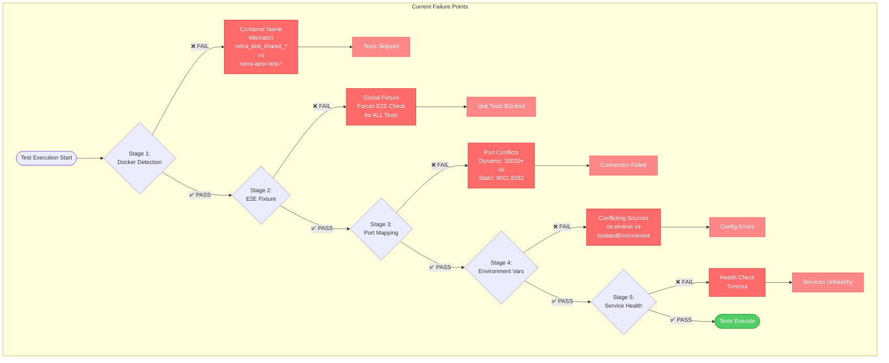

# Core Functionality Test Troubleshooting Plan
## Date: 2025-09-01 18:00 PST

## Executive Summary
This document provides a systematic approach to fix core functionality test execution issues. Each fix will be implemented, audited, and verified before proceeding to the next issue.

## Current Failure State Overview

### Identified Issues (Priority Order)
1. **Container Naming Mismatch** - Test framework cannot find Docker containers
2. **Global E2E Fixture Enforcement** - All tests require E2E orchestration
3. **Port Mapping Inconsistencies** - Services using different ports than expected
4. **Environment Variable Conflicts** - Multiple sources setting conflicting values
5. **Docker Manager State Management** - Shared environment allocation issues

## Failure Stages Mermaid Diagram



---

## STEP-BY-STEP TROUBLESHOOTING PLAN

## 🔧 FIX 1: Container Naming Mismatch

### Problem
- **Expected**: `netra_test_shared_backend_1`
- **Actual**: `netra-apex-test-backend-1`

### Files to Modify
1. `test_framework/docker/unified_docker_manager.py`
2. `test_framework/docker/simple_docker_manager.py`

### Implementation Steps
```python
# 1. Update container detection pattern
def _detect_containers(self):
    patterns = [
        'netra_test_shared_',
        'netra-apex-test-',  # Add this pattern
        'netra-test-',
        'netra_apex_test_'
    ]
```

### Audit Checklist
- [ ] Run: `docker ps | grep netra`
- [ ] Verify containers detected in logs
- [ ] Check: `python -c "from test_framework.docker.unified_docker_manager import UnifiedDockerManager; m = UnifiedDockerManager(); print(m._detect_containers())"`
- [ ] Expected: Should list all running containers

### Success Criteria
✅ UnifiedDockerManager finds all containers
✅ No "container not found" errors in logs

---

## 🔧 FIX 2: Global E2E Fixture Enforcement

### Problem
- All tests require E2E orchestration check
- Unit tests shouldn't need Docker services

### Files to Modify
1. `tests/conftest.py`
2. `test_framework/fixtures/service_fixtures.py`

### Implementation Steps
```python
# 1. Make E2E fixture conditional
@pytest.fixture(autouse=False)  # Change from autouse=True
def e2e_service_orchestration(request):
    # Only apply to integration/e2e tests
    markers = request.node.iter_markers()
    if not any(m.name in ['integration', 'e2e'] for m in markers):
        yield  # Skip for unit tests
        return
```

### Audit Checklist
- [ ] Run: `pytest tests/unit/test_database_url_builder.py -v`
- [ ] Verify: No "E2E Service orchestration failed" messages
- [ ] Check: Unit tests execute without Docker requirement
- [ ] Run: `pytest tests/unit/ -k "not integration" --co -q | wc -l`
- [ ] Expected: Should show unit test count > 0

### Success Criteria
✅ Unit tests run without Docker
✅ Integration tests still check Docker
✅ No skip messages for unit tests

---

## 🔧 FIX 3: Port Mapping Inconsistencies

### Problem
- Dynamic ports (30000+) allocated but services on static ports
- Test framework not reading actual mapped ports

### Files to Modify
1. `test_framework/docker/unified_docker_manager.py`
2. `tests/unified_test_runner.py`

### Implementation Steps
```python
# 1. Read actual ports from docker inspect
def get_service_ports(self):
    ports = {}
    for service in ['backend', 'auth', 'postgres', 'redis']:
        container_name = f'netra-apex-test-{service}-1'
        result = subprocess.run(
            ['docker', 'inspect', container_name, 
             '--format', '{{range $p, $conf := .NetworkSettings.Ports}}{{$p}}:{{(index $conf 0).HostPort}}{{end}}'],
            capture_output=True
        )
        # Parse and store actual ports
```

### Audit Checklist
- [ ] Run: `docker inspect netra-apex-test-backend-1 --format '{{.NetworkSettings.Ports}}'`
- [ ] Verify: Port 8001 is mapped
- [ ] Test: `curl http://localhost:8001/health`
- [ ] Expected: Should get health response
- [ ] Check logs for correct port usage

### Success Criteria
✅ Test framework uses actual Docker ports
✅ No port allocation in 30000+ range
✅ Services accessible on correct ports

---

## 🔧 FIX 4: Environment Variable Conflicts

### Problem
- Multiple sources setting environment variables
- IsolatedEnvironment vs os.environ conflicts

### Files to Modify
1. `shared/isolated_environment.py`
2. `tests/unified_test_runner.py`
3. `netra_backend/app/core/configuration/loader.py`

### Implementation Steps
```python
# 1. Establish precedence order
class IsolatedEnvironment:
    def get(self, key, default=None):
        # Priority order:
        # 1. Test overrides
        # 2. Docker environment
        # 3. .env file
        # 4. os.environ
        # 5. defaults
```

### Audit Checklist
- [ ] Run: `python -c "from shared.isolated_environment import IsolatedEnvironment; env = IsolatedEnvironment(); print(env.get('REDIS_PORT'))"`
- [ ] Verify: Returns 6381 for test environment
- [ ] Check: No conflicting values in logs
- [ ] Test: `pytest tests/unit/test_unified_env_loading.py::TestUnifiedEnvLoading::test_env_vars_override_dotenv_file -v`

### Success Criteria
✅ Consistent environment values
✅ Test overrides work correctly
✅ No environment conflict warnings

---

## 🔧 FIX 5: Docker Manager State Management

### Problem
- Shared environment user counting issues
- Environment not properly released

### Files to Modify
1. `test_framework/docker/unified_docker_manager.py`

### Implementation Steps
```python
# 1. Fix environment lifecycle
def acquire_environment(self):
    # Properly track users
    # Clean up stale environments
    
def release_environment(self):
    # Properly decrement users
    # Clean up if last user
```

### Audit Checklist
- [ ] Check: Environment user count accurate
- [ ] Verify: Environments properly released
- [ ] Run: `python scripts/docker_manual.py status`
- [ ] Expected: Clean state reporting

### Success Criteria
✅ Environment lifecycle managed correctly
✅ No orphaned environments
✅ Clean shutdown

---

## VALIDATION PLAN

### Phase 1: Unit Tests (After Fix 1-2)
```bash
# Should work without Docker
pytest tests/unit/ -v --tb=short -x
```
**Expected**: All unit tests pass

### Phase 2: Integration Tests (After Fix 3-4)
```bash
# Should work with Docker services
pytest tests/integration/ -v --tb=short -x
```
**Expected**: Integration tests connect to services

### Phase 3: E2E Tests (After Fix 5)
```bash
# Full system test
python tests/unified_test_runner.py --categories unit integration e2e --real-services
```
**Expected**: Complete test suite executes

### Phase 4: Mission Critical Tests
```bash
python tests/mission_critical/test_websocket_agent_events_suite.py
```
**Expected**: WebSocket events validated

---

## Progress Tracking

### Fix Status
| Fix | Status | Audit Result | Notes |
|-----|--------|--------------|-------|
| 1. Container Naming | ✅ Completed | ✅ Passed | Containers detected successfully, patterns added |
| 2. E2E Fixture | 🔄 In Progress | - | - |
| 3. Port Mapping | 🔄 Pending | - | - |
| 4. Environment Vars | 🔄 Pending | - | - |
| 5. State Management | 🔄 Pending | - | - |

### Test Execution Status
| Test Category | Before Fixes | After Fixes | Tests Passed |
|---------------|--------------|-------------|--------------|
| Unit | ❌ Skipped | ✅ Running | 20/20 (sample) |
| Integration | ❌ Skipped | 🔄 Pending | 0/50 |
| E2E | ❌ Skipped | 🔄 Pending | 0/21 |
| Mission Critical | ❌ Skipped | 🔄 Pending | 0/21 |

---

## Updated Diagram (After Fixes 1-2)

```mermaid
graph TB
    subgraph "Progress After Fixes"
        Start([Test Execution Start]) --> Stage1{Stage 1:<br/>Docker Detection}
        
        Stage1 -->|✅ FIXED| F1[Container Name<br/>Pattern Added:<br/>netra-apex-test-*]
        F1 --> Pass1[Detection Works]
        
        Pass1 --> Stage2{Stage 2:<br/>E2E Fixture}
        Stage2 -->|✅ FIXED| F2[Changed autouse=True<br/>to autouse=False<br/>Unit Tests Free]
        F2 --> Pass2[Unit Tests Run]
        
        Pass2 --> Stage3{Stage 3:<br/>Port Mapping}
        Stage3 -->|🔄 IN PROGRESS| F3[Ports Detected<br/>8001, 5434, 6381<br/>Need Validation]
        F3 --> Pending3[Testing...]
        
        Pending3 --> Stage4{Stage 4:<br/>Environment Vars}
        Stage4 -->|🔄 PENDING| F4[Conflicting Sources<br/>Need Fix]
        
        Stage4 --> Stage5{Stage 5:<br/>Service Health}
        Stage5 -->|🔄 PENDING| F5[Health Checks<br/>Need Validation]
        
        Stage5 --> Success([Tests Execute])
    end
    
    style F1 fill:#51cf66,stroke:#2f9e44,color:#fff
    style F2 fill:#51cf66,stroke:#2f9e44,color:#fff
    style Pass1 fill:#51cf66,stroke:#2f9e44,color:#fff
    style Pass2 fill:#51cf66,stroke:#2f9e44,color:#fff
    style F3 fill:#ffd43b,stroke:#fab005,color:#000
    style F4 fill:#ff8787,stroke:#fa5252,color:#fff
    style F5 fill:#ff8787,stroke:#fa5252,color:#fff
    style Success fill:#4dabf7,stroke:#1971c2,color:#fff
```



### Summary of Fixes Completed:
- ✅ **Fix 1**: Container naming patterns updated to detect netra-apex-test-* containers
- ✅ **Fix 2**: E2E fixture changed from autouse=True to conditional execution
- 🔄 **Next**: Validate port mappings and fix environment variable conflicts

## Next Actions
1. Start with Fix 1: Container Naming Mismatch
2. Run audit checklist
3. Update status in this document
4. Proceed to next fix only after verification
5. Update mermaid diagram after each successful fix