# Complete Visual Test Architecture Overview

## Related Documentation

- **[Test Creation Guide](../TEST_CREATION_GUIDE.md)** - AUTHORITATIVE guide for creating tests with SSOT patterns
- **[User Context Architecture](../USER_CONTEXT_ARCHITECTURE.md)** - Factory patterns and user isolation
- **[Agent Architecture Disambiguation Guide](../docs/AGENT_ARCHITECTURE_DISAMBIGUATION_GUIDE.md)** - Agent component relationships
- **[Docker Orchestration](../docs/docker_orchestration.md)** - Docker management and Alpine containers
- **[Documentation Hub](../docs/index.md)** - Central documentation index

## 1. Test Layer Hierarchy

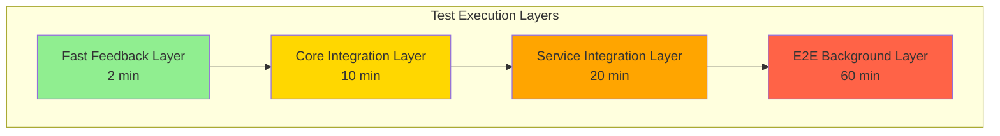

## 2. Test Categories & Infrastructure Requirements

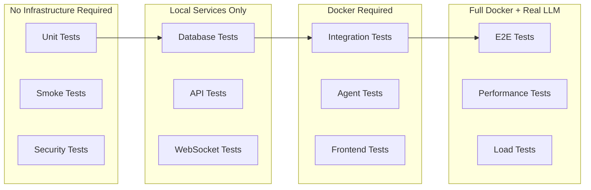

## 3. Service Dependencies Map

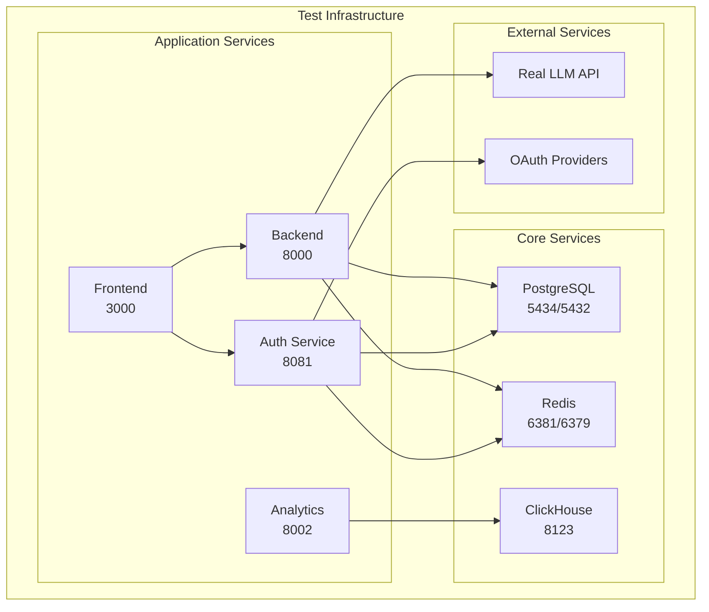

## 4. Mock vs Real Service Usage

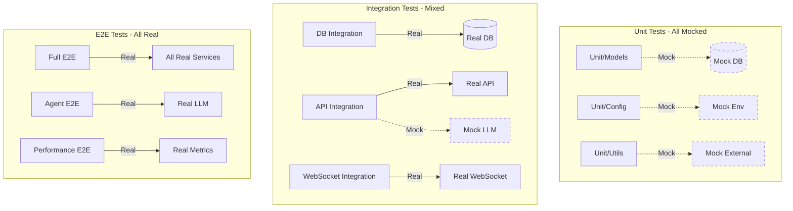

## 5. Test Directory Structure

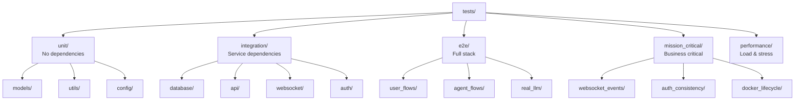

## 6. Docker Container Requirements

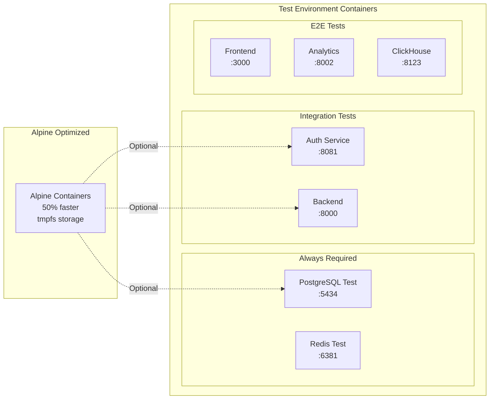

## 7. Test Execution Flow

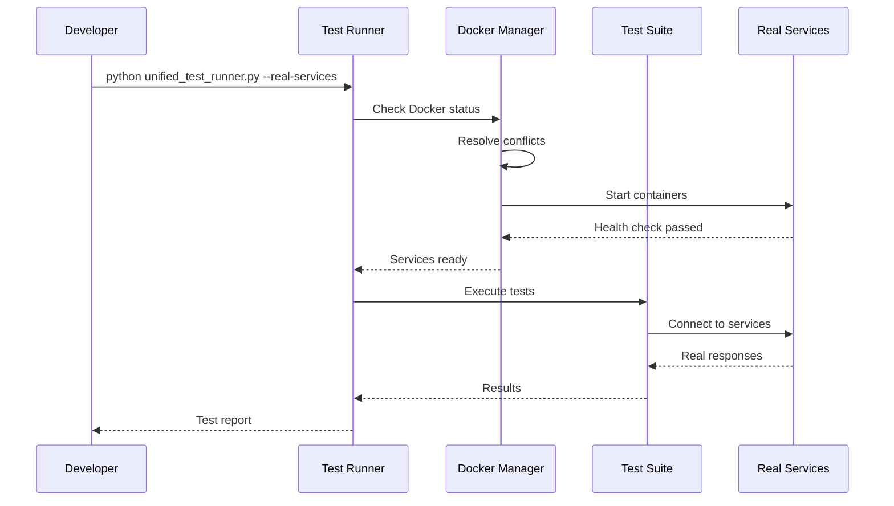

## 8. Mission Critical Test Coverage

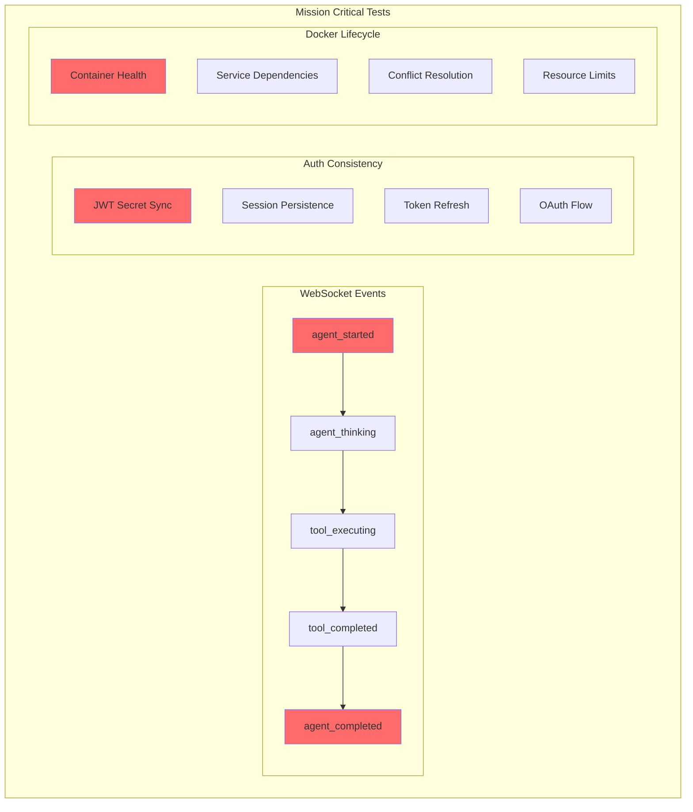

## 9. Test Infrastructure vs Business Logic

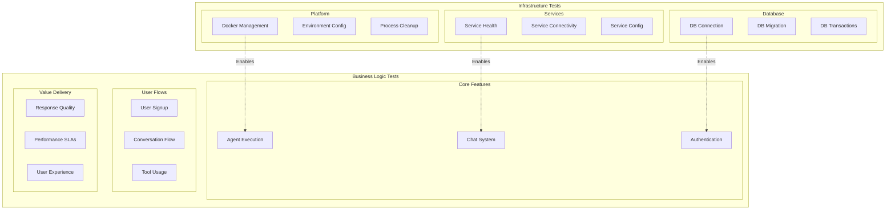

## 10. Real Service Requirements Matrix

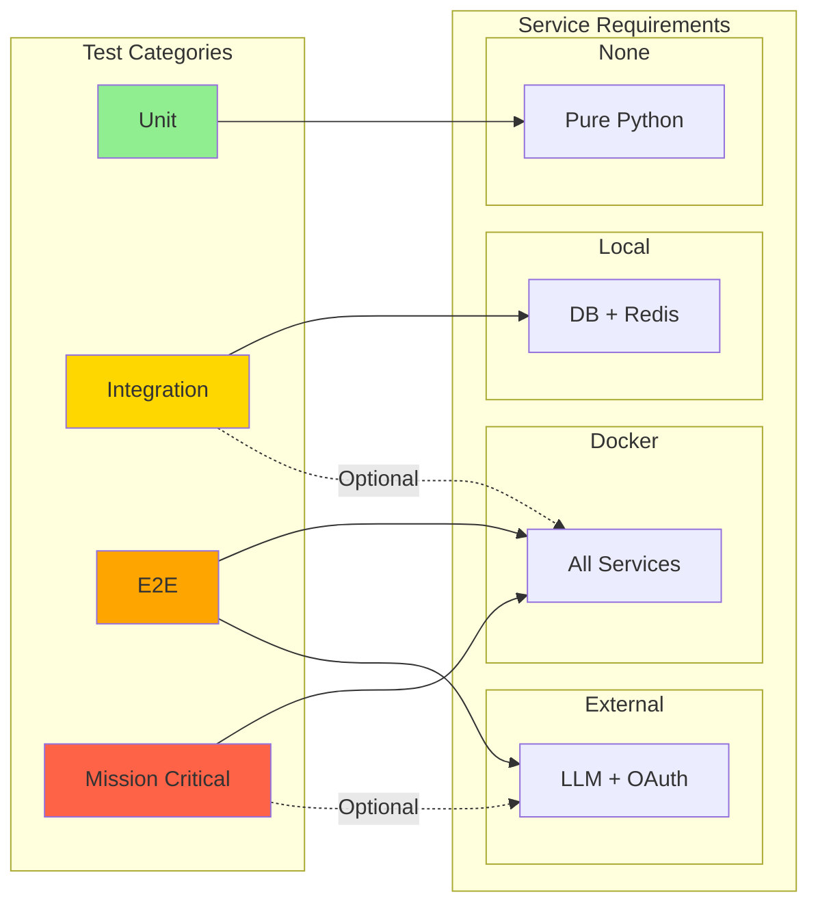

## 11. Test Isolation Patterns

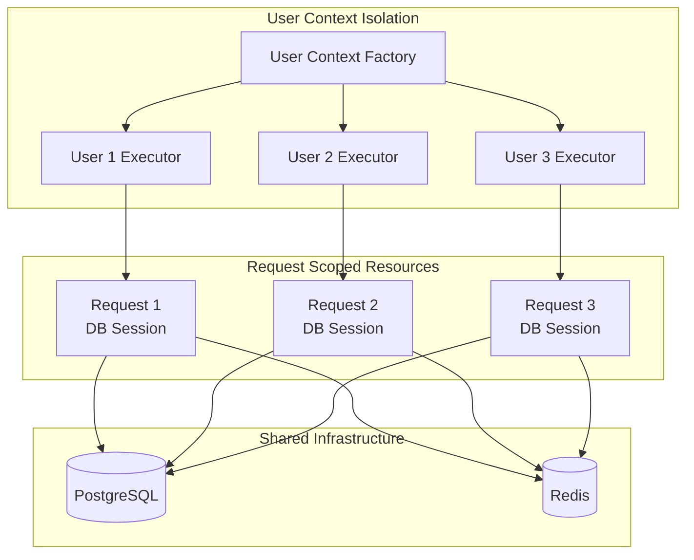

## 12. Performance Test Infrastructure

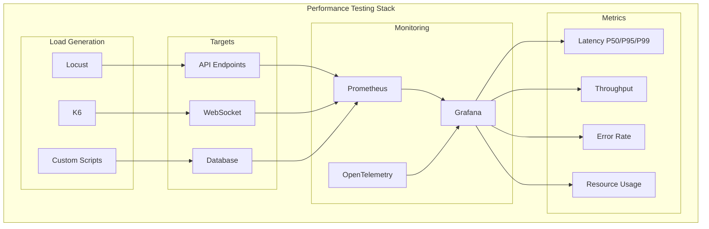

## 13. CI/CD Test Pipeline

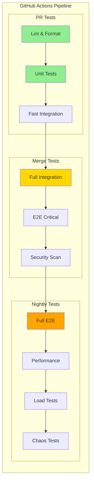

## Test Execution Summary

### Quick Reference

| Test Type | Infrastructure | Docker | Real LLM | Mocks | Execution Time |
|-----------|---------------|--------|----------|-------|----------------|
| Unit | None | ❌ | ❌ | ✅ All | < 1 min |
| Smoke | None | ❌ | ❌ | ✅ Most | < 2 min |
| Integration | Local DB/Redis | Optional | ❌ | ✅ External only | 5-10 min |
| API | Local Services | ✅ | ❌ | ✅ LLM only | 5-10 min |
| WebSocket | Local Services | ✅ | ❌ | ✅ Some | 5-10 min |
| E2E | Full Stack | ✅ | ✅ | ❌ None | 20-60 min |
| Performance | Full Stack | ✅ | Optional | ❌ None | 30-120 min |
| Mission Critical | Full Stack | ✅ | Optional | ❌ None | 10-30 min |

### Docker Service Requirements

| Service | Test Port | Dev Port | Required For |
|---------|-----------|----------|--------------|
| PostgreSQL | 5434 | 5432 | Integration, E2E, Mission Critical |
| Redis | 6381 | 6379 | Integration, E2E, Mission Critical |
| Backend | 8000 | 8000 | API, E2E, Mission Critical |
| Auth | 8081 | 8081 | Auth tests, E2E |
| Frontend | 3000 | 3000 | E2E only |
| ClickHouse | 8123 | 8123 | Analytics tests |
| Analytics | 8002 | 8002 | Analytics E2E |

### Key Testing Principles

1. **NO MOCKS in Production-Like Tests**: E2E, Integration, and Mission Critical tests use real services
2. **Alpine Containers by Default**: 50% faster test execution with Alpine images
3. **Automatic Docker Management**: UnifiedDockerManager handles conflicts and health checks
4. **User Context Isolation**: Factory pattern ensures complete user isolation
5. **WebSocket Events are Critical**: All 5 agent events must be sent for business value

## See Also

- **[CLAUDE.md](../CLAUDE.md)** - Complete development guidelines and testing requirements
- **[Unified Test Runner](./unified_test_runner.py)** - Central test execution script
- **[Mission Critical Tests](./mission_critical/)** - Business-critical test suites