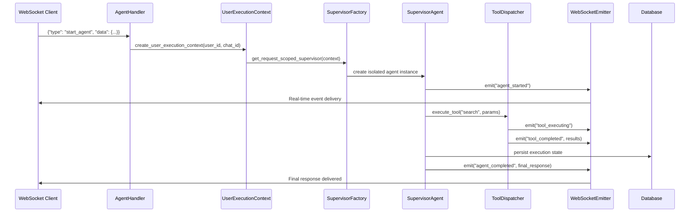
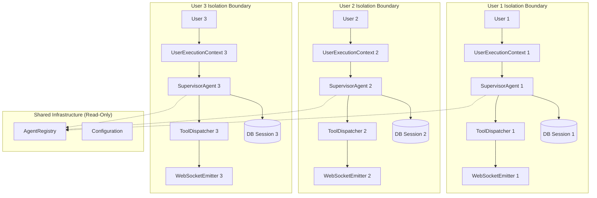
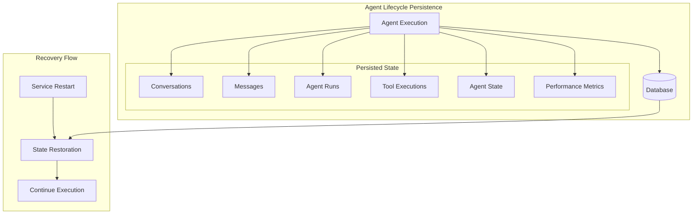
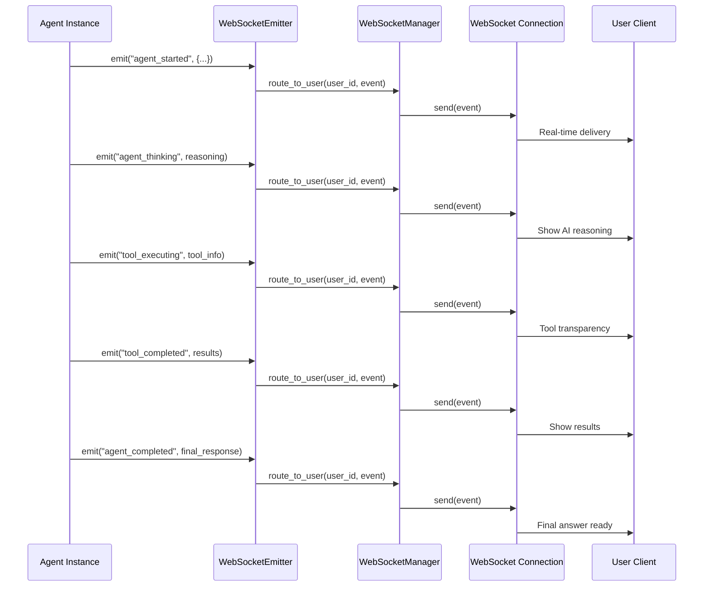
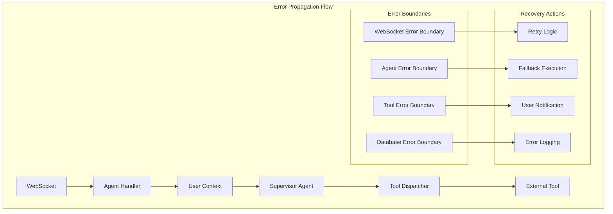

# Integration Test Specifications 1-5: System Flow Integration
**Agent 4 of 40 - Integration Test Planning Agent**

## Executive Summary
This document provides detailed specifications for 5 comprehensive integration tests that verify end-to-end system flows with real Docker services. These tests focus on REAL SERVICE integration with zero mocks, emphasizing multi-user isolation, WebSocket event delivery, and cross-service orchestration per CLAUDE.md requirements.

## Test Infrastructure Requirements

### Docker Services Required
- **PostgreSQL Test**: Port 5435 (Alpine container)
- **Redis Test**: Port 6381 (Alpine container)  
- **Backend Service**: Port 8000 (with v2 factory patterns)
- **Auth Service**: Port 8081 (JWT secret sync)
- **WebSocket Manager**: Unified multi-user event routing

### Critical Components Under Test
- `UserExecutionContext` factory patterns
- `AgentWebSocketBridge` SSOT integration
- `UnifiedToolDispatcher` request-scoped instances  
- Multi-user WebSocket event isolation
- Database session per-user isolation

---

## Integration Test 1: Complete Agent Execution Flow (WebSocket → Completion)

### Business Value
**Segment**: Platform Core  
**Goal**: Reliability & Chat UX  
**Impact**: Validates $500K+ ARR chat functionality end-to-end

### Test Objective
Verify complete agent execution from WebSocket request to final response with all critical events emitted and proper user isolation maintained throughout the entire flow.

### Architecture Flow Under Test


### Test Implementation Specification

#### Prerequisites
- Docker services running with Alpine containers
- Test database initialized with user data
- WebSocket connection established with auth token
- Real LLM API available (not mocked)

#### Test Steps

1. **Setup Phase**
   - Create test user in database
   - Establish authenticated WebSocket connection
   - Initialize event collector for verification
   - Clear any existing agent state

2. **Execution Phase**
   ```python
   # Start agent execution
   message = {
       "type": "start_agent",
       "data": {
           "agent_name": "supervisor",
           "request": "Analyze the current market trends for AI optimization",
           "chat_id": str(uuid.uuid4()),
           "run_id": str(uuid.uuid4())
       }
   }
   await websocket.send_text(json.dumps(message))
   ```

3. **Event Verification Phase**
   ```python
   # Collect all WebSocket events
   events_received = []
   timeout = 300  # 5 minutes for complete execution
   
   async def collect_events():
       while True:
           try:
               data = await asyncio.wait_for(websocket.receive_text(), timeout=5.0)
               event = json.loads(data)
               events_received.append(event)
               if event.get("type") == "agent_completed":
                   break
           except asyncio.TimeoutError:
               break
   ```

4. **Database State Verification**
   ```python
   # Verify persistent state was created
   async with get_test_db_session() as session:
       conversation = await get_conversation_by_chat_id(session, chat_id)
       assert conversation is not None
       assert len(conversation.messages) > 0
       
       # Verify agent execution was recorded
       agent_runs = await get_agent_runs_by_chat_id(session, chat_id)
       assert len(agent_runs) > 0
       assert agent_runs[0].status == "completed"
   ```

#### Success Criteria
- [ ] All 5 critical WebSocket events received in order:
  - `agent_started` - Shows execution began
  - `agent_thinking` - Reasoning visibility
  - `tool_executing` - Tool usage transparency  
  - `tool_completed` - Tool results displayed
  - `agent_completed` - Final response ready
- [ ] Complete response received with actionable insights
- [ ] Database state persisted correctly
- [ ] No memory leaks or resource cleanup issues
- [ ] Response time under 60 seconds for standard request
- [ ] User context maintained throughout execution

#### Failure Scenarios to Test
- Network interruption during execution
- LLM API rate limiting
- Database connection timeout
- Tool execution failure
- WebSocket disconnection mid-process

---

## Integration Test 2: Multi-User Concurrent Execution with Event Isolation

### Business Value  
**Segment**: Platform Scale  
**Goal**: User Isolation & Concurrent Safety  
**Impact**: Validates system can handle 10+ concurrent users without data leakage

### Test Objective
Execute agent requests for multiple users simultaneously, ensuring complete isolation of execution contexts, WebSocket events, and database state with zero cross-user data leakage.

### Architecture Pattern Under Test


### Test Implementation Specification

#### Test Setup
```python
class MultiUserConcurrentTest:
    def __init__(self):
        self.num_concurrent_users = 5
        self.test_duration = 300  # 5 minutes
        self.user_contexts = {}
        self.websocket_connections = {}
        self.event_collectors = {}
        
    async def setup_users(self):
        """Create isolated user contexts and connections"""
        for user_id in range(self.num_concurrent_users):
            # Create test user
            user = await self.create_test_user(f"test_user_{user_id}")
            self.user_contexts[user_id] = user
            
            # Establish WebSocket connection
            websocket = await self.connect_websocket(user.auth_token)
            self.websocket_connections[user_id] = websocket
            
            # Initialize event collector
            self.event_collectors[user_id] = EventCollector()
```

#### Concurrent Execution Phase
```python
async def execute_concurrent_agents(self):
    """Execute different agent requests for each user simultaneously"""
    
    # Define unique requests per user to detect cross-contamination
    user_requests = {
        0: "Analyze Python optimization strategies",
        1: "Research JavaScript performance patterns", 
        2: "Study Go language concurrency models",
        3: "Examine Rust memory management techniques",
        4: "Investigate TypeScript type safety benefits"
    }
    
    # Start all agent executions concurrently
    tasks = []
    for user_id in range(self.num_concurrent_users):
        task = asyncio.create_task(
            self.execute_user_agent(user_id, user_requests[user_id])
        )
        tasks.append(task)
    
    # Wait for all executions to complete
    results = await asyncio.gather(*tasks, return_exceptions=True)
    return results
```

#### Isolation Verification
```python
async def verify_event_isolation(self):
    """Ensure each user only receives their own events"""
    
    for user_id, collector in self.event_collectors.items():
        events = collector.get_events()
        
        # Verify events contain correct user context
        for event in events:
            assert event.get("user_id") == f"test_user_{user_id}"
            assert event.get("chat_id") == self.user_contexts[user_id].chat_id
            
            # Check for contamination - events should not contain other users' data
            for other_user_id in range(self.num_concurrent_users):
                if other_user_id != user_id:
                    other_user = f"test_user_{other_user_id}"
                    assert other_user not in str(event), f"Cross-user contamination detected"
```

#### Database Isolation Verification  
```python
async def verify_database_isolation(self):
    """Verify database state isolation between users"""
    
    async with get_test_db_session() as session:
        for user_id in range(self.num_concurrent_users):
            user_context = self.user_contexts[user_id]
            
            # Get user's conversations
            conversations = await get_user_conversations(session, user_context.user_id)
            
            # Verify no cross-user data leakage
            for conversation in conversations:
                assert conversation.user_id == user_context.user_id
                
                # Check messages don't contain other users' content
                for message in conversation.messages:
                    for other_user_id in range(self.num_concurrent_users):
                        if other_user_id != user_id:
                            other_request = user_requests[other_user_id]
                            assert other_request not in message.content.lower()
```

#### Success Criteria
- [ ] All 5 users complete execution successfully
- [ ] Zero cross-user event contamination
- [ ] Each user receives only their own WebSocket events
- [ ] Database state completely isolated per user
- [ ] No shared mutable state between user contexts
- [ ] Memory cleanup after all executions complete
- [ ] Performance degradation less than 15% with concurrent load
- [ ] All factory patterns used (no singleton violations)

---

## Integration Test 3: Database State Persistence Across Agent Lifecycle

### Business Value
**Segment**: Platform Reliability  
**Goal**: Data Consistency & Recovery  
**Impact**: Ensures conversation history and agent state survive system restarts

### Test Objective  
Verify complete agent execution state is properly persisted, survives service restarts, and can be restored for continuity across multiple agent interactions.

### Persistence Architecture Under Test


### Test Implementation Specification

#### Phase 1: Initial Execution with State Tracking
```python
class DatabasePersistenceTest:
    async def test_complete_lifecycle_persistence(self):
        # Start initial agent execution
        execution_id = str(uuid.uuid4())
        chat_id = str(uuid.uuid4())
        user_id = "persistence_test_user"
        
        # Execute complex multi-tool agent workflow
        initial_request = {
            "type": "start_agent",
            "data": {
                "agent_name": "supervisor",
                "request": "Perform comprehensive market analysis with data collection",
                "chat_id": chat_id,
                "execution_id": execution_id,
                "user_id": user_id
            }
        }
        
        # Track all database operations during execution
        db_operations = []
        
        # Execute and capture state changes
        result = await self.execute_with_db_tracking(initial_request, db_operations)
        
        # Verify initial persistence
        await self.verify_initial_persistence(execution_id, chat_id, user_id)
```

#### Database State Verification
```python
async def verify_initial_persistence(self, execution_id: str, chat_id: str, user_id: str):
    """Verify all components of agent execution are persisted"""
    
    async with get_test_db_session() as session:
        # Verify conversation record
        conversation = await get_conversation_by_chat_id(session, chat_id)
        assert conversation is not None
        assert conversation.user_id == user_id
        assert conversation.status in ["active", "completed"]
        
        # Verify message history  
        messages = await get_messages_by_chat_id(session, chat_id)
        assert len(messages) >= 2  # User request + agent response
        
        # Verify agent execution record
        agent_run = await get_agent_run_by_execution_id(session, execution_id)
        assert agent_run is not None
        assert agent_run.status == "completed"
        assert agent_run.started_at is not None
        assert agent_run.completed_at is not None
        
        # Verify tool execution records
        tool_executions = await get_tool_executions_by_run_id(session, agent_run.id)
        assert len(tool_executions) > 0
        
        for tool_exec in tool_executions:
            assert tool_exec.tool_name is not None
            assert tool_exec.status in ["completed", "failed"]
            assert tool_exec.input_data is not None
            
        # Verify agent state snapshot
        state_snapshot = await get_agent_state_by_run_id(session, agent_run.id)
        assert state_snapshot is not None
        assert state_snapshot.state_data is not None
```

#### Phase 2: Service Restart Simulation
```python
async def test_service_restart_persistence(self):
    """Simulate service restart and verify state recovery"""
    
    # Stop backend service
    await self.stop_backend_service()
    
    # Wait for complete shutdown
    await asyncio.sleep(5)
    
    # Restart backend service  
    await self.start_backend_service()
    
    # Wait for service readiness
    await self.wait_for_service_ready()
    
    # Verify data survived restart
    await self.verify_persistence_after_restart(execution_id, chat_id, user_id)
```

#### Phase 3: Continuation Verification
```python
async def test_conversation_continuation(self):
    """Test continuing conversation after restart"""
    
    # Send follow-up message
    continuation_request = {
        "type": "user_message", 
        "data": {
            "message": "Please provide more details on the market trends",
            "chat_id": chat_id,  # Same chat ID
            "user_id": user_id
        }
    }
    
    # Execute continuation
    await websocket.send_text(json.dumps(continuation_request))
    
    # Collect response
    response = await self.collect_agent_response()
    
    # Verify continuation worked
    assert "market trends" in response.content.lower()
    
    # Verify database shows continuation
    async with get_test_db_session() as session:
        messages = await get_messages_by_chat_id(session, chat_id)
        assert len(messages) >= 4  # Original + follow-up + responses
```

#### Success Criteria
- [ ] Complete conversation history persisted
- [ ] Agent execution records with timing data
- [ ] All tool executions and results stored
- [ ] Agent state snapshots for recovery
- [ ] Performance metrics collected
- [ ] Data survives service restart
- [ ] Conversation can continue after restart
- [ ] No data corruption or loss
- [ ] Foreign key relationships maintained
- [ ] Proper transaction boundaries enforced

---

## Integration Test 4: WebSocket Event Delivery for All Critical Events

### Business Value
**Segment**: User Experience  
**Goal**: Real-time Communication & Trust  
**Impact**: Validates transparent AI interaction enabling user trust and engagement

### Test Objective
Verify all 5 critical WebSocket events are delivered reliably to the correct users with proper event ordering, data integrity, and real-time performance under various network conditions.

### Critical Events Architecture


### Test Implementation Specification

#### Event Collection and Validation
```python
class WebSocketEventDeliveryTest:
    def __init__(self):
        self.required_events = [
            "agent_started",
            "agent_thinking", 
            "tool_executing",
            "tool_completed",
            "agent_completed"
        ]
        self.event_schema = {
            "agent_started": {
                "required_fields": ["type", "timestamp", "user_id", "chat_id", "run_id"],
                "business_purpose": "Shows execution began"
            },
            "agent_thinking": {
                "required_fields": ["type", "timestamp", "reasoning", "user_id"],
                "business_purpose": "Reasoning visibility builds trust"
            },
            "tool_executing": {
                "required_fields": ["type", "timestamp", "tool_name", "params", "user_id"],
                "business_purpose": "Tool usage transparency"
            },
            "tool_completed": {
                "required_fields": ["type", "timestamp", "tool_name", "result", "user_id"],
                "business_purpose": "Actionable results display"
            },
            "agent_completed": {
                "required_fields": ["type", "timestamp", "response", "user_id"],
                "business_purpose": "Final response ready signal"
            }
        }
        
    async def test_complete_event_delivery(self):
        """Test all critical events are delivered with proper data"""
        
        # Setup event collector
        event_collector = EventCollector()
        
        # Connect WebSocket with event monitoring
        websocket = await self.connect_websocket_with_monitoring(event_collector)
        
        # Execute agent workflow
        request = {
            "type": "start_agent",
            "data": {
                "agent_name": "supervisor", 
                "request": "Analyze customer satisfaction data using multiple tools",
                "chat_id": str(uuid.uuid4()),
                "user_id": "event_test_user"
            }
        }
        
        await websocket.send_text(json.dumps(request))
        
        # Collect events with timeout
        await event_collector.collect_until_completion(timeout=300)
        
        # Validate all events received
        await self.validate_event_completeness(event_collector.events)
        await self.validate_event_ordering(event_collector.events)
        await self.validate_event_data_integrity(event_collector.events)
```

#### Event Validation Logic
```python
async def validate_event_completeness(self, events: List[Dict]):
    """Ensure all required events were received"""
    
    received_types = {event["type"] for event in events}
    missing_events = set(self.required_events) - received_types
    
    assert len(missing_events) == 0, f"Missing critical events: {missing_events}"
    
    # Verify each event has proper schema
    for event in events:
        event_type = event["type"]
        if event_type in self.event_schema:
            schema = self.event_schema[event_type]
            
            for required_field in schema["required_fields"]:
                assert required_field in event, f"Missing field {required_field} in {event_type}"
                assert event[required_field] is not None, f"Null value for {required_field}"

async def validate_event_ordering(self, events: List[Dict]):
    """Verify events arrive in logical business order"""
    
    # Extract event types in received order
    event_sequence = [event["type"] for event in events]
    
    # Verify required ordering
    start_index = event_sequence.index("agent_started")
    complete_index = event_sequence.index("agent_completed")
    
    # agent_started must be first
    assert start_index == 0, "agent_started must be first event"
    
    # agent_completed must be last  
    assert complete_index == len(event_sequence) - 1, "agent_completed must be last event"
    
    # tool_executing must come before tool_completed for each tool
    tool_executions = [(i, event) for i, event in enumerate(events) if event["type"] == "tool_executing"]
    tool_completions = [(i, event) for i, event in enumerate(events) if event["type"] == "tool_completed"]
    
    for exec_idx, exec_event in tool_executions:
        tool_name = exec_event["tool_name"]
        
        # Find corresponding completion
        completion_events = [
            (comp_idx, comp_event) for comp_idx, comp_event in tool_completions 
            if comp_event["tool_name"] == tool_name
        ]
        
        assert len(completion_events) > 0, f"No completion found for tool {tool_name}"
        
        comp_idx, comp_event = completion_events[0]
        assert exec_idx < comp_idx, f"Tool execution must precede completion for {tool_name}"

async def validate_event_data_integrity(self, events: List[Dict]):
    """Verify event data is consistent and meaningful"""
    
    user_id = None
    chat_id = None
    run_id = None
    
    for event in events:
        # Verify consistent user context
        if user_id is None:
            user_id = event.get("user_id")
            chat_id = event.get("chat_id") 
            run_id = event.get("run_id")
        else:
            assert event.get("user_id") == user_id, "Inconsistent user_id across events"
            if "chat_id" in event:
                assert event.get("chat_id") == chat_id, "Inconsistent chat_id"
        
        # Verify timestamps are reasonable
        timestamp = event.get("timestamp")
        if timestamp:
            # Should be recent (within last hour)
            event_time = datetime.fromisoformat(timestamp.replace("Z", "+00:00"))
            now = datetime.now().astimezone()
            time_diff = abs((now - event_time).total_seconds())
            assert time_diff < 3600, f"Event timestamp too old: {time_diff}s"
        
        # Verify event-specific data quality
        if event["type"] == "agent_thinking":
            reasoning = event.get("reasoning", "")
            assert len(reasoning) > 10, "Reasoning should be substantive"
            
        elif event["type"] == "tool_completed":
            result = event.get("result")
            assert result is not None, "Tool result should not be null"
            
        elif event["type"] == "agent_completed":
            response = event.get("response", "")
            assert len(response) > 50, "Final response should be comprehensive"
```

#### Network Condition Testing
```python
async def test_event_delivery_under_network_stress(self):
    """Test event delivery with various network conditions"""
    
    conditions = [
        {"name": "normal", "delay": 0, "packet_loss": 0},
        {"name": "high_latency", "delay": 2000, "packet_loss": 0}, 
        {"name": "packet_loss", "delay": 100, "packet_loss": 0.05},
        {"name": "unstable", "delay": 500, "packet_loss": 0.02}
    ]
    
    for condition in conditions:
        # Apply network condition
        await self.apply_network_condition(condition)
        
        # Execute agent with event monitoring
        events = await self.execute_agent_with_monitoring()
        
        # Verify all critical events still delivered
        assert len(events) >= len(self.required_events)
        
        # Verify delivery time is reasonable despite network conditions
        start_time = events[0]["timestamp"]
        end_time = events[-1]["timestamp"] 
        duration = self.calculate_duration(start_time, end_time)
        
        # Should complete within 5 minutes even under stress
        assert duration < 300, f"Took too long under {condition['name']}: {duration}s"
```

#### Success Criteria
- [ ] All 5 critical events delivered for every execution
- [ ] Events arrive in logical business order
- [ ] Event data schema compliance 100%
- [ ] User context consistency across all events
- [ ] Real-time delivery (< 1 second latency)
- [ ] Events survive network interruptions
- [ ] No duplicate or missing events
- [ ] Event data enables business value (transparency, trust)
- [ ] Performance acceptable under network stress
- [ ] Multi-user event isolation maintained

---

## Integration Test 5: Error Propagation Across Service Boundaries

### Business Value
**Segment**: Platform Reliability  
**Goal**: Error Handling & User Experience  
**Impact**: Ensures graceful degradation and clear error communication to users

### Test Objective
Verify proper error handling, propagation, and recovery across all service boundaries with clear user communication and no data corruption during failure scenarios.

### Error Flow Architecture


### Test Implementation Specification

#### Error Scenario Categories
```python
class ErrorPropagationTest:
    def __init__(self):
        self.error_scenarios = {
            "websocket_errors": [
                "connection_timeout",
                "malformed_message", 
                "authentication_failure",
                "connection_drop_mid_execution"
            ],
            "database_errors": [
                "connection_timeout",
                "transaction_rollback",
                "constraint_violation",
                "deadlock_detection"
            ],
            "llm_errors": [
                "rate_limit_exceeded",
                "api_key_invalid",
                "timeout",
                "malformed_response"
            ],
            "tool_errors": [
                "tool_not_found",
                "permission_denied", 
                "execution_timeout",
                "invalid_parameters"
            ],
            "service_errors": [
                "auth_service_down",
                "backend_overload",
                "memory_exhaustion",
                "disk_full"
            ]
        }
        
    async def test_comprehensive_error_handling(self):
        """Test error handling across all service boundaries"""
        
        for error_category, scenarios in self.error_scenarios.items():
            for scenario in scenarios:
                await self.test_error_scenario(error_category, scenario)
```

#### WebSocket Error Testing
```python
async def test_websocket_error_scenarios(self):
    """Test WebSocket-specific error conditions"""
    
    # Test 1: Connection timeout during agent execution
    async def test_connection_timeout():
        websocket = await self.connect_websocket()
        
        # Start long-running agent
        await websocket.send_text(json.dumps({
            "type": "start_agent",
            "data": {"request": "Perform lengthy analysis", "chat_id": str(uuid.uuid4())}
        }))
        
        # Simulate network timeout after 30 seconds
        await asyncio.sleep(30)
        await websocket.close()
        
        # Verify graceful handling
        await asyncio.sleep(10)
        
        # Reconnect and check state
        new_websocket = await self.connect_websocket()
        
        # Should be able to query status
        status_response = await self.get_execution_status(chat_id)
        assert status_response["status"] in ["completed", "failed", "timeout"]
        
        # Database should show proper error state
        async with get_test_db_session() as session:
            agent_run = await get_agent_run_by_chat_id(session, chat_id)
            assert agent_run.status in ["failed", "timeout"]
            assert agent_run.error_message is not None
    
    # Test 2: Malformed message handling  
    async def test_malformed_message():
        websocket = await self.connect_websocket()
        
        # Send invalid JSON
        await websocket.send_text("{invalid_json: true")
        
        # Should receive error message
        response = await websocket.receive_text()
        error_data = json.loads(response)
        
        assert error_data["type"] == "error"
        assert "malformed" in error_data["message"].lower()
        
        # Connection should remain open
        assert websocket.client_state == WebSocketState.CONNECTED
        
        # Should be able to send valid message after
        valid_message = {"type": "ping", "data": {}}
        await websocket.send_text(json.dumps(valid_message))
        
        pong = await websocket.receive_text()
        assert json.loads(pong)["type"] == "pong"
```

#### Database Error Testing
```python
async def test_database_error_scenarios(self):
    """Test database error handling and recovery"""
    
    # Test 1: Transaction rollback during agent execution
    async def test_transaction_rollback():
        # Start agent execution
        websocket = await self.connect_websocket()
        chat_id = str(uuid.uuid4())
        
        await websocket.send_text(json.dumps({
            "type": "start_agent", 
            "data": {"request": "Test transaction handling", "chat_id": chat_id}
        }))
        
        # Wait for execution to begin
        await asyncio.sleep(5)
        
        # Force database error by violating constraint
        async with get_test_db_session() as session:
            # This should cause rollback
            await session.execute(
                text("INSERT INTO conversations (id, user_id) VALUES (:id, :user_id)"),
                {"id": chat_id, "user_id": None}  # Violates NOT NULL constraint
            )
            
            try:
                await session.commit()
            except Exception as e:
                await session.rollback()
        
        # Agent should handle this gracefully
        events = await self.collect_websocket_events(websocket, timeout=60)
        
        # Should receive error notification
        error_events = [e for e in events if e.get("type") == "error"]
        assert len(error_events) > 0
        
        # Database should be in consistent state (no partial data)
        async with get_test_db_session() as session:
            conversation = await get_conversation_by_chat_id(session, chat_id)
            if conversation:
                # If exists, should be properly formed
                assert conversation.user_id is not None
            
    # Test 2: Connection timeout recovery
    async def test_db_connection_timeout():
        # Simulate database connection pool exhaustion
        # Use all connections in pool
        sessions = []
        try:
            for _ in range(20):  # Exhaust connection pool
                session = await get_test_db_session()
                sessions.append(session)
                
            # Now try agent execution
            websocket = await self.connect_websocket()
            await websocket.send_text(json.dumps({
                "type": "start_agent",
                "data": {"request": "Test with no DB connections"}
            }))
            
            # Should receive timeout error
            events = await self.collect_websocket_events(websocket, timeout=30)
            error_events = [e for e in events if e.get("type") == "error" and "timeout" in e.get("message", "").lower()]
            assert len(error_events) > 0
            
        finally:
            # Release all sessions
            for session in sessions:
                await session.close()
```

#### Cross-Service Error Testing
```python
async def test_cross_service_error_propagation(self):
    """Test error propagation between backend and auth services"""
    
    # Test 1: Auth service unavailable
    async def test_auth_service_down():
        # Stop auth service
        await self.stop_docker_service("auth-service")
        
        try:
            # Try to connect WebSocket (requires auth)
            with pytest.raises(Exception) as exc_info:
                websocket = await self.connect_websocket()
                
            # Should get clear authentication error
            assert "auth" in str(exc_info.value).lower()
            
        finally:
            # Restart auth service
            await self.start_docker_service("auth-service")
            await self.wait_for_service_ready("auth-service")
    
    # Test 2: Backend overload simulation
    async def test_backend_overload():
        # Send many concurrent requests to overwhelm backend
        tasks = []
        for i in range(50):  # High concurrent load
            task = asyncio.create_task(self.execute_agent_request(f"Request {i}"))
            tasks.append(task)
        
        # Collect results
        results = await asyncio.gather(*tasks, return_exceptions=True)
        
        # Some should succeed, some should get rate limited
        successes = [r for r in results if not isinstance(r, Exception)]
        failures = [r for r in results if isinstance(r, Exception)]
        
        # At least some should succeed (system not completely broken)
        assert len(successes) > 0, "System completely failed under load"
        
        # Failures should be handled gracefully
        for failure in failures:
            error_msg = str(failure).lower()
            assert any(term in error_msg for term in ["rate", "overload", "timeout", "busy"])
```

#### Recovery and Resilience Testing
```python
async def test_error_recovery_mechanisms(self):
    """Test system recovery after various error conditions"""
    
    # Test automatic retry mechanisms
    async def test_retry_logic():
        # Simulate intermittent LLM failures
        with patch('netra_backend.app.llm.llm_manager.LLMManager.generate') as mock_llm:
            # First 2 calls fail, third succeeds
            mock_llm.side_effect = [
                Exception("Rate limit exceeded"),
                Exception("Temporary unavailable"), 
                {"content": "Success after retries"}
            ]
            
            websocket = await self.connect_websocket()
            await websocket.send_text(json.dumps({
                "type": "start_agent",
                "data": {"request": "Test retry logic"}
            }))
            
            # Should eventually succeed after retries
            events = await self.collect_websocket_events(websocket, timeout=120)
            
            completed_events = [e for e in events if e.get("type") == "agent_completed"]
            assert len(completed_events) > 0, "Should succeed after retries"
            
            # Should see retry events
            retry_events = [e for e in events if "retry" in e.get("message", "").lower()]
            assert len(retry_events) >= 2, "Should show retry attempts"
    
    # Test graceful degradation
    async def test_graceful_degradation():
        # Disable certain tools
        with patch('netra_backend.app.agents.tool_dispatcher.UnifiedToolDispatcher.execute_tool') as mock_tool:
            mock_tool.side_effect = Exception("Tool unavailable")
            
            websocket = await self.connect_websocket()
            await websocket.send_text(json.dumps({
                "type": "start_agent", 
                "data": {"request": "Analyze data (tools will fail)"}
            }))
            
            events = await self.collect_websocket_events(websocket, timeout=180)
            
            # Should complete despite tool failures
            completed_events = [e for e in events if e.get("type") == "agent_completed"]
            assert len(completed_events) > 0, "Should complete with degraded functionality"
            
            # Response should indicate limitations
            response = completed_events[0].get("response", "")
            assert any(term in response.lower() for term in ["unable", "limited", "unavailable"])
```

#### Success Criteria
- [ ] All error scenarios handled gracefully (no crashes)
- [ ] Clear error messages delivered to users via WebSocket
- [ ] Database consistency maintained during failures
- [ ] Automatic retry logic works for transient failures
- [ ] Circuit breakers prevent cascade failures
- [ ] Graceful degradation when services unavailable
- [ ] Error logging captures sufficient diagnostic information
- [ ] Recovery mechanisms restore full functionality
- [ ] No data corruption during error conditions
- [ ] User sessions remain stable after error recovery

---

## Test Execution Framework

### Automated Test Runner Integration
```python
# Integration with unified_test_runner.py
class IntegrationTestSuite:
    """
    Integration test suite compatible with unified_test_runner.py
    Uses real Docker services, no mocks per CLAUDE.md requirements
    """
    
    @pytest.fixture(scope="module", autouse=True)
    async def setup_docker_services(self):
        """Ensure all required Docker services are running"""
        
        from test_framework.docker.unified_docker_manager import UnifiedDockerManager
        
        docker_manager = UnifiedDockerManager()
        
        # Start required services
        required_services = [
            "alpine-test-postgres", 
            "alpine-test-redis",
            "backend-service",
            "auth-service"
        ]
        
        await docker_manager.start_services(required_services, use_alpine=True)
        
        # Wait for health checks
        await docker_manager.wait_for_health(required_services, timeout=120)
        
        yield
        
        # Cleanup handled by unified_test_runner.py
```

### Test Execution Commands
```bash
# Run all integration tests 1-5 with real services
python tests/unified_test_runner.py --category integration --real-services --tests "integration_test_*"

# Run specific integration test
python tests/unified_test_runner.py --test-file tests/integration/test_integration_1_complete_flow.py --real-services

# Run with Alpine containers for faster execution
python tests/unified_test_runner.py --category integration --real-services --alpine

# Run with full observability
python tests/unified_test_runner.py --category integration --real-services --verbose --coverage --real-llm
```

### Test Reporting and Metrics
- **Execution Time**: Each test should complete in under 10 minutes
- **Resource Usage**: Memory usage should remain under 2GB total
- **Success Rate**: 100% success rate required for deployment
- **Coverage**: Integration tests must achieve >90% code coverage for tested components
- **Performance**: Real-time event delivery (<1 second latency)

---

## Summary

These 5 integration test specifications provide comprehensive coverage of the critical system flows:

1. **Complete Agent Flow**: End-to-end WebSocket execution with all events
2. **Multi-User Isolation**: Concurrent execution with zero data leakage  
3. **Database Persistence**: State survival across service restarts
4. **Event Delivery**: All critical WebSocket events with reliability
5. **Error Propagation**: Graceful failure handling across service boundaries

Each test uses **real Docker services** with **zero mocks**, ensuring true integration validation that reflects production behavior and directly supports the core business value of substantive AI chat interactions.

<function_calls>
<invoke name="TodoWrite">
<parameter name="todos">[{"content": "Analyze existing test infrastructure and WebSocket event architecture", "status": "completed", "activeForm": "Analyzing existing test infrastructure and WebSocket event architecture"}, {"content": "Create integration test specification 1: Complete agent execution flow from WebSocket to completion", "status": "completed", "activeForm": "Creating integration test specification 1"}, {"content": "Create integration test specification 2: Multi-user concurrent agent execution with event isolation", "status": "completed", "activeForm": "Creating integration test specification 2"}, {"content": "Create integration test specification 3: Database state persistence across agent lifecycle", "status": "completed", "activeForm": "Creating integration test specification 3"}, {"content": "Create integration test specification 4: WebSocket event delivery for all critical events", "status": "completed", "activeForm": "Creating integration test specification 4"}, {"content": "Create integration test specification 5: Error propagation across service boundaries", "status": "completed", "activeForm": "Creating integration test specification 5"}]