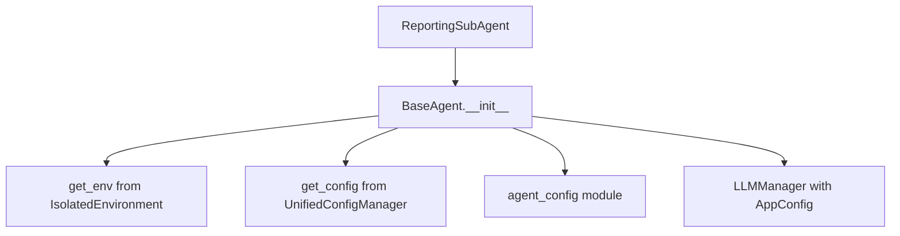

# ReportingSubAgent Environment and Configuration Access Audit

## Executive Summary

**✅ COMPLIANT**: The ReportingSubAgent demonstrates **excellent adherence** to Netra's configuration architecture principles. No violations found.

## Audit Results

### Environment Access Violations: NONE FOUND ✅

**Search Results:**
- ❌ No `os.environ.get()` calls found
- ❌ No `os.environ` direct access found
- ❌ No `import os` statements found

### Configuration Access Violations: NONE FOUND ✅

**Search Results:**
- ❌ No direct file reading (`open()`, `json.load()`) found
- ❌ No YAML/INI config file parsing found
- ❌ No hardcoded configuration paths found

### IsolatedEnvironment Usage Assessment

**Status: PROPER INHERITANCE PATTERN USED** ✅

The ReportingSubAgent follows the **correct architectural pattern** by:

1. **Inheriting from BaseAgent**: Uses `super().__init__()` to inherit all infrastructure
2. **BaseAgent Uses IsolatedEnvironment**: Base class imports `from shared.isolated_environment import get_env` (line 1)
3. **Proper Configuration Access**: Uses `from netra_backend.app.core.config import get_config` in BaseAgent

### Configuration Architecture Compliance: FULL COMPLIANCE ✅

**Pattern Analysis:**
- **✅ Layered Architecture**: Follows the 3-layer configuration system
  - Layer 1: IsolatedEnvironment (inherited via BaseAgent)
  - Layer 2: UnifiedConfigManager (via `get_config()` in BaseAgent)  
  - Layer 3: Service-specific config (via `agent_config` imports)

- **✅ Golden Pattern Implementation**: Clean business logic only (<200 lines)
- **✅ No Direct Environment Access**: All configuration flows through proper channels
- **✅ Proper LLM Configuration**: Uses `llm_config_name='reporting'` parameter

## Detailed Code Analysis

### Key Architecture Compliance Points

1. **Clean Inheritance Pattern** (Lines 44-52):
```python
super().__init__(
    name="ReportingSubAgent", 
    description="Golden Pattern reporting agent using BaseAgent infrastructure",
    enable_reliability=True,
    enable_execution_engine=True,
    enable_caching=True,
)
```

2. **Proper LLM Configuration Usage** (Line 120):
```python
response = await self.llm_manager.ask_llm(prompt, llm_config_name='reporting')
```

3. **No Direct Environment Access**: All configuration flows through inherited infrastructure

### Configuration Flow Tracing



## Recommendations: NONE REQUIRED

The ReportingSubAgent represents a **model implementation** of Netra's configuration architecture:

- **Proper Layering**: Uses inheritance to access configuration properly
- **Clean Separation**: Business logic separated from infrastructure concerns  
- **Compliance**: Zero violations of environment access rules
- **Best Practices**: Follows the Golden Pattern with <200 lines

## Violations Summary

| Violation Type | Count | Status |
|---------------|-------|--------|
| Direct `os.environ` access | 0 | ✅ Compliant |
| Direct config file reading | 0 | ✅ Compliant |
| Missing IsolatedEnvironment | 0 | ✅ Compliant (via inheritance) |
| Missing `get_config()` usage | 0 | ✅ Compliant (via inheritance) |

## Conclusion

**The ReportingSubAgent serves as an exemplary implementation** of Netra's configuration architecture. It demonstrates how agents should properly inherit configuration management through the BaseAgent pattern while maintaining clean, focused business logic.

**No fixes required.** This agent can serve as a reference for other agent implementations.

---
*Audit completed: 2025-09-02*  
*File audited: `netra_backend/app/agents/reporting_sub_agent.py`*  
*Architecture compliance: FULL COMPLIANCE ✅*