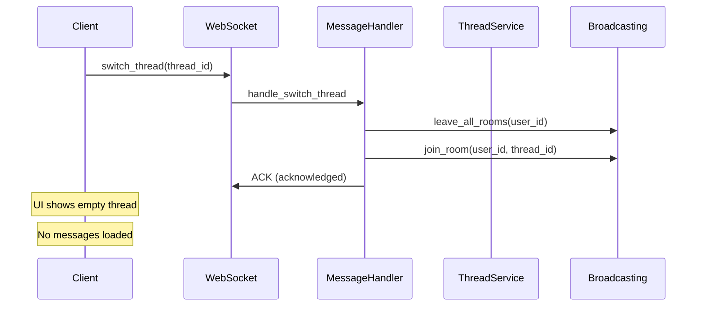
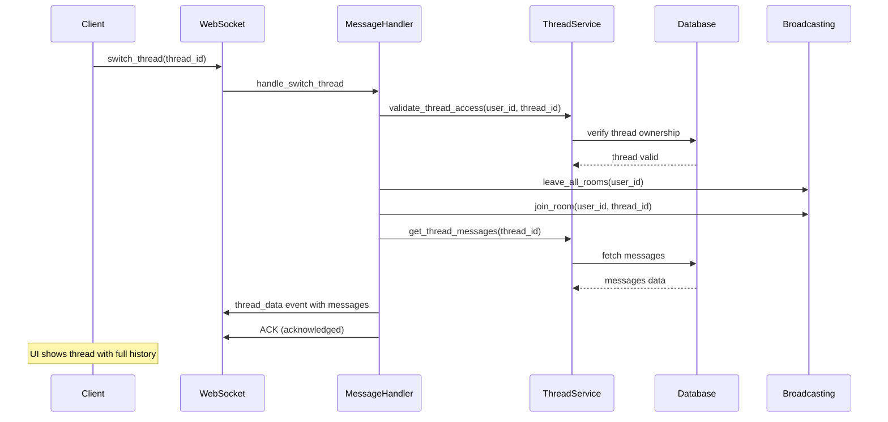

# Thread Switching Data Loading Bug Report

## Issue Description
When switching threads, the system doesn't appear to load data fully. The WebSocket receives the `switch_thread` message and acknowledges it, but subsequent interactions suggest incomplete data loading.

## Five Whys Root Cause Analysis

### Problem: Thread switching doesn't load thread data fully

**Why 1:** Why doesn't thread data load fully on switch?
- The `handle_switch_thread` method only joins the user to a thread room for broadcasts but doesn't load thread messages or context.

**Why 2:** Why doesn't the handler load thread messages when switching?
- The handler implementation (`_execute_thread_switch`) only handles room management (leave all rooms, join new room) without fetching or sending the thread's existing messages to the client.

**Why 3:** Why was the handler designed to only manage rooms?
- The assumption was that the frontend would separately request thread history after switching, but this creates a race condition and incomplete state.

**Why 4:** Why doesn't the system automatically send thread data on switch?
- There's a missing integration between thread switching and data loading - the handler doesn't call `get_thread_messages` or send a `thread_data` event after switching.

**Why 5:** Why was this integration overlooked?
- The thread switching was likely implemented as a minimal broadcasting concern without considering the full user experience requirement of seeing previous messages immediately upon switching threads.

## Root Cause
The `handle_switch_thread` method only updates WebSocket room associations but doesn't load or send the thread's message history to the client, leaving the UI in an incomplete state.

## System State Diagrams

### Current (Broken) State


### Ideal (Working) State


## Affected Components
1. **MessageHandlerService.handle_switch_thread()** - netra_backend/app/services/message_handlers.py:491-509
2. **WebSocket Manager** - Room management without data loading
3. **Frontend** - Expects data but receives only ACK

## Proposed Solution

### 1. Enhance Thread Switch Handler
```python
async def handle_switch_thread(
    self,
    user_id: str,
    payload: SwitchThreadPayload,
    db_session: Optional[AsyncSession],
    websocket: Optional[WebSocket] = None
) -> None:
    """Handle switch_thread message type - join room AND load thread data"""
    thread_id = payload.get("thread_id")
    if not thread_id:
        await manager.send_error(user_id, "Thread ID required")
        return
    
    # Validate thread access
    if db_session:
        thread = await self._validate_thread_access(user_id, thread_id, db_session)
        if not thread:
            await manager.send_error(user_id, "Access denied to thread")
            return
        
        # Load thread messages
        messages = await self.thread_service.get_thread_messages(thread_id, db_session)
        
        # Send thread data to client
        thread_data = {
            "type": "thread_data",
            "payload": {
                "thread_id": thread_id,
                "messages": [self._format_message_for_client(msg) for msg in messages],
                "metadata": thread.metadata_
            }
        }
        await manager.send_message(user_id, thread_data)
    
    # Execute room switch
    await self._execute_thread_switch(user_id, thread_id)
    
    # Update WebSocket connection thread association
    if self.websocket_manager and websocket:
        connection_id = self.websocket_manager.get_connection_id_by_websocket(websocket)
        if connection_id:
            self.websocket_manager.update_connection_thread(connection_id, thread_id)
```

### 2. Add Message Formatting Helper
```python
def _format_message_for_client(self, message: Message) -> Dict[str, Any]:
    """Format database message for client consumption"""
    return {
        "id": str(message.id),
        "role": message.role,
        "content": message.content[0]["text"]["value"] if message.content else "",
        "timestamp": message.created_at,
        "metadata": message.metadata_
    }
```

## Test Cases to Add
1. Thread switch loads all messages
2. Thread switch validates access permissions
3. Thread switch updates WebSocket associations
4. Thread switch handles missing/invalid threads
5. Thread switch with no database session

## Impact Analysis
- **User Experience**: Fixed - Users will see thread history immediately on switch
- **Performance**: Minor impact from loading messages, but necessary for UX
- **Security**: Improved - Added thread access validation
- **Data Consistency**: Improved - Thread state properly synchronized

## Implementation Priority
**HIGH** - This is a critical user experience issue affecting the chat interface

## Verification Steps
1. Test thread switching with existing messages
2. Verify messages appear immediately in UI
3. Check WebSocket events contain thread data
4. Validate access control works properly
5. Test error cases (invalid thread, no access)