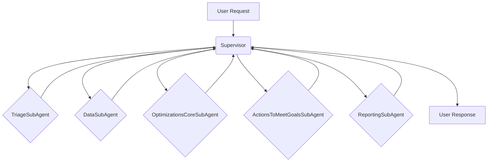

# Sub-Agent Architecture

This document describes the Sub-Agent architecture used in the Netra application.

## Overview

The Sub-Agent architecture is a modular and scalable way to organize the different components of the Netra application. Each Sub-Agent is responsible for a specific task, and the Supervisor is responsible for orchestrating the flow between the different Sub-Agents.

The Supervisor uses a dynamic routing mechanism to determine the next Sub-Agent to activate. This allows for a flexible and intelligent workflow that can adapt to the user's request.

## BaseSubAgent

The `BaseSubAgent` class is the base class for all sub-agents. It defines the common interface for all sub-agents, including the `run` method. Each sub-agent also has a lifecycle state, which is managed by the `SubAgentLifecycle` enum.

## Sub-Agents

- **TriageSubAgent**: This Sub-Agent is responsible for triaging the user's request and determining the primary category of the request (e.g., Data Analysis, Code Optimization, General Inquiry).
- **DataSubAgent**: This Sub-Agent is responsible for gathering and enriching data based on the triage result. For example, if the request is for data analysis, this agent will fetch and process the relevant data.
- **OptimizationsCoreSubAgent**: This Sub-Agent is responsible for analyzing the data from the `DataSubAgent` and formulating optimization strategies.
- **ActionsToMeetGoalsSubAgent**: This Sub-Agent is responsible for taking the optimization strategies and creating a concrete plan of action.
- **ReportingSubAgent**: This Sub-Agent is responsible for summarizing the overall results and generating a final report for the user.

## Workflow

The Supervisor orchestrates the SubAgent workflow in a predefined sequence:

1.  **Supervisor**: The user's request is first received by the `Supervisor`.
2.  **TriageSubAgent**: The `Supervisor` passes the request to the `TriageSubAgent`, which analyzes the initial user request and categorizes it.
3.  **Supervisor**: The `Supervisor` receives the output from the `TriageSubAgent` and passes it to the next agent.
4.  **DataSubAgent**: The output of the `TriageSubAgent` is passed to the `DataSubAgent`, which gathers and processes the necessary data.
5.  **Supervisor**: The `Supervisor` receives the output from the `DataSubAgent` and passes it to the next agent.
6.  **OptimizationsCoreSubAgent**: The `OptimizationsCoreSubAgent` receives the processed data and formulates optimization strategies.
7.  **Supervisor**: The `Supervisor` receives the output from the `OptimizationsCoreSubAgent` and passes it to the next agent.
8.  **ActionsToMeetGoalsSubAgent**: The `ActionsToMeetGoalsSubAgent` takes the optimization strategies and translates them into a concrete action plan.
9.  **Supervisor**: The `Supervisor` receives the output from the `ActionsToMeetGoalsSubAgent` and passes it to the next agent.
10. **ReportingSubAgent**: Finally, the `ReportingSubAgent` takes the action plan and generates a comprehensive report for the user.
11. **Supervisor**: The `Supervisor` returns the final report to the user.

## WebSocket Communication

The application uses WebSockets to provide real-time updates to the client. The `ConnectionManager` class is responsible for managing the WebSocket connections, and the `Supervisor` uses it to send updates to the client as the agent progresses through the workflow. At each step, the `Supervisor` sends a message to the client with the current agent's name and the data that has been processed so far.