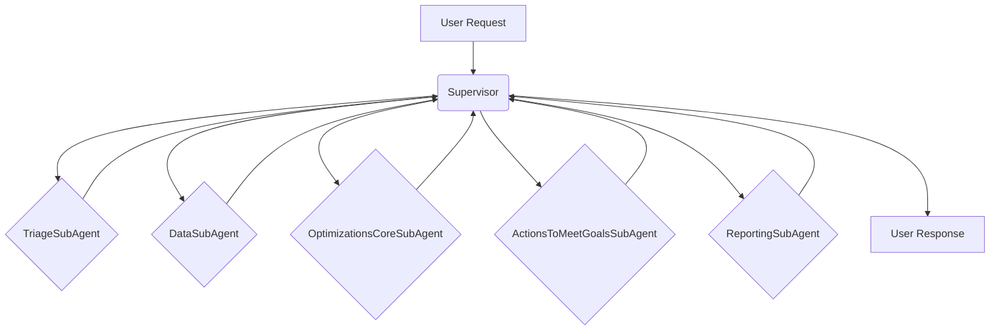

# Sub-Agent Architecture

This document describes the Sub-Agent architecture used in the Netra application.

## Overview

The Sub-Agent architecture is a modular and scalable way to organize the different components of the Netra application. Each Sub-Agent is responsible for a specific task, and the Supervisor is responsible for orchestrating the flow between the different Sub-Agents.

The Supervisor uses a dynamic routing mechanism to determine the next Sub-Agent to activate. This allows for a flexible and intelligent workflow that can adapt to the user's request.

## Sub-Agents

- **TriageSubAgent**: This Sub-Agent is responsible for triaging the user's request and determining the next step.
- **DataSubAgent**: This Sub-Agent is responsible for gathering and enriching data for the optimization process.
- **OptimizationsCoreSubAgent**: This Sub-Agent is responsible for analyzing data and formulating optimization strategies.
- **ActionsToMeetGoalsSubAgent**: This Sub-Agent is responsible for formulating tangible actions and changes to meet optimization goals.
- **ReportingSubAgent**: This Sub-Agent is responsible for summarizing the overall results and reporting them to the user.

## Workflow

The Supervisor orchestrates the SubAgent workflow in a predefined sequence:

1.  **TriageSubAgent**: The workflow begins with the `TriageSubAgent`, which analyzes the initial user request.
2.  **DataSubAgent**: The `DataSubAgent` is activated to gather and process the necessary data.
3.  **OptimizationsCoreSubAgent**: The `OptimizationsCoreSubAgent` analyzes the data and formulates optimization strategies.
4.  **ActionsToMeetGoalsSubAgent**: The `ActionsToMeetGoalsSubAgent` translates the optimization strategies into actionable steps.
5.  **ReportingSubAgent**: Finally, the `ReportingSubAgent` summarizes the results and presents them to the user.

The Supervisor can also dynamically route to a specific SubAgent if the user's query contains the name of that agent.

## WebSocket Communication

The application uses WebSockets to provide real-time updates to the client. The `ConnectionManager` class is responsible for managing the WebSocket connections, and the `Supervisor` uses it to send updates to the client as the agent progresses through the workflow. At each step, the `Supervisor` sends a message to the client with the current agent's name and the messages that have been processed so far.