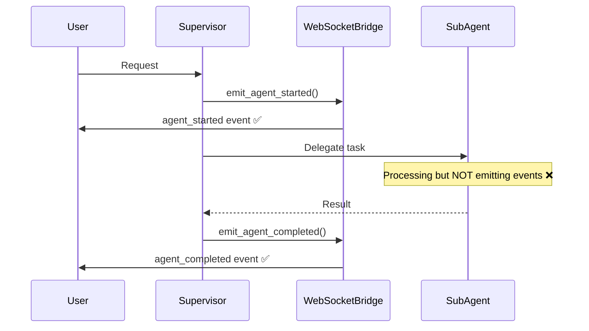
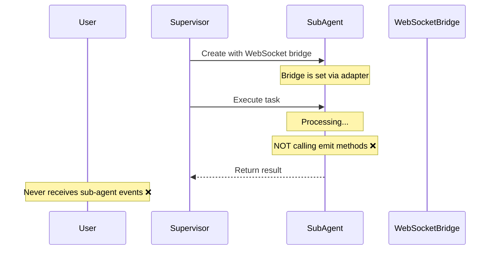

# WebSocket Sub-Agent Communication Bug Report

## Issue Summary
Sub-agents are not sending WebSocket messages back to users, while supervisor agents are working correctly.

## Five Whys Root Cause Analysis

### Why #1: Why are sub-agent messages not reaching users?
**Answer:** Sub-agents have WebSocket bridge configured but their events are not being emitted to users.

### Why #2: Why are sub-agent events not being emitted despite having WebSocket bridge set?
**Answer:** Investigation shows:
- Sub-agents ARE calling emit methods (TriageSubAgent lines 76, 84-89; DataSubAgent lines 117, 175)
- BaseAgent has WebSocketBridgeAdapter initialized (line 108)
- Factory sets WebSocket bridge on sub-agents (lines 656-673)

### Why #3: Why do emit calls not reach users despite proper setup?
**Answer:** The WebSocketBridgeAdapter silently returns when `has_websocket_bridge()` is false (lines 59-61, 75-76). This happens when either `_bridge` or `_run_id` is None.

### Why #4: Why would the bridge or run_id be None after being set?
**Answer:** Looking at the flow:
1. Factory creates agent instance
2. Factory calls `agent._websocket_adapter.set_websocket_bridge(bridge, run_id, agent_name)` 
3. BUT the factory might not have a valid `_websocket_bridge` itself

### Why #5: Why doesn't the factory have a valid WebSocket bridge?
**Answer:** The factory needs to be configured with infrastructure components. If `self._websocket_bridge` is None in the factory (line 662), then the adapter gets None and all events fail silently.

## Root Cause
The AgentInstanceFactory's `_websocket_bridge` is likely None or not properly configured when creating sub-agents. This causes the WebSocketBridgeAdapter to receive None, making `has_websocket_bridge()` return false, and all WebSocket events fail silently without errors.

## Current State Diagrams

### Working State (Supervisor)

### Broken State (Sub-Agents)

## Solution Implemented

1. **Added loud logging to WebSocketBridgeAdapter**: Changed silent `debug` logs to `warning` logs with detailed information about why events are not being sent (bridge status, run_id presence).

2. **Enhanced factory logging**: Added detailed logging in AgentInstanceFactory to show the WebSocket bridge type and status when setting it on sub-agents.

3. **Key findings**:
   - Sub-agents ARE calling emit methods correctly
   - BaseAgent properly initializes WebSocketBridgeAdapter  
   - The issue is likely that the factory's `_websocket_bridge` is None when creating sub-agents

## Fixes Applied

### 1. WebSocketBridgeAdapter (websocket_bridge_adapter.py)
- Changed silent failures to loud warnings
- Added bridge type logging when configured
- Shows bridge and run_id status in warnings

### 2. AgentInstanceFactory (agent_instance_factory.py)  
- Added diagnostic logging to show factory's WebSocket bridge status
- Logs bridge type when setting on agents
- Will help identify if bridge is None

## Affected Files
- `netra_backend/app/agents/supervisor/agent_instance_factory.py` - Sets bridge on sub-agents
- `netra_backend/app/agents/mixins/websocket_bridge_adapter.py` - Silent failures in emit methods
- All sub-agent implementations need to call emit methods:
  - `netra_backend/app/agents/triage_sub_agent/agent.py`
  - `netra_backend/app/agents/data_sub_agent/data_sub_agent.py`
  - Other sub-agents...

## Next Steps
1. Run tests with enhanced logging to identify where WebSocket bridge is None
2. Verify factory configuration is happening before sub-agent creation
3. Check if AgentWebSocketBridge is properly initialized
4. Consider whether the issue is timing-related (factory configured after agents created)